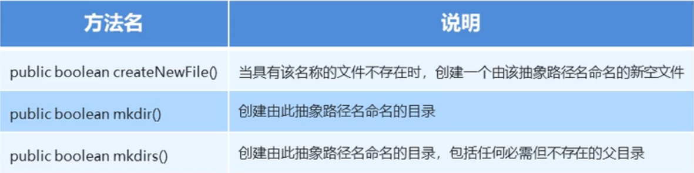

# IO流
## File

*File简介*


*File的构造方法*


### File文件的创建功能

*File类的创建功能*
> 在Java中对文件进行操作时常常用到java.io.File.mkdir()和java.io.File.mkdirs()两个方法来创建一个目录(文件夹)，这两个方法非常相似，都是无参数且返回值都为boolean类型的方法，都是用于创建指定路径名称对应的目录，但二者主要区别如下：
java.io.File.mkdir()：只能创建一级目录，且父目录必须存在，否则无法成功创建一个目录。
java.io.File.mkdirs()：可以创建多级目录，父目录不一定存在。下面是一个例子
```java
    File srcFile = new File("D:\\itcast");
    File destFile = new File("C:\\");
    String srcName = srcFile.getName();
    File newFolder = new File(destFile, srcName);
    //如果目录不存在,则创建该目录
    if(!newFolder.exists()) {
        newFolder.mkdir();
    }
```
上面这种情况,因为父目录`C:\\`存在,那么创建下一级目录就能成功。
对于下面的情况:
```java
    File srcFile = new File("D:\\itcast");
    File destFile = new File("D:\\itcast1");
    String srcName = srcFile.getName();
    File newFolder = new File(destFile, srcName);
    //如果目录不存在,则创建该目录
    if(!newFolder.exists()) {
        newFolder.mkdir();
    }
```
如果父目录`D:\\itcast1`不存在的话,那么使用`mkdir()`创建就不会成功,需要使用`mkdirs()`。


这里需要注意的是:
**不应该仅仅依靠目录名或者文件名来判断创建的是目录还是文件,这里需要注意的是,`createNewFile`创建的是一个文件,但是`mkdir`与`mkdirs`创建的是目录。并且如果创建的目录名为`java.txt`,那么就不能够再创建相同名字的目录。**
### File类的判断和获取功能

*File类的判断和获取功能*


### File类的删除功能

*删除*


## 字节流

*字节流的概述与分类*


### 字节流写数据


下面是代码示例:
```java
    public static void main(String[] args) throws IOException {
        //采用方法write(int b)
        FileOutputStream fileOutputStream = new FileOutputStream("module5\\fos.txt");
        fileOutputStream.write(57);
        //采用方法write(byte[] b)
        Byte[] bytes = {97, 98, 99};//或者采用这样的方式Byte[] bytes = "abc".getBytes(); 
        //采用方法write(byte[] b, int off, int len) 
        fileOutputStream.write(bytes);
        fileOutputStream.write(bytes, 0, 3);
    }
```
字节流写数据如何实现换行？
采用写入换行符的方法
    1. Windows: /r/n
    2. Linux: /n
    3. mac: /r
字节流写数据如何实现追加写入？
使用`FileOutputStream(String name, boolean append)`方法,当使用这个方法的时候,如何后一个参数为`true`,我们写入数据就并非从开头写入,而是从末尾写入。
### 字节流读数据

*字节流读数据的步骤*
```java
    //创建字节流对象
    FileInputStream fis = new FileInputStream("module5\\fis.txt");
    //调用读数据的方法
    //int read() 一次读一个字节的数据,当读到文件末尾的时候,返回-1
    int read;
    while ((read = fis.read()) != -1) {
        System.out.println((char)read);
    }
    //释放资源
    fis.close();
```
案例:复制文本文件
```java
    //创建字节流对象
    FileInputStream fis = new FileInputStream("module5//fis.txt");
    FileOutputStream fos = new FileOutputStream("module5//fos.txt");
    //开始读数据以及写数据
    int read;
    while ((read = fis.read()) != -1) {
        //写入刚读出的数据
        fos.write(read);
    }
    //释放资源
    fos.close();
    fis.close();
```
其它读取文件的方式
一次读取一个字节数组的方式,使用方法`int read(byte[] b)`,该方法可以读取最多传入字节数组大小的数据,并将其读入到该字节数组中,但是需要注意的是:**该方法的返回值为,如果有数据被读入,那么将会返回读入缓存区的数据的长度,如果没有更多的数据被读入的话,那么就会返回-1.**
```java
    //创建字节流对象
    FileInputStream fis = new FileInputStream("module5//fis.txt");
    //开始读数据
    //申请字节数组,存放读出的数据
    byte[] bytes = new byte[1024];
    int read;
    while((read = fis.read(bytes)) != -1) {
        System.out.println(new String(bytes, 0, read));
    }
    //释放资源
    fis.close();
```
在这里补充一个`String`类的构造方法:
`String(byte[] b, int offset, int length)`

### 字节缓冲流


*字节缓冲流*
字节缓冲流主要是为了提高输入、输出的效率,对于其使用方式来说,基本上与上面提到的`FileInputStream`与`FileOutputStream`一模一样。下面是一组比较四种读取文件方式的示例代码:
```java
public class BufferedDemo {
    public static void main(String[] args) throws IOException {
        //记录开始时间
        long startTime = System.currentTimeMillis();

        //复制md文件
        method4();

        //记录结束时间
        long endTime = System.currentTimeMillis();
        System.out.println("共耗时：" + (endTime - startTime) + "毫秒" );
    }

    public static void method1() throws IOException {
        //创建字节流对象
        FileInputStream fis = new FileInputStream("D://学习//笔记本//Java//Java的异常.md");
        FileOutputStream fos = new FileOutputStream("module5//fos.md");
        //基本字节流一次读入一个字节的数据
        int read;
        while ((read = fis.read()) != -1) {
            fos.write(read);
        }
        //释放资源
        fos.close();
        fis.close();
    }

    public static void method2() throws IOException {
        //创建字节流对象
        FileInputStream fis = new FileInputStream("D://学习//笔记本//Java//Java的异常.md");
        FileOutputStream fos = new FileOutputStream("module5//fos.md");
        //基本字节流一次读入一个字节数组的数据
        byte[] bytes = new byte[1024];
        int read;
        while ((read = fis.read(bytes)) != -1) {
            fos.write(bytes);
        }
        //释放资源
        fos.close();
        fis.close();
    }

    public static void method3() throws IOException {
        //创建字节流对象
        BufferedInputStream bis = new BufferedInputStream(new FileInputStream("D://学习//笔记本//Java//Java的异常.md"));
        BufferedOutputStream bos = new BufferedOutputStream(new FileOutputStream("module5//fos.md"));
        //字节缓冲流一次读入一个字节的数据
        int read;
        while ((read = bis.read()) != -1) {
            bos.write(read);
        }
        //释放资源
        bis.close();
        bos.close();
    }

    public static void method4() throws IOException {
        //创建字节流对象
        BufferedInputStream bis = new BufferedInputStream(new FileInputStream("D://学习//笔记本//Java//Java的异常.md"));
        BufferedOutputStream bos = new BufferedOutputStream(new FileOutputStream("module5//fos.md"));
        //字节缓冲流一次读入一个字节数组的数据
        byte[] bytes = new byte[1024];
        int read;
        while((read = bis.read(bytes)) != -1) {
            bos.write(bytes);
        }
        //释放资源
        bis.close();
        bos.close();
    }
}
```
从上面的代码基本上可以得出下面的结论:
1. 使用缓冲字节流要比基本字节流更快。
2. 使用一次读入一个字节数组比一次读入一个字节更快。

## 字符流

### 为什么会出现字符流？

*出现字符流的原因*
这里需要注意的问题为:**如果使用的编码表是`UTF-8`,那么中文字符就是三个字节,如果使用的是`GBK`,那么中文字符就是二个字节。**

### 字符集


使用`FileOutputStream`,如果我们想要往文件中写入汉字的话,我们可以采用下面的方式:
```java
    FileOutputStream fos = new FileOutputStream("module5//fos.txt");
    fos.write("中国".getBytes("UTF-8"));
    fos.close();
```
使用`FileInputStream`,如果我们想要将文件中的汉字读出来的话,我们可以采用下面的方式:
```java
    FileInputStream fis = new FileInputStream("module5//fos.txt");
    byte[] bytes = new byte[6];
    fis.read(bytes);
    System.out.println(new String(bytes));
    fis.close();
```
对于我们上面的操作来说,`FileOutputStream`与`FileInputStream`全部都是面向字节,因为当你使用`FileOutputStream`向文件中想要写入汉字的时候,我们首先应该采用`byte[] getBytes()`和`byte[] getBytes(String charsetName)`这两个方法,将对应的字符串编码为一系列字节。
当我们想要将文件中的汉字读出来,我们首先应该使用`String(byte[] bytes)`或者`String(byte[] bytes, String charsetName)`这两个方法,将对应的字节构造出新的字符串。
为了改变这种烦琐的方式,因为需要在字符流与字节流之间进行解码与编码,所以我们接下来介绍`InputStreamReader`与`OutputSteamWriter`这两个类。

### `InputStreamReader`与`OutputSteamWriter`
正如上面介绍的那样,如果使用`InputStreamReader`与`OutputSteamWriter`,我们可以将上面的代码改造成:
使用`OutputSteamWriter`
```java
    OutputStreamWriter osw = new OutputStreamWriter(new FileOutputStream("module5//fos.txt"));
    osw.write("中国");
    osw.close();
```
如果我们使用之前的`FileInputStream`的话,我们将之前的转化就是错误的,因为汉字在`UTF-8`以及`GBK`中全部不是按照一个字节存储的,当从文件取出来的字节流,将每个字节转化为字符的话,就转化不了汉字。但是我们使用`InputStreamReader`,就不会出现这样的问题。
使用`InputStreamReader`
```java
    InputStreamReader isr = new InputStreamReader(new FileInputStream("module5//fos.txt"));
    int read;
    while((read = isr.read()) != -1) {
        System.out.print((char)read);
    }
    isr.close();
```
上面`InputStreamReader`与`OutputSteamWriter`都能够选择相应的字符集,默认的是平台的字符集,我们可以使用相应的构造方法来使用相应的字符集。
`InputStreamReader​(InputStream in, String charsetName)`和`OutputStreamWriter​(OutputStream out, String charsetName)`
### 字符串写数据的五种方式


*flush与close*
这里需要注意的是:当我们使用**字符流**来写数据的时候,我们如果不刷新,即不使用`flush()`方法的话,数据就会写不进去。但是如果我们使用**字节流**的话,就不会出现这些问题。事实上, 当我们使用`close()`方法的时候,它首先会刷新流,刷新完之后,才会释放资源。
### 字符流读数据的二种方式

下面是示例代码:
```java
    InputStreamReader isr = new InputStreamReader(new FileInputStream("module5//fos.txt"));
    char[] chars = new char[1024];
    int len;
    while ((len = isr.read(chars)) != -1) {
        System.out.print(new String(chars, 0, len));
    }
```
### 字符缓冲流


*字符缓冲流简介*
使用字符缓冲流写数据:
```java
    BufferedWriter bw = new BufferedWriter(new FileWriter("module5//bw.txt"));
    bw.write("中国");
    bw.close();
```
使用字节缓冲流读数据
```java
    //一次读取一个字符
    BufferedReader br = new BufferedReader(new FileReader("module5\\bw.txt"));
    int read;
    while ((read = br.read()) != -1) {
        System.out.println((char)read);
    }
    br.close();
```
```java
    //一次读取一个字符数组
    BufferedReader br = new BufferedReader(new FileReader("module5\\bw.txt"));
    int read;
    char[] chars = new char[1024];
    while ((read = br.read(chars)) != -1) {
        System.out.println(new String(chars, 0, read));
    }
    br.close();
```
### 字符缓冲流的特有功能

代码示例:
**`newLine()`**
```java
    BufferedWriter bw = new BufferedWriter(new FileWriter("module5//bw.txt"));
    for (int i =0; i < 5; i++) {
        bw.write("hello" + i);
        bw.newLine();
    }
    bw.close();
```
**`readLine()`**
```java
    BufferedReader br = new BufferedReader(new FileReader("module5//bw.txt"));
    String line = null;
    while ((line = br.readLine()) != null) {
        System.out.print(line);
    }
    br.close();
```
这里需要注意的是:**当使用`readLine()`方法的时候,不会读取任何行终止符号。**所以说上面的代码不会有换行出现。
## IO流小结

*字节流小结*

*字符流小结*

## 练习
### 1.从集合到文件
```java
    //创建一个集合
    ArrayList<String> array = new ArrayList<>();

    //向集合中添加元素
    array.add("hello");
    array.add("world");
    array.add("java");

    //创建输出流对象
    BufferedWriter bw = new BufferedWriter(new FileWriter("practice//bw.txt"));

    //将集合中的元素存入文件中
    for(String s : array) {
        bw.write(s);
    }

    //释放资源
    bw.close();
```
### 2.从文件到集合
```java
    //创建字符流对象
    BufferedReader br = new BufferedReader(new FileReader("practice//bw.txt"));
    //创建ArrayList数组
    ArrayList<String> array = new ArrayList<String>();
    //使用字符流对象从文件中读数据
    String line = null;
    while ((line = br.readLine()) != null) {
        array.add(line);
    }
    //遍历整个数组
    for(String s : array) {
        System.out.println(s);
    }
    //释放资源
    br.close();
```
### 3.点名器
```java
    //创建字符缓冲流对象
    BufferedReader br = new BufferedReader(new FileReader("practice//bw.txt"));
    //创建ArrayList数组
    ArrayList<String> array = new ArrayList<String>();
    //使用字符流对象从文件中读数据
    String line = null;
    while ((line = br.readLine()) != null) {
        array.add(line);
    }
    //释放资源
    br.close();
    //产生随机数
    Random random = new Random();
    int num = random.nextInt(array.size());
    System.out.println(array.get(num));
```
### 4.集合到文件(改进版)
```java
    //创建ArrayList集合
    ArrayList<Student> array = new ArrayList<Student>();
    //创建学生对象
    Student s1 = new Student("s001", "张三", 15, "北京");
    Student s2 = new Student("s002", "李四", 18, "上海");
    Student s3 = new Student("s003", "王五", 17, "广州");
    //将学生对象添加到集合中
    array.add(s1);
    array.add(s2);
    array.add(s3);
    //创建字符输出流对象
    BufferedWriter bw = new BufferedWriter(new FileWriter("practice//bw.txt"));
    //将集合中的对象写入到文件中
    for (Student s : array) {
        StringBuilder sb = new StringBuilder(s.getSid());
        sb.append(",").append(s.getName()).append(s.getAge()).append(",").append(s.getAddress());
        bw.write(sb.toString());
        bw.newLine();
        bw.flush();
    }
    //释放资源
    bw.close();
```
### 5.文件到集合(改进版)
```java
    //创建字符缓冲流对象
    BufferedReader br = new BufferedReader(new FileReader("practice//bw.txt"));
    //从文件中读取数据
    String line = null;
    //创建集合对象
    ArrayList<Student> array = new ArrayList<Student>();
    while ((line = br.readLine()) != null) {
        //将读取出来的数据进行分割
        String[] splitSprings = line.split(",");
        //初始化学生对象
        Student s = new Student(splitSprings[0], splitSprings[1], Integer.parseInt(splitSprings[2]), splitSprings[3]);
        //将学生添加到集合中
        array.add(s);
    }
    //释放资源
    br.close();
    for (Student s : array) {
        System.out.println(s);
    }
```
### 6.集合到文件(改进版)
```java
    //创建一个树集
    TreeSet<Student> treeSet = new TreeSet<>(new Comparator<Student>() {
        @Override
        public int compare(Student s1, Student s2) {
            //主要条件,比较总成绩
            int num1 = s1.getSum() - s2.getSum();
            //次要条件
            //比较语文成绩
            int num2 = num1 == 0 ? s1.getChinese() - s2.getChinese() : num1;
            //比较数学成绩
            int num3 = num2 == 0 ? s1.getMath() - s2.getMath() : num2;
            //比较名字
            int num4 = num3 == 0 ? s1.getName().compareTo(s2.getName()) : num3;
            return num4;
        }
    });
    //录入学生数据,并添加到树集中
    for (int i = 0; i < 3; i++) {
        Scanner scanner = new Scanner(System.in);
        System.out.println("录入第" + (i + 1) + "个学生的信息:");
        System.out.println("姓名:");
        String name = scanner.nextLine();
        System.out.println("语文成绩:");
        Integer chinese = scanner.nextInt();
        System.out.println("数学成绩:");
        Integer math = scanner.nextInt();
        System.out.println("英语成绩:");
        Integer english = scanner.nextInt();
        Student student = new Student();
        student.setName(name);
        student.setChinese(chinese);
        student.setMath(math);
        student.setEnglish(english);
        treeSet.add(student);
    }
    //创建字符流对象
    BufferedWriter bw = new BufferedWriter(new FileWriter("practice//bw.txt"));
    for (Student s : treeSet) {
        StringBuilder sb = new StringBuilder();
        sb.append(s.getName()).append(",").append(s.getChinese()).append(",").append(s.getMath()).append(",").append(s.getEnglish()).append(",").append(s.getSum());
        bw.write(sb.toString());
        bw.newLine();
        bw.flush();
    }
    //释放资源
    bw.close();
```
### 复制单级文件夹
```java
    //创建数据源目录File对象,路径为D:\\itcast
    File srcFolder = new File("D:\\itcast");
    //获取数据源目录File文件的名称
    String folderName = srcFolder.getName();
    //创建目的地目录File对象,路径为模块名+itcast组成
    /*File​(String parent, String child)
    Creates a new File instance from a parent pathname string and a child pathname string.*/
    File destFolder = new File("practice", folderName);
    //判断目的地目录对应File对象是否存在,如果不存在,创建出来
    /*mkdir()
    Creates the directory named by this abstract pathname.*/
    if(!destFolder.exists()) {
        destFolder.mkdir();
    }
    //获取数据源目录下所有文件的File数组
    File[] listFiles = srcFolder.listFiles();

    //遍历File数组,得到每一个File对象
    for (File srcFile : listFiles) {
        String srcFileName = srcFile.getName();
        /*
        File​(File parent, String child)
        Creates a new File instance from a parent abstract pathname and a child pathname string.
            */
        File destFile = new File(destFolder, srcFileName);
        copyFile(srcFile, destFile);
    }

    private static void copyFile(File srcFile, File destFile) throws IOException {
        //创建字节流对象
        BufferedInputStream bis = new BufferedInputStream(new FileInputStream(srcFile));
        BufferedOutputStream bos = new BufferedOutputStream(new FileOutputStream(destFile));

        //进行文件的复制
        byte[] bytes = new byte[1024];
        int len;
        while ((len = bis.read(bytes)) != -1) {
            bos.write(bytes, 0, len);
        }

        //释放资源
        bos.close();
        bis.close();
    }
```
### 复制多级文件夹
```java
    private static void copyFolder(File srcFile, File destFile) throws IOException {
        //判断数据源是否是文件
        if(srcFile.isDirectory()) {
            //如果是目录的话
            String srcName = srcFile.getName();
            File newFolder = new File(destFile, srcName);
            //如果目录不存在,则创建该目录
            if(!newFolder.exists()) {
                newFolder.mkdir();
            }
            //获取数据源下面的File对象
            File[] listFiles = srcFile.listFiles();
            for (File file : listFiles) {
                copyFolder(file, newFolder);
            }
        } else {
            //如果是文件的话
            File newFile = new File(destFile, srcFile.getName());
            copyFile(srcFile, newFile);
        }
    }
```

## 复制文件的异常处理

*异常处理的发展*

## 特殊操作流

### 标准输入流

字节实现键盘录入:
```java
    InputStream is = System.in;

    int by;
    while ((by = is.read()) != -1) {
        System.out.print((char)by);
    }
```
但是上面的这种方式不能够读取占2或3个字节的中国字’
```java
    InputStreamReader isr = new InputStreamReader(System.in);
    //读取数据
    int by;
    while((by = isr.read()) != -1) {
        System.out.println((char)by);
    }
```
上面的中各种方式一次只能读取字符,要想读取一行,要使用`BufferedReader`
```java
    //每次读一行数据进来
    BufferedReader br = new BufferedReader(new InputStreamReader(System.in));
    //读取一行数据
    String line;
    while ((line = br.readLine()) != null) {
        System.out.println(line);
    }
```
但是按照上面的方式读取出来的数据基本上全都是字符串,为了更近一步,Java提供给我们`Scanner`类。
```java
Scanner sc = new Scanner(System.in);
```
`Scanner`类调用`nextLine()`读取一行数据,调用`nextInt()`读取一整数,调用`nextDouble`读取一浮点数。

### 标准输出流


### 字节打印流


使用`write()`写数据的时候,会转码,但是使用自己独有的方法`print`和`println`不会。

### 字符打印流

使用字符打印流的时候,调用`write()`方法并不会对自动刷新,为了能够刷新,需要使用构造函数`PrintWriter(Writer out, boolean autoFlush)`,如果调用`println`,`printf`和`format`方法时,则会自动刷新,但是`print`不会。

### 对象序列化流


下面是实例
```java
    //创建学生对象
    Student student = new Student(15, "林青霞");
    //创建对象序列化流
    ObjectOutputStream oos = new ObjectOutputStream(new FileOutputStream("practice//bw.txt"));
    //写入对象
    oos.writeObject(student);
    //释放资源
    oos.close();
```
这里需要注意的是,要写入的类必须要实现`Serializable`接口:
```java
public class Student implements Serializable
```

### 对象的反序列化流

下面是代码示例:
```java
    //创建一个反序列化流对象
    ObjectInputStream ois = new ObjectInputStream(new FileInputStream("practice//bw.txt"));
    //从文件中读取对象
    Object obj = ois.readObject();
    Student s = (Student) obj;
    System.out.println(s.getName() + s.getAge());
    //释放资源
    ois.close();
```
### 对象序列化流出现的问题

通俗地说,就是当你序列化一个对象,并将其写入到文件之后,再从文件中想要读取出来的时候,此时的类已经发生了变化,所以从文件中读取会出错。

之所以出现这样的问题,是因为我们没有显式给出一个`serialVersionUID`,这个值是默认生成的,因为前后两次类发生了变化,所以这个值不相同。但是如果显式给出来,即使类发生变化,这个值也不会发生变化。

见下面的示例:
```java
    public static void main(String[] args) throws IOException, ClassNotFoundException {
        write();
        read();
    }

    private static void read() throws IOException, ClassNotFoundException {
        ObjectInputStream ois = new ObjectInputStream(new FileInputStream("practice//bw.txt"));
        Object obj = ois.readObject();
        Student s = (Student) obj;
        System.out.println(s.getName() + s.getAge());
        ois.close();
    }

    private static void write() throws IOException {
        ObjectOutputStream oos = new ObjectOutputStream(new FileOutputStream("practice//bw.txt"));
        Student s = new Student(15, "林青霞");
        oos.writeObject(s);
        oos.close();
    }
```
从上面的例子可以看出,如果在成员变量`age`前面加了关键字`transient`之后,就不会被序列化了,最后我们读出来的对象的`age`为0,不再是15,使用的是默认值。

### Properties


#### Properties作为`Map`集合的使用
`Properties`作为`Map`集合的使用,`Properties`不能够像`Map`集合那样指定键和值的类型:
```java
Properties prop = new Properties();

//存储元素
prop.put("student001", "张聚胜");
prop.put("student002", "张曼玉");

//遍历元素
Set<Object> keySet = prop.keySet();
for(Object key : keySet) {
    Object obj = prop.get(key);
}
```
#### Properties的特有方法


#### Properties与IO流相结合

