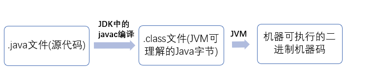

# Java入门知识

## Java语言的特点
1. 简单性
2. **面向对象(封装,继承,多态)**
3. 分布式
   > Java是面向网络的语言。通过它提供的类库可以处理`TCP/IP`协议 ,用户可以通过`URL`地址在网络上很方便地访问其它对象。(Java应用程序能通过`URL`打开和访问网络上的对象,其便捷程度就如同访问本地文件)
4. 健壮性
5. 安全性
6. 体系结构中立
   > 编译器生成一个体系结构中立的目标文件格式,这是一种编译过的代码,只要有`Java`运行时系统,就可以在许多处理器上运行.Java生成与特定的计算机体系结构无关的字节码指令来实现这一特性。**虚拟机可以将执行最频繁的字节码序列转化为机器码,这一过程称为即时编译。**
7. **可移植性**
   > 与C和C++不同,Java规范中没有“依赖具体实现”的地方,基本数据类型大小以及有关运算的行为都有明确的说明。例如,Java中的int永远都是32位的整数,而在C/C++中,int可能是16位的整数或者32位的整数。
8. **编译与解释并存**
   > Java implementations typically use a two-step compilation process. Java source code is compiled down to bytecode by the Java compiler. The bytecode is executed by a Java Virtual Machine (JVM). Modern JVMs use a technique called Just-in-Time (JIT) compilation to compile the bytecode to native instructions understood by hardware CPU on the fly at runtime.Some implementations of JVM may choose to interpret the bytecode instead of JIT compiling it to machine code, and running it directly. While this is still considered an "interpreter," It's quite different from interpreters that read and execute the high level source code(i.e. in this case, Java source code is not interpreted directly, the bytecode, output of Java compiler, is)

   > It is technically possible to compile Java down to native code ahead-of-time and run the resulting binary. It is also possible to interpret the Java code directly.

   > To summarize, depending on the execution environment, bytecode can be:
   > + compiled ahead of time and executed as native code (similar to most C++ compilers)
   > + compiled just-in-time and executed
   > + interpreted
   > + directly executed by a supported processor (bytecode is the native instruction set of some CPUs)

   
   > 我们需要格外注意的是 .class->机器码 这一步。在这一步 JVM 类加载器首先加载字节码文件，然后通过解释器逐行解释执行，这种方式的执行速度会相对比较慢。而且，有些方法和代码块是经常需要被调用的(也就是所谓的热点代码)，所以后面引进了 JIT 编译器，而 JIT 属于运行时编译。当 JIT 编译器完成第一次编译后，其会将字节码对应的机器码保存下来，下次可以直接使用。而我们知道，机器码的运行效率肯定是高于 Java 解释器的。这也解释了我们为什么经常会说 Java 是编译与解释共存的语言。
9.  高性能
10. **多线程**
    >  C++ 语言没有内置的多线程机制，因此必须调用操作系统的多线程功能来进行多线程程序设计，而 Java 语言却提供了多线程支持.修正（参见： issue#544）：C++11 开始（2011 年的时候）,C++就引入了多线程库，在 windows、linux、macos 都可以使用std::thread和std::async来创建线程。
11. 动态性

## `JRE`与`JDK`与`JVM`

### `JVM`
> Java 虚拟机（JVM）是运行 Java 字节码的虚拟机。JVM 有针对不同系统的特定实现（Windows，Linux，macOS），目的是使用相同的字节码，它们都会给出相同的结果。

**什么是字节码?采用字节码的好处是什么?**
    &nbsp;&nbsp;&nbsp;&nbsp;&nbsp;&nbsp;&nbsp;&nbsp;在 Java 中，JVM 可以理解的代码就叫做字节码（即扩展名为 .class 的文件），它不面向任何特定的处理器，只面向虚拟机。Java 语言通过字节码的方式，在一定程度上解决了传统解释型语言执行效率低的问题，同时又保留了解释型语言可移植的特点。所以 Java 程序运行时比较高效，而且，由于字节码并不针对一种特定的机器，因此，Java 程序无须重新编译便可在多种不同操作系统的计算机上运行。**解释型语言是指使用专门的解释器对源程序进行逐行解释成特定平台的机器码并立即执行的语言。所以运行起来肯定没有编译型语言快**

### `JRE`与`JDK`
`JDK` 是 `Java Development Kit` 缩写，它是功能齐全的 `Java SDK`。它拥有 JRE 所拥有的一切，还有编译器（`javac`）和工具（如 `javadoc` 和 `jdb`）。它能够创建和编译程序。
`JRE` 是 `Java` 运行时环境。它是运行已编译`Java`程序所需的所有内容的集合，包括 `Java` 虚拟机（`JVM`），`Java` 类库，`java` 命令和其他的一些基础构件。但是，它不能用于创建新程序。
如果你只是为了运行一下 `Java` 程序的话，那么你只需要安装 `JRE` 就可以了。如果你需要进行一些`Java`编程方面的工作，那么你就需要安装`JDK`了。

### `Oracle JDK`和`Open JDK`的对比
1. 授权协议的不同
   `OpenJDK`采用`GPL V2`协议发布，而`JDK`则采用`JRL`协议发布。两个协议虽然都是开放源代码的，但是在使用上的不同在于`GPL V2`允许在商业上使用，而`JRL`只允许个人研究使用。
2. `OpenJDK`只包含最精简的JDK
   `OpenJDK`不包含其他的软件包，比如`Rhino Java DB JAXP……`，并且可以分离的软件包也都是尽量的分离，但是这大多数都是自由软件，你可以自己下载加入。
3. `OpenJDK`源代码不完整
   这个很容易想到，在采用`GPL`协议的`OpenJDK`中，`SUN JDK`的一部分源代码因为产权的问题无法开放`OpenJDK`使用，其中最主要的部分就是JMX中的可选元件`SNMP`部分的代码。

## `Java`和`C++`的异同
+ 都是面向对象的语言，都支持封装、继承和多态
+ `Java`不提供指针来直接访问内存，程序内存更加安全
+ `Java`的类是单继承的，`C++`支持多重继承；虽然`Java`的类不可以多继承，但是接口可以多继承
+ `Java`有自动内存管理垃圾回收机制(`GC`)，不需要程序员手动释放无用内存
+ `C++`是编译型语言,但很明显,`Java`具有解释性。
+ `Java`具有更好的移植性。
+ 其实`Java`和`C++`在很多细节上并不相同,比如`Java`是值传递,但是`C++`有引用传递和值传递。

## 什么是`Java`程序的主类？应用程序和小程序的主类有何不同？
一个程序中可以有多个类，但只能有一个类是主类。在`Java`应用程序中，这个主类是指包含`main()`方法的类。而在`Java`小程序中，这个主类是一个继承自系统类`JApplet`或`Applet`的子类。应用程序的主类不一定要求是`public`类，但小程序的主类要求必须是`public`类。主类是`Java`程序执行的入口点。

## `import java`和`javax`有什么区别
> Originally, everything that was part of the standard API was part of the java package, whereas everything that was not part of the standard API was released under the package name javax. Hence, packages essential to the API was java, while javax contained the extensions to the API. It can even be said that javax, is just java with an x, which stands for extension.
> Over time the extensions that were released as javax, become integral to the Java API. However, moving the extension from the javax package to the java package would be too cumbersome and would end up breaking a bunch of existing code. Hence, eventually it was decided that the javax packages would become part of the standard API.
> Practically there is no difference between Java and Javax. It is just the name that differs.
也就是说`javax`也应该被称为`java`,之前在`java`包里的是基本的`API`,后来又扩展了一些额外的`API`,放到了`javax`,但后来发现这些扩展出来的`API`也是必须的,但是不能将`javax`里面的融到`java`里面。