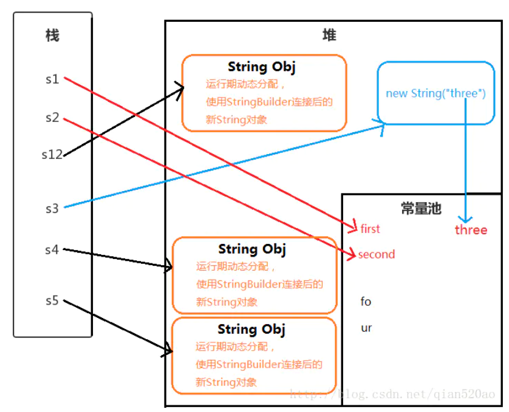

# String
本文的内容主要来源于:https://how2playlife.com/2019/09/03/3string%E5%92%8C%E5%8C%85%E8%A3%85%E7%B1%BB/
以及
https://juejin.im/entry/6844903544999395342
如有侵权,请联系作者。

## String概述

字符串广泛应用 在 Java 编程中，在 Java 中字符串属于对象，Java 提供了 String 类来创建和操作字符串。

String 类是不可改变的，所以你一旦创建了 String 对象，那它的值就无法改变了（详看笔记部分解析）。

如果需要对字符串做很多修改，那么应该选择使用 [StringBuffer & StringBuilder](https://www.runoob.com/java/java-stringbuffer.html) 类。

## String基本用法

### 字符串的创建
创建字符串最简单的方式如下:
String greeting = “菜鸟教程”;
在代码中遇到字符串常量时，这里的值是 “菜鸟教程“”，编译器会使用该值创建一个 String 对象。

和其它对象一样，可以使用关键字和构造方法来创建 String 对象。

String 类有 11 种构造方法，这些方法提供不同的参数来初始化字符串。
创建`String`对象的基本方法:
```java
String s1 = “mpptest”

String s2 = new String();

String s3 = new String(“mpptest”);

char[] helloArray = { 'r', 'u', 'n', 'o', 'o', 'b'};    String helloString = new String(helloArray);
``` 
下面我们来详细总结一下创建`String`对象的方法,如下图所示:
```java
//使用 ” ” 双引号创建 ： 
String s1 = “first”;
//使用字符串连接符拼接 ： 
String s2=”se”+”cond”;
//使用字符串加引用拼接 ： 
String s12=”first”+s2;
//使用new String(“”)创建 ： 
String s3 = new String(“three”);
//使用new String(“”)拼接 ： 
String s4 = new String(“fo”)+”ur”;
//使用new String(“”)拼接 ： 
String s5 = new String(“fo”)+new String(“ur”);
```

对于上面的解析:
Java 会确保一个字符串常量只有一个拷贝。
1. s1 ： 中的”first” 是字符串常量，在编译期就被确定了，先检查字符串常量池中是否含有”first”字符串,若没有则添加”first”到字符串常量池中，并且直接指向它。所以s1直接指向字符串常量池的”first”对象。

2. s2 ： “se”和”cond”也都是字符串常量，当一个字符串由多个字符串常量连接而成时，它自己肯定也是字符串常量，所以s2也同样在编译期就被解析为一个字符串常量，并且s2是常量池中”second”的一个引用。

3. s12 ： JVM对于字符串引用，由于在字符串的”+”连接中，有字符串引用存在，而引用的值在程序编译期是无法确定的，即("first"+s2)无法被编译器优化，只有在程序运行期来动态分配使用StringBuilder连接后的新String对象赋给s12。
(编译器创建一个StringBuilder对象，并调用append()方法，最后调用toString()创建新String对象，以包含修改后的字符串内容)

4. s3 ： 用new String() 创建的字符串不是常量，不能在编译期就确定，所以new String() 创建的字符串不放入常量池中，它们有自己的地址空间。
但是”three”字符串常量在编译期也会被加入到字符串常量池（如果不存在的话）

5. s4 ： 同样不能在编译期确定，但是”fo”和”ur”这两个字符串常量也会添加到字符串常量池中，并且在堆中创建String对象。（字符串常量池并不会存放”four”这个字符串）

6. s5 ： 原理同s4。

### 关于字符串的`intern()`方法
```java
String s = new String("1");
s.intern();
String s2 = "1";
System.out.println(s == s2);
//false
String s3 = new String("1") + new String("1") ;
s3.intern();
String s4 = "11";
System.out.println(s3 == s4);
//true
```
对上面方法的分析,根据我们上面关于创建字符串的分析,`String s = new String("1")`,会在堆上创建一个对象,同时会检查在常量池中有没有该对象,如果没有的话,会在常量池中生成"1",而对于`s.intern()`方法来说,会检查在常量池有没有该常量,如果有的话,就返回在常量池中的引用,我们使用`String s2 = "1";`,会检查在常量池中有没有,如果有的话,则直接将常量池中的引用赋值给`s2`.因为s是指向堆中的,但是s2是指向常量池中,所以肯定不相同.

对于`String s3 = new String("1") + new String("1");`,会在堆中创建一个"11"对象,同时也会在常量池中创建"1"这个对象,对于`s.intern()`方法来说,同样会执行上面的步骤,即检查在常量池中有没有"11"这个对象,如果没有的话,在JDK1.7及以前,会将字符串拷贝到常量池,但是在JDK1.8及以后,会将该引用返回到常量池中,也就是说,当我们在`String s4 = "11"`的时候,会发现在常量池中尽管没有"11",但是有指向"11"的引用,我们会将这个引用给到`s4`,这样的话,`s3`和`s4`就会相等,但是因为在JDK1.7及以前,因为`intern()`还是会在常量池中创建相应的对象,所以`s3`和`s4`不会相等。

### 字符串的常见方法


```java
package com.mpp.string;

public class StringDemo1 { 
   public static void main(String[] args) { 
      //定义一个字符串"晚来天欲雪 能饮一杯无"
      String str = "晚来天欲雪 能饮一杯无";
      System.out.println("字符串的长度是："+str.length()); 
      //字符串的雪字打印输出  charAt(int index)
      System.out.println(str.charAt(4)); 
      //取出子串  天欲
      System.out.println(str.substring(2));   
      //取出从index2开始直到最后的子串，包含2
      System.out.println(str.substring(2,4));  
      //取出index从2到4的子串，包含2不包含4  顾头不顾尾
 }
}
```

### 求字符或子串第一次/最后一次在字符串中出现的位置： indexOf() lastIndexOf()
```java
String str = new String("赵客缦胡缨 吴钩胡缨霜雪明");
//查找胡在字符串中第一次出现的位置
System.out.println("\"胡\"在字符串中第一次出现的位置："+str.indexOf("胡"));
//查找子串"胡缨"在字符串中第一次出现的位置
System.out.println("\"胡缨\"在字符串中第一次出现的位置"+str.indexOf("胡缨"));
//查找胡在字符串中最后一次次出现的位置
System.out.println(str.lastIndexOf("胡"));
//查找子串"胡缨"在字符串中最后一次出现的位置
System.out.println(str.lastIndexOf("胡缨"));
//从indexOf为5的位置，找第一次出现的"吴"
System.out.println(str.indexOf("吴",5));
```

### 字符串与byte数组间的相互转换
```java
String str = new String("hhhabc银鞍照白马 飒沓如流星星"); //将字符串转换为byte数组，并打印输出
byte[] arrs = str.getBytes("GBK");
for(int i=0;i < arrs.length; i++){
   System.out.print(arrs[i]);
} //将byte数组转换成字符串
System.out.println();
String str1 = new String(arrs,"GBK");  //保持字符集的一致，否则会出现乱码
System.out.println(str1);
```

### ==运算符和equals之间的区别
引用指向的内容和引用指向的地址
```java
String str1 = "mpp";
String str2 = "mpp";
String str3 = new String("mpp");

System.out.println(str1.equals(str2)); //true  内容相同
System.out.println(str1.equals(str3));   //true  内容相同
System.out.println(str1==str2);   //true   地址相同
System.out.println(str1==str3);   //false  地址不同
```

### 字符串的不可变性
String的对象一旦被创建，则不能修改，是不可变的

所谓的修改其实是创建了新的对象，所指向的内存空间不变
上图中，s1不再指向imooc所在的内存空间，而是指向了hello,imooc

### String的连接
```java
@Test
public void contact () {
    //1连接方式
    String s1 = "a";
    String s2 = "a";
    String s3 = "a" + s2;
    String s4 = "a" + "a";
    String s5 = s1 + s2;
    //表达式只有常量时，编译期完成计算
    //表达式有变量时，运行期才计算，所以地址不一样
    System.out.println(s3 == s4); //f
    System.out.println(s3 == s5); //f
    System.out.println(s4 == "aa"); //t
}
```
当将一个字符串和一个非字符串进行拼接的值进行拼接时,后者会转化为字符串。

### String、String builder和String buffer的区别
#### String和StringBuffer的详解，联系和区别

String是Java中基础且重要的类，并且String也是Immutable类的典型实现，被声明为final class，**除了hash这个属性其它属性都声明为final**，因为它的**不可变性**，所以例如拼接字符串时候会产生很多无用的中间对象，如果频繁的进行这样的操作对性能有所影响。
如果采用字符串拼接的方式来达到这个目的,效率会比较低。每次拼接字符串时,都会构建一个`String`对象,浪费时间和空间。
StringBuffer就是为了解决大量拼接字符串时产生很多中间对象问题而提供的一个类。
StringBuffer是一个具有对象引用传递特点的字符串对象。 StringBuffer对象可以调用其方法动态的进行增加、插入、修改和删除操作，且不用像数组那样事先指定大小，从而实现多次插入字符，一次整体取出的效果，因而操作字符串非常灵活方便。 一旦通过StringBuffer生成最终想要的字符串，就可调用它的toString方法将其转换为一个String对象。
那么有人就问StringBuffer调用它的toString方法指向一个地址，最后还是变成了一个String对象，为什么在不直接用String呢？（意思是多次一举），这里我们就引出StringBuffer的好处了。
从这两类的区别分析：**String类是不可变类，StringBuffer类是可变类**，String 类提供的比如substring，replace等方法都不会更改字符串内容，实际上是创建一个方法所浮于特性的新字符串，返回一个改变后内容的新字符串。 而StringBuffer的append等方法都会改变字符缓冲区中的字符串内容。简单来说，String类不可变，所以我们每次"**改变字符串内容"，其实是创建了新的String对象，而StringBuffer类是可变的，我们每次改变字符串内容就是对原字符串对象的操作**。所以StringBuffer在处理改变字符串等等上比String效率更高和消耗内存更小。
下面我们举个例子来说明一下，我们需要在love字符串基础上再拼接一个love字符串
```java
String s= new String("love");
s = s + "love";
System.out.println(s);
StringBuffer sb = new StringBuffer("love");
sb.append("love");
String s = sb.toString();
System.out.println(s);
```
这个一次拼接还看不出什么，因为都是创建了两个对象，只不过上边是两个String对象，下边的方法是一个StringBuffer和String对象。效率和消耗的内存也差不了多少
接下来我们给这个过程加上循环，比如我要得到一个love字符串基础上再拼接一个100个love的字符串，分别用String和StringBuffer来实现结果又会是怎样
```java
String s= new String("love");
for(int i = 0; i < 100; i++){
    s = s + "love";
}
System.out.println(s);
```
```java
StringBuffer sb = new StringBuffer("love");
for(int i = 0; i < 100; i++){
    sb.append("love");
}
String s = sb.toString();
System.out.println(s);
```
两者的区别和效率就出来了，上边的代码的效率很低，因为创建了101个对象（开始的一个和循环100次创建的100个）；而下边的代码的效率很高，因为只创建了一个StringBuffer对象，最后用toString方法转化为String对象，总结起来就是一个StringBuffer对象和String对象的消耗（2个）。
这还只是循环100次，可想而知1000次，10000次，StringBuffer相比String优势一下就出来了，所以增删查改字符串使用StringBuffer是比较好的（有些视情况而定）。

**String和StringBuffer一些共性**：
1. 都是用来处理字符串的。
2. 都提供了 length() , toString() ,charAt() , substring() 方法 ，用法一样。
3. 对于String 类和 StringBuffer 类，字符在字符串中的索引位置都从0开始。

**String和StringBuffer主要区别**：
1. String类的内容一旦声明后是不可改变的，改变的只是其内存的指向，而StringBuffer类的对象内容是可以改变的（**String对象不可修改指的是对象本身不可修改，而不是引用不可修改**）。
2. String 类覆盖了Object类的 equals()方法，StringBuffer类没有覆盖。
3. 都覆盖了Object()类的 toString() 方法，实现不一样。String类的toString() 方法返回当前String实例本身的引用。 StringBuffer类的toString方法返回一个以当前StringBuffer的缓冲区中的所有字符串为内容的新的String对象的引用。
4. String 对象可以用 操作符 "+ "进行连接，StringBuffer不能。

#### StringBuffer与StringBuilder
StringBuffer就是为了解决大量拼接字符串时产生很多中间对象问题而提供的一个类，提供append和add方法，可以将字符串添加到已有序列的末尾或指定位置，**它的本质是一个线程安全的可修改的字符序列，把所有修改数据的方法都加上了synchronized。但是保证了线程安全是需要性能的代价的**。

在很多情况下我们的字符串拼接操作不需要线程安全，这时候StringBuilder登场了，StringBuilder是JDK1.5发布的，它和StringBuffer本质上没什么区别，就是去掉了保证线程安全的那部分，减少了开销。

StringBuffer 和 StringBuilder 二者都继承了 AbstractStringBuilder ，底层都是利用可修改的char数组(JDK 9 以后是 byte数组)。

所以如果我们有大量的字符串拼接，如果能预知大小的话最好在new StringBuffer 或者StringBuilder 的时候设置好capacity，避免多次扩容的开销。扩容要抛弃原有数组，还要进行数组拷贝创建新的数组。

我们平日开发通常情况下少量的字符串拼接其实没太必要担心，例如

String str = "aa"+"bb"+"cc";

像这种没有变量的字符串，编译阶段就直接合成"aabbcc"了，然后看字符串常量池（下面会说到常量池）里有没有，有也直接引用，没有就在常量池中生成，返回引用。

> 1、在字符串不经常发生变化的业务场景优先使用String(代码更清晰简洁)。如常量的声明，少量的字符串操作(拼接，删除等)。
>2、在单线程情况下，如有大量的字符串操作情况，应该使用StringBuilder来操作字符串。不能使用String"+"来拼接而是使用，避免产生大量无用的中间对象，耗费空间且执行效率低下（新建对象、回收对象花费大量时间）。如JSON的封装等。
> 3、在多线程情况下，如有大量的字符串操作情况，应该使用StringBuffer。如HTTP参数解析和封装等。

## String类的源码分析
这里面需要注意的是:
```
jdk1.8及以前String使用的是char数组，jdk1.9及以后使用的是byte数组。
因为开发人员发现人们使用的字符串值是拉丁字符居多而之前使用的char数组每一个char占用两个字节而拉丁字符只需要一个字节就可以存储，剩下的一个字节就浪费了，造成内存的浪费，gc的更加频繁。因此在jdk9中将String底层的实现改为了byte数组。
但是这样肯定会出现问题,就是汉字根本无法存储到一个byte里面,
```

### String类型的intern
```java
//2：string的intern使用
//s1是基本类型，比较值。s2是string实例，比较实例地址
//字符串类型用equals方法比较时只会比较值
String s1 = "a";
String s2 = new String("a");
//调用intern时,如果s2中的字符不在常量池，则加入常量池并返回常量的引用
String s3 = s2.intern();
System.out.println(s1 == s2);
System.out.println(s1 == s3);
```

### String类的equals
```java
   字符串的equals方法
   public boolean equals(Object anObject) {
        if (this == anObject) {
            return true;
        }
        if (anObject instanceof String) {
            String anotherString = (String)anObject;
            int n = value.length;
            if (n == anotherString.value.length) {
                char v1[] = value;
                char v2[] = anotherString.value;
                int i = 0;
                while (n-- != 0) {
                    if (v1[i] != v2[i])
                        return false;
                    i++;
                }
                return true;
            }
        }
        return false;
    }
```

### StringBuffer 和 StringBuilder
底层是继承父类的可变字符数组value
```java
/**

- The value is used for character storage.
  */
  char[] value;
  初始化容量为16

/**

- Constructs a string builder with no characters in it and an
- initial capacity of 16 characters.
  */
  public StringBuilder() {
    super(16);
  }
  这两个类的append方法都是来自父类AbstractStringBuilder的方法

public AbstractStringBuilder append(String str) {
    if (str == null)
        return appendNull();
    int len = str.length();
    ensureCapacityInternal(count + len);
    str.getChars(0, len, value, count);
    count += len;
    return this;
}
@Override
public StringBuilder append(String str) {
    super.append(str);
    return this;
}

@Override
public synchronized StringBuffer append(String str) {
    toStringCache = null;
    super.append(str);
    return this;
}
```

### append方法
StringBuffer在大部分涉及字符串修改的操作上加了synchronized关键字来保证线程安全，效率较低。

String类型在使用 + 运算符例如
```java
String a = "a"
```
a = a + a;时，实际上先把a封装成stringBuilder，调用append方法后再用toString返回，所以当大量使用字符串加法时，会大量地生成stringBuilder实例，这是十分浪费的，这种时候应该用stringBuilder来代替string。见下面的例子:
```java
String s = "abs";
String b = "harry";
String a = s + "abc" + b;

a += b;
a += b;

StringBuilder sb = new StringBuilder("")
```
上面的例子经过`jad`处理之后,变成下面这样:
```java
String s = "abs";
String a = (new StringBuilder()).append(s).append("abc").toString();
```
也就是说创建了一个`StringBuilder`对象,之后将`s`和"abc"全都添加上之后再转化为`String`。
如果比这个更加复杂的情况能更好体现这一点:
```java
String s = "abs";
String b = "harry";
String a = s + b;

a += "harry";
a += "harry";

StringBuilder sb = new StringBuilder("abs");
StringBuilder bb = new StringBuilder("harry");
StringBuilder c = sb.append(bb);

c.append("harry");
c.append("harry");
```
经过反编译之后:
```java
String s = "abs";
String b = "harry";
String a = (new StringBuilder()).append(s).append(b).toString();
a = (new StringBuilder()).append(a).append("harry").toString();
a = (new StringBuilder()).append(a).append("harry").toString();
StringBuilder sb = new StringBuilder("abs");
StringBuilder bb = new StringBuilder("harry");
StringBuilder c = sb.append(bb);
c.append("harry");
c.append("harry");
```

### 扩容
注意在append方法中调用到了一个函数
ensureCapacityInternal(count + len); 该方法是计算append之后的空间是否足够，不足的话需要进行扩容。
```java
public void ensureCapacity(int minimumCapacity) {
    if (minimumCapacity > 0)
        ensureCapacityInternal(minimumCapacity);
}
private void ensureCapacityInternal(int minimumCapacity) {
    // overflow-conscious code
    if (minimumCapacity - value.length > 0) {
        value = Arrays.copyOf(value,
                newCapacity(minimumCapacity));
    }
}
```
如果新字符串长度大于value数组长度则进行扩容
扩容后的长度一般为原来的两倍 + 2;
假如扩容后的长度超过了jvm支持的最大数组长度MAX_ARRAY_SIZE。
考虑两种情况
如果新的字符串长度超过int最大值，则抛出异常，否则直接使用数组最大长度作为新数组的长度。
```java
private int hugeCapacity(int minCapacity) {
    if (Integer.MAX_VALUE - minCapacity < 0) { // overflow
        throw new OutOfMemoryError();
    }
    return (minCapacity > MAX_ARRAY_SIZE)
        ? minCapacity : MAX_ARRAY_SIZE;
}
```

### 删除
这两个类型的删除操作：
都是调用父类的delete方法进行删除
```java
public AbstractStringBuilder delete(int start, int end) {
    if (start < 0)
        throw new StringIndexOutOfBoundsException(start);
    if (end > count)
        end = count;
    if (start > end)
        throw new StringIndexOutOfBoundsException();
    int len = end - start;
    if (len > 0) {
        System.arraycopy(value, start+len, value, start, count-end);
        count -= len;
    }
    return this;
}
```
system.arraycopy方法
> 在主流高性能的JVM上（HotSpot VM系、IBM J9 VM系、JRockit系等等），可以认为System.arraycopy()在拷贝数组时是可靠高效的——如果发现不够高效的情况，请报告performance bug，肯定很快就会得到改进。
java.lang.System.arraycopy()方法在Java代码里声明为一个native方法。所以最naïve的实现方式就是通过JNI调用JVM里的native代码来实现。

## String和JVM的关系

### Java栈、Java堆、方法区、常量池
1. Java栈:线程私有数据区
> 每个Java虚拟机线程都有自己的Java虚拟机栈，Java虚拟机栈用来存放栈帧，每个方法被执行的时候都会同时创建一个栈帧（Stack Frame）用于存储局部变量表、操作栈、动态链接、方法出口等信息。每一个方法被调用直至执行完成的过程，就对应着一个栈帧在虚拟机栈中从入栈到出栈的过程。

2. Java堆:线程共享数据区
> 在虚拟机启动时创建，此内存区域的唯一目的就是存放对象实例，几乎所有的对象实例都在这里分配。

3. 方法区:线程共享数据区
> 方法区在虚拟机启动的时候被创建，它存储了每一个类的结构信息，例如运行时常量池、字段和方法数据、构造函数和普通方法的字节码内容、还包括在类、实例、接口初始化时用到的特殊方法。在JDK8之前永久代是方法区的一种实现，而JDK8元空间替代了永久代，永久代被移除，也可以理解为元空间是方法区的一种实现。

4. 常量池:线程共享数据区
> 常量池常被分为两大类：静态常量池和运行时常量池。
静态常量池也就是Class文件中的常量池，存在于Class文件中。
运行时常量池（Runtime Constant Pool）是方法区的一部分，存放一些运行时常量数据。

5. 字符串常量池
> 字符串常量池存在运行时常量池之中（在JDK7之前存在运行时常量池之中，在JDK7已经将其转移到堆中）。
字符串常量池的存在使JVM提高了性能和减少了内存开销。
使用字符串常量池，每当我们使用**字面量**（String s="1";）创建字符串常量时，JVM会首先检查字符串常量池，如果该字符串已经存在常量池中，那么就将**此字符串对象的地址赋值给引用s（引用s在Java栈中）**。如果字符串不存在常量池中，就会**实例化该字符串并且将其放到常量池中，并将此字符串对象的地址赋值给引用s（引用s在Java栈中）**。
> 使用字符串常量池，每当我们使用关键字new（String s=new String(”1”);）创建字符串常量时，JVM会首先检查字符串常量池，如果该字符串已经存在常量池中，那么不再在字符串常量池创建该字符串对象，而直接堆中复制该对象的副本，然后将堆中对象的地址赋值给引用s，如果字符串不存在常量池中，就会实例化该字符串并且将其放到常量池中，然后在堆中复制该对象的副本，然后将堆中对象的地址赋值给引用s。

### String为什么不可变？
翻开JDK源码，java.lang.String类起手前三行，是这样写的:
```java
public final class String implements java.io.Serializable, Comparable<String>, CharSequence {   
/** String本质是个char数组. 而且用final关键字修饰.*/     
    private final char value[];  
    ...  
    ...
} 
```
首先String类是用final关键字修饰，这说明String不可继承。再看下面，String类的主力成员字段value是个char[]数组，而且是用final修饰的。
final修饰的字段创建以后就不可改变。 有的人以为故事就这样完了，其实没有。因为虽然value是不可变，也只是value这个引用地址不可变。挡不住Array数组是可变的事实。
String类里的value用final修饰，只是说stack里的这个叫value的引用地址不可变。没有说堆里array本身数据不可变。看下面这个例子:
```java
final int[] value={1,2,3} ；
int[] another={4,5,6};
value=another;    //编译器报错，final不可变 value用final修饰，编译器不允许我把value指向堆区另一个地址。
但如果我直接对数组元素动手，分分钟搞定。

final int[] value={1,2,3};
value[2]=100;  //这时候数组里已经是{1,2,100}   所以String是不可变，关键是因为SUN公司的工程师。 
```
在后面所有String的方法里很小心的没有去动Array里的元素，没有暴露内部成员字段。private final char value[]这一句里，private的私有访问权限的作用都比final大。而且设计师还很小心地把整个String设成final禁止继承，避免被其他人继承后破坏。所以String是不可变的关键都在底层的实现，而不是一个final。考验的是工程师构造数据类型，封装数据的功力。
为什么不可变？
> String 类本身是final的，不可以被继承
String类内部通过private final char value[]实现，从而保证了引用的不可变和对外的不可见
String内部通过良好的封装，不去改变value数组的值

 ### 不可变的好处
 安全性
 > 线程安全，不可变天生线程安全
String常被用作HashMap的key，如果可变会引有安全问题，如两个key相同
String常被用作数据库或接口的参数，可变的话也会有安全问题
效率
> 通过字符串池可以节省很多空间,实际上就是便于实现字符串池（String pool）。
每个String对应一个hashCode，再次使用的话不用重新计算

上面的第一点好理解,我们先解析**字符串池可以节省更多空间**。也就是说有助于实现字符串池(String pool),理由如下:
> 在Java中，由于会大量的使用String常量，如果每一次声明一个String都创建一个String对象，那将会造成极大的空间资源的浪费。Java提出了String pool的概念，在堆中开辟一块存储空间String pool，当初始化一个String变量时，如果该字符串已经存在了，就不会去创建一个新的字符串变量，而是会返回已经存在了的字符串的引用。我们在这里重申一下,这里面说的`String`不可变,指的是它指向的内容是不可变的,比如里面之前存的是`ab`,不可以将其转化为`abc`。但是`String`引用本身可以变,我们可以让其由原先指向`ab`,转化为指向`abc`。如果说字符串是可变的,如果某一时刻,两个`String`同时指向一个变量`ab`,但是我们可以通过其中的一个`String`将其变为`abc`的话,另一个`String`指向的内容也会发生改变。字符串池不能够实现。
我们再来解析另外一点,就是使多线程安全,看下面的场景:
一个函数appendStr()在不可变的String参数后面加上一段“bbb”后返回。appendSb()负责在可变的StringBuilder后面加"bbb"。
```java
public class test {
  // 不可变的String
  public static String appendStr(String s) {
      s += "bbb";
      return s;
  }

  // 可变的StringBuilder
  public static StringBuilder appendSb(StringBuilder sb) {
      return sb.append("bbb");
  }
  
  public static void main(String[] args) {
      String s = new String("aaa");
      String ns = test.appendStr(s);
      System.out.println("String aaa>>>" + s.toString());
      // StringBuilder做参数
      StringBuilder sb = new StringBuilder("aaa");
      StringBuilder nsb = test.appendSb(sb);
      System.out.println("StringBuilder aaa >>>" + sb.toString());
  }
}
```
如果程序员不小心像上面例子里，直接在传进来的参数上加上“bbb”.因为Java对象参数传的是引用，所有可变的StringBuilder参数就被改变了。可以看到变量sb在Test.appendSb(sb)操作之后，就变成了"aaabbb"。
有的时候这可能不是程序员的本意。所以String不可变的安全性就体现在这里。

在并发场景下，多个线程同时读一个资源，是安全的，不会引发竞争，但对资源进行写操作时是不安全的，不可变对象不能被写，所以保证了多线程的安全。
关于安全性的第三条:String常被用作数据库或接口的参数，可变的话也会有安全问题,其实这一条说容易理解也容易理解,说不容易理解也不可以理解.
> 在网络连接和数据库连接中字符串常常作为参数，例如，网络连接地址URL，文件路径path，反射机制所需要的String参数。其不可变性可以保证连接的安全性。如果字符串是可变的，黑客就有可能改变字符串指向对象的值，那么会引起很严重的安全问题。
因为String是不可变的，所以它的值是不可改变的。但由于String不可变，也就没有任何方式能修改字符串的值，每一次修改都将产生新的字符串，如果使用char[]来保存密码，仍然能够将其中所有的元素设置为空和清零，也不会被放入字符串缓存池中，用字符串数组来保存密码会更好。

至于效率的第二条,感触也没有那么深,但还是可以推断一下:
每个String对应一个hashCode，再次使用的话不用重新计算,如果我们查看`String`源码的话,我们可以看到有这么一行代码:`private int hash;`,这其实是非常关键的一步,因为我们只要计算一次之后,就可以将其写入到缓存中,这样的话也就保证下一次不需要计算`hash code`,就可以直接得出对应的哈希值。这么说来我们再来捋一下如何从`Map`中获取值,也就是我们通过`Key`去找`Value`,我们首先要将`Key`的`hash code`,每个对象都会有`hash code`,因为他们都继承自`Object`,`Object`类里面有`hashCode`方法,会返回相应的`hash code`值,如果我们随便找一个对象（可能是自己自定义类的对象）,我们可能都没有重写里面的`hashCode`方法,那么任意两个对象都会有不同的`hash code`值。比如下面的例子:
```java
Test test = new Test(1);
Map<Test,String> map1 = new HashMap<>();
map1.put(test,"123");

System.out.print(map1.get(new Test(1)));    //我们试图取出对应的 value
```
就像上面的这种情况,假设我们的类`Test`里面有一个成员变量`id`,我们上面用构造函数`Test(int)`给它初始化,假设我们认为拥有相同的id的对象是相等的,那么我们就必须要重写`hashCode`和`equals`方法使其相等,这样的话,我们用`map1.get(new Test(1))`取出来的值才与`map1.put(test, "123")`取出来的值相同。但是对于`String`方法来说,首先我们没有必要再重写方法,另外计算出来的`hash code`会被存储起来,也就是说,我们只需要计算一次`hash code`就可以了。

### String常用工具类
这部分详情见博客
https://github.com/h2pl/Java-Tutorial/blob/master/docs/java/basic/3%E3%80%81string%E5%92%8C%E5%8C%85%E8%A3%85%E7%B1%BB.md#string%E5%B8%B8%E7%94%A8%E5%B7%A5%E5%85%B7%E7%B1%BB