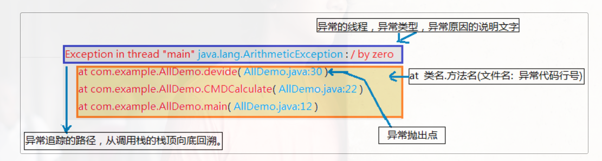
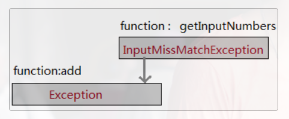

# Java的异常
下面的主要内容基本上来自:
https://how2playlife.com/2019/09/10/10Java%E5%BC%82%E5%B8%B8/
https://www.cnblogs.com/lulipro/p/7504267.html
如有侵权,请告知作者。

程序中出现了不正常的情况。


Java的体系结构

继承自`Exception`中的异常,除了`RuntimeException`之外的所有异常都是受检异常,但是对于继承自`RuntimeException`就是非受检异常。

`Throwable`的下一层分为`Error`和`Exception`，其中`Error`是严重的错误，基本上无能为力。

`Exception`往下分为`RuntimeException`以及非`RuntimeException`。简单来说`RuntimeException`是因为你的问题，就是程序问题。包括下面的问题：

1. 错误的强制类型转换。
2. 数组访问越界。
3. 访问null指针。

上面的问题自己可以通过修正自己的代码来解决，比如，在使用一个变量的时候，可以来检查它是不是为空来避免空指针异常，但是非`RuntimeException`则包括下面问题：

1. 试图超过文件末尾来读取数据。
2. 试图打开一个不存在的文件。
3. 试图根据指定的字符串来查找Class对象，但这个字符串代表的类并不存在。

上面的问题可能不能够仅仅依靠修正程序来解决，因为如果你想检查文件存不存在再打开它，但是检查完之后可能会被消除。或者检查完还未超过文件末尾，但是随后文件内容被删除到读取位置之前。这些全都很难预料。

> Java将派生于Error类或RuntimeException类(以及其子类)的所有异常成为非检查型异常，所有其它的异常称为检查型异常。

上面的这句话是我从Java核心技术上面摘抄出来的，我觉得他这段话有点小问题，派生于Error类，我觉得不能够被称为异常，关于`Throwable`的定义：

> The `Throwable` class is the superclass of all errors and exceptions in the Java language.

很明显errors跟exceptions是不属于一类的。除此之外，我们还需要注意的是：这里说的检查型异常，指的并不是通不过编译，需要在编译的时候就必须要检查出来，现在我们正在讨论的异常以及错误全部都发生在运行中。`RuntimeException`这个名字很容易让人混淆，以为只有这个才是在运行中出现，其实这种异常是由编程导致的，不需要在编译期进行处理(这里的处理指的是不需要提供异常处理器)，所以叫做非检查型异常，而检查型在编译期就会检查是否有异常处理器。

总结上面的话，异常可以被分为两类：1.编译时异常 2.运行时异常 编译时异常也被叫做检查型异常，也就是必须要被显式处理，否则的话通不过编译，而运行时异常也被叫做非检查型异常，不需要显式处理，可以通过编译期。

**RuntimeException需要自己来改,一般情况下不会用异常处理器对其进行处理,但是对于受检异常CheckedException,指的就是非RuntimeException,一般情况下可以用异常处理器来处理。**

## 1.JVM的默认处理

JVM默认处理：

1. 把异常的名称，异常的原因以及异常出现的位置全部都显示出来。
2. 异常之后的代码不予处理。

## 2.关于抛出的异常

1. 对于我们要抛出的异常，我们应当尽量抛出检查型异常，事实上，如果一个方法首部不能够列出所有的异常，通不过编译。

   ```java
   void drawImage(int i) throws ArrayIndexOutOfBoundsException {
       
   }
   ```

   上面的就是一种比较坏的风格，因为`ArrayIndexOutOfBoundsException`是一种运行时错误，应该从一开始就将其避免。

2. 异常的“继承”，对于子类覆盖了父类的方法，子类方法中声明的异常不能够比父类方法中声明的异常更通用，但是可以相同，或者更特定。另外还需要说明的是，如果父类方法中没有抛出检查型异常，子类也不能抛出任何检查型异常。

3. 对于捕获的异常，也就是可以通过一个该异常的父类引用来指向。

   异常类`SubException`继承于`Exception`:

   ```java
   public class SubException extends Exception{
       public ParentException() {}
       public ParentException(String gripe) {
           super(gripe);
       }
   }
   ```

   对于`CheckScore`来说，抛出了`SubException`异常：

   ```java
   public void CheckScore(int score) throws SubException {
   
   }
   ```

   那么我们捕获可以使用`Exception`来捕获：

   ```java
   try {
       t.CheckScore(score);
   } catch (Exception e) {
   
   }
   ```

4. A调用B，A抛出的异常可以是B抛出异常的父类

   ```java
   public void Method() throws Exception {
       CheckScore(50);
   }
   
   public void CheckScore(int score) throws SubException {
   
   }
   ```

   

## 3. 如何抛出异常(关于throws与throw)

`throw` 和`throws`全部都是抛出的意思，但是两者的使用不相同。对于`throws`来说。他是用来说明该方法可能会抛出哪些异常的。

```java
public FileInputStream(String name) throws FileNoFoundException
```

上面表明该方法体可能会抛出`FileNoFoundException`这样的异常。个人认为方法体应该这样：

```java
{
    throw new FileNoFoundException();
}
```

或者应该调用可能会抛出该异常的方法：

```java
{
    Method();    //public void Method() throws FileNoFoundException
}
```

上面是我可以想到的能够抛出异常的两种情况，但是对第二种情况，Method方法会调用其它方法，就这样一直回溯下去，总会找到一个`throw new FileNoFoundException()`这样的语句。但实际上：

```java
public int CheckScore(int score) throws SubException {
    return 0;
}
```

但实际上上面这种情况也不会报错，我个人认为如果一个方法在不显式抛出异常的情况下，也可能抛出异常,见如下情况,但这种属于运行时异常,使用`throws`语句并不应该被建议：

```java
int a = 0;
System.out.println(5 / a);
```

上面的方法会出现`java.lang.ArithmeticException`的异常，但这种情况一般都是因为运行时异常，属于非检查型异常，对于我最初说的那种情况，即方法体内未显式抛出异常或调用抛出异常的函数，而方法首部可以抛出异常，一般指的是检查型异常。非检查型异常一般自己可以通过修正代码来解决，而不是通过抛出异常。尽管非检查型异常可以抛出。

还有就是，如果方法体内显式抛出异常或调用抛出异常的函数，那么方法首部必须抛出异常。

```java
public void Method() throws Exception {
    CheckScore(50);
}

public int CheckScore(int score) throws SubException {
    throw new SubException();
}
```

上面的代码很好说明了这种情况，事实上，这也是非常合理的。

## 4.如何处理异常

对于抛出的异常，通常有两种解决方案，一个是对于抛出的异常，利用`try-catch`将其捕捉，另外一种是将其抛出去。如果将异常捕获了，那么就没有必要往上抛了(比如A调用了B，如果B将异常捕获了，那么A就完全看不到B中的异常)

`try-catch`的用法：

```java
try {
    //可能出现异常的代码
} catch(异常类名 对象名) {
    //异常的处理代码
}
```

如果`try`里面的代码出现了异常，那么抛出的异常会被`catch`捕获到，`catch(异常类名 对象名)`这里的对象就指向该异常，我们可以进行相应的处理，这里需要注意的是：程序并不会因为抛出了异常而中断，因为异常已经被捕获了，会继续往下执行。**如果我们使用的是向上抛出异常的方式，我们程序在抛出异常的地方就会中断，不会继续往下执行。**

```java
public static void main(String[] args) throws Exception {
    throw new Exception("A exception");
    System.out.println("hello");
}
```
但是我们使用`try-catch`可以使代码继续执行:
```java
try {
    throw new Exception("A exception");
} catch (Exception e) {
    e.printStackTrace();
}
System.out.println("hello");
```
上面的代码会输出`hello`.
但是这里需要注意的事情为:
```java
    public static void main(String[] args) {
        System.out.println("开始");
        try {
            int[] a = {1, 2, 3};
            System.out.println(a[3]);
            System.out.println("99999999");
        } catch (ArrayIndexOutOfBoundsException e) {
            e.printStackTrace();
        }
        System.out.println("结束");
    }
```
对于上面的例子,我们可以知道,在`try`下面的代码块中,在语句`System.out.println(a[3])`会抛出异常`ArrayIndexOutOfBoundsException`,事实上,抛出该异常之后,`try`代码块中的剩余内容就不会再执行了,也就是不会再执行`System.out.println("99999999");`语句。上面提到的会继续往下执行,指的是`try-catch`代码块下面的语句`System.out.println("结束");`会继续执行。下面引出关键字`finally`,首先有一个比较大的疑问,就是如果我们使用`catch`捕获了异常之后,下面的程序依旧还会执行,而关键字`finally`的作用的确保在`finally`代码块中的代码必须执行。那么我可以给出这样的解释,就是我们有可能不能够将代码中出现的所有异常全部`catch`到,或者我们并不想处理,这样的情况下,的确会出现后面代码不执行的情况。这样的话,我们给出下面的分析:
如果我们可以捕获到所有的异常的话,那么我们就应该能够完全省略掉下面的`finally`关键字,因为下面的语句肯定会执行,所以我们完全没有必要放到`finally`代码块里。
但是我们捕获所有异常的情况下,有异常抛出,`finally`子句肯定会保证代码的执行。
```java
    try {
        throw new Exception("A exception");
    } catch (Exception e) {
        e.printStackTrace();
    } finally {
        System.out.println("hello");
    }
```
还有一点我们需要注意的是:
**try语句可以没有catch子句,只有finally子句,当然,也可以只有catch子句,而没有finally子句。**
根据我们之前的描述，我们应该注意的是：上面的异常我们应该成为检查型异常，对于错误和运行时异常，我们往往不会将它们抛出来，错误，我们控制不了，但是对于运行时异常来说，我们完全可以控制，我们可以通过修正代码的方式来避免异常的存在。事实上，对于运行时异常来说，因为我们一般不捕获以及不显式抛出，最后他们会隐式地从`main`方法中抛给JVM。
通过下面的这个例子来全面体会一下:
```java
public class 异常处理方式 {

@Test
public void main() {
    try{
        //try块中放可能发生异常的代码。
        InputStream inputStream = new FileInputStream("a.txt");

        //如果执行完try且不发生异常，则接着去执行finally块和finally后面的代码（如果有的话）。
        int i = 1/0;
        //如果发生异常，则尝试去匹配catch块。
        throw new SQLException();
        //使用1.8jdk同时捕获多个异常，runtimeexception也可以捕获。只是捕获后虚拟机也无法处理，所以不建议捕获。
    }catch(SQLException | IOException | ArrayIndexOutOfBoundsException exception){
        System.out.println(exception.getMessage());
        //每一个catch块用于捕获并处理一个特定的异常，或者这异常类型的子类。Java7中可以将多个异常声明在一个catch中。

        //catch后面的括号定义了异常类型和异常参数。如果异常与之匹配且是最先匹配到的，则虚拟机将使用这个catch块来处理异常。

        //在catch块中可以使用这个块的异常参数来获取异常的相关信息。异常参数是这个catch块中的局部变量，其它块不能访问。

        //如果当前try块中发生的异常在后续的所有catch中都没捕获到，则先去执行finally，然后到这个函数的外部caller中去匹配异常处理器。

        //如果try中没有发生异常，则所有的catch块将被忽略。

    }catch(Exception exception){
        System.out.println(exception.getMessage());
        //...
    }finally{
        //finally块通常是可选的。
        //无论异常是否发生，异常是否匹配被处理，finally都会执行。

        //finally主要做一些清理工作，如流的关闭，数据库连接的关闭等。
    }
}    
```
还有一个比较有意思的Demo:
```java
    public static void main(String[] args) {
        try {
            throwE();
            System.out.println("我前面抛出异常了");
            System.out.println("我不会执行了");
        }  catch (Exception ex) {
            //在catch块中仍然可以使用try catch finally
            try {
                throw new Exception();
            } catch (Exception ee) {

            } finally {
                System.out.println("我所在的catch块没有执行，我也不会执行的");
            }
        }
    }

    private static void throwE() {
        throw new StringIndexOutOfBoundsException();
    }
}
```
上面这个例子中在catch里面还有一个`try - catch - finally`结构,一般情况下来说,finally是用来保证一定要执行的,但是还有比较特殊的情况,就是如果所在的`catch`块没有执行的话,那么也不会执行`finally`里面的代码。

try-catch-finally语句块的具体用法
```java
try{
     //try块中放可能发生异常的代码。     //如果执行完try且不发生异常，则接着去执行finally块和finally后面的代码（如果有的话）。     //如果发生异常，则尝试去匹配catch块。

}catch(SQLException SQLexception){
    //每一个catch块用于捕获并处理一个特定的异常，或者这异常类型的子类。Java7中可以将多个异常声明在一个catch中。
    //catch后面的括号定义了异常类型和异常参数。如果异常与之匹配且是最先匹配到的，则虚拟机将使用这个catch块来处理异常。
    //在catch块中可以使用这个块的异常参数来获取异常的相关信息。异常参数是这个catch块中的局部变量，其它块不能访问。
    //如果当前try块中发生的异常在后续的所有catch中都没捕获到，则先去执行finally，然后到这个函数的外部caller中去匹配异常处理器。    
    //如果try中没有发生异常，则所有的catch块将被忽略。
}catch(Exception exception){
    //...
}finally{
       //finally块通常是可选的。   //无论异常是否发生，异常是否匹配被处理，finally都会执行。
   //一个try至少要有一个catch块，否则， 至少要有1个finally块。但是finally不是用来处理异常的，finally不会捕获异常。
  //finally主要做一些清理工作，如流的关闭，数据库连接的关闭等。 
}
```
**需要注意的地方**
1、try块中的局部变量和catch块中的局部变量（包括异常变量），以及finally中的局部变量，他们之间不可共享使用。
 
2、每一个catch块用于处理一个异常。异常匹配是按照catch块的顺序从上往下寻找的，只有第一个匹配的catch会得到执行。匹配时，不仅运行精确匹配，也支持父类匹配，因此，如果同一个try块下的多个catch异常类型有父子关系，应该将子类异常放在前面，父类异常放在后面，这样保证每个catch块都有存在的意义。
 
3、java中，异常处理的任务就是将执行控制流从异常发生的地方转移到能够处理这种异常的地方去。也就是说：当一个函数的某条语句发生异常时，这条语句的后面的语句不会再执行，它失去了焦点。执行流跳转到最近的匹配的异常处理catch代码块去执行，异常被处理完后，执行流会接着在“处理了这个异常的catch代码块”后面接着执行。
有的编程语言当异常被处理后，控制流会恢复到异常抛出点接着执行，这种策略叫做：resumption model of exception handling（恢复式异常处理模式 ）
而Java则是让执行流恢复到处理了异常的catch块后接着执行，这种策略叫做：termination model of exception handling（终结式异常处理模式）
throws函数声明
如果一个方法内部的代码会抛出检查异常（checked exception），而方法自己又没有完全处理掉，则javac保证你必须在方法的签名上使用throws关键字声明这些可能抛出的异常，否则编译不通过。

throws是另一种处理异常的方式，它不同于try...catch...finally，throws仅仅是将函数中可能出现的异常向调用者声明，而自己则不具体处理。

采取这种异常处理的原因可能是：方法本身不知道如何处理这样的异常，或者说让调用者处理更好，调用者需要为可能发生的异常负责。
```java
public void foo() throws ExceptionType1 , ExceptionType2 ,ExceptionTypeN
{ 
     //foo内部可以抛出 ExceptionType1 , ExceptionType2 ,ExceptionTypeN 类的异常，或者他们的子类的异常对象。
}
```


关于`finally`:
finally块不管异常是否发生，只要对应的try执行了，则它一定也执行。只有一种方法让finally块不执行：System.exit()。因此finally块通常用来做资源释放操作：关闭文件，关闭数据库连接等等。
良好的编程习惯是：在try块中打开资源，在finally块中清理释放这些资源。
需要注意的地方:
1、finally块没有处理异常的能力。处理异常的只能是catch块。

2、在同一try…catch…finally块中 ，如果try中抛出异常，且有匹配的catch块，则先执行catch块，再执行finally块。如果没有catch块匹配，则先执行finally，然后去外面的调用者中寻找合适的catch块。

3、在同一try…catch…finally块中 ，try发生异常，且匹配的catch块中处理异常时也抛出异常，那么后面的finally也会执行：首先执行finally块，然后去外围调用者中寻找合适的catch块。

关于`throw`关键字

throw exceptionObject

程序员也可以通过throw语句手动显式的抛出一个异常。throw语句的后面必须是一个异常对象。

throw 语句必须写在函数中，执行throw 语句的地方就是一个异常抛出点，它和由JRE自动形成的异常抛出点没有任何差别

```java
public void save(User user)
{
    if(user  == null) 
        throw new IllegalArgumentException("User对象为空");
    //......
}
```

在这里补充一个小知识点:

在单个`catch`代码块中捕获多个异常
在Java7中，catch代码块得到了升级，用以在单个catch块中处理多个异常。

在Java7之前的代码:
```java
catch (IOException ex) {
     logger.error(ex);
     throw new MyException(ex.getMessage());
catch (SQLException ex) {
     logger.error(ex);
     throw new MyException(ex.getMessage());
}catch (Exception ex) {
     logger.error(ex);
     throw new MyException(ex.getMessage());
}
```
在Java7中，我们可以用一个catch捕获所有这些异常
```java
catch(IOException | SQLException | Exception ex){
     logger.error(ex);
     throw new MyException(ex.getMessage());
}
```
如果用一个catch块处理多个异常，可以用管道符将它们分开，在这种情况下异常参数变量ex是定义为final的，所以不能被修改。这一特性将生成更少的字节码并减少代码冗余。


## 5.创建自己的异常类

如果任何标准异常类都无法描述清楚的问题，那么我们应该创建自己的异常类。我们可以定义一个派生于`Exception`的类，或者派生于`Exception`的子类。一般习惯的做法是这样的：

```java
class XXXException extends Exception {
    public XXXException() {} //默认构造函数
    public XXXException(String gripe) {  //包含详细描述信息的构造器
        super(gripe);
    }
}
```

所有的异常类的父类是`Throwable`，所以我们可以在初始化异常类的时候，也会将`Throwable`初始化。

```java
public Throwable() {} //默认构造函数
```

```java
public Throwable(String message) {	//构造一个新的Throwable对象，带有指定的详细描述信息。
    fillInStackTrace();
    detailMessage = message;
}
```

其中`getMessage`方法获取`Throwable`对象的详细信息：

```java
public String getMessage() {
    return detailMessage;
}
```

如果我们定义的异常类，有包含详细描述信息的构造器，那么也会调用`Throwable`包含详细描述信息的构造器。之后配合`Throwable`的`toString`方法，将会返回详细信息的字符串。

```java
public String toString() {
    String s = getClass().getName();
    String message = getLocalizedMessage();
    return (message != null) ? (s + ": " + message) : s;
}
```

除了上面的`getMessage()`和`toString()`以外，还有一个方法`printStackTrace()`也可以打印异常的信息。但是`getMessage()`最简略，`toString()`居中，`printStackTrace()`最详细。

`getMessage()`只输出异常出现的原因：


`toString()`还输出异常类名：


`printStackTrace()`还输出出错位置：


补充一个小知识点:
& && | || 
&&和&都是表示与，区别是&&只要第一个条件不满足，后面条件就不再判断。而&要对所有的条件都进行判断。
||和|都是表示“或”，区别是||只要满足第一个条件，后面的条件就不再判断，而|要对所有的条件进行判断。

## 异常链
异常是在执行某个函数时引发的，而函数又是层级调用，形成调用栈的，因为，只要一个函数发生了异常，那么他的所有的caller都会被异常影响。当这些被影响的函数以异常信息输出时，就形成的了异常追踪栈。

异常最先发生的地方，叫做异常抛出点。


异常的链化

在一些大型的，模块化的软件开发中，一旦一个地方发生异常，则如骨牌效应一样，将导致一连串的异常。假设B模块完成自己的逻辑需要调用A模块的方法，如果A模块发生异常，则B也将不能完成而发生异常。

==但是B在抛出异常时，会将A的异常信息掩盖掉，这将使得异常的根源信息丢失。异常的链化可以将多个模块的异常串联起来，使得异常信息不会丢失。==

异常链化:以一个异常对象为参数构造新的异常对象。新的异对象将包含先前异常的信息。这项技术主要是异常类的一个带Throwable参数的函数来实现的。这个当做参数的异常，我们叫他根源异常（cause）。

查看Throwable类源码，可以发现里面有一个Throwable字段cause，就是它保存了构造时传递的根源异常参数。这种设计和链表的结点类设计如出一辙，因此形成链也是自然的了。
```java
public class Throwable implements Serializable {
    private Throwable cause = this;

    public Throwable(String message, Throwable cause) {
        fillInStackTrace();
        detailMessage = message;
        this.cause = cause;
    }
     public Throwable(Throwable cause) {
        fillInStackTrace();
        detailMessage = (cause==null ? null : cause.toString());
        this.cause = cause;
    }

    //........
}
```
下面是一个例子:
```java
    public static void main(String[] args)
    {

        System.out.println("请输入2个加数");
        int result;
        try
        {
            result = add();
            System.out.println("结果:"+result);
        } catch (Exception e){
            e.printStackTrace();
        }
    }
    //获取输入的2个整数返回
    private static List<Integer> getInputNumbers()
    {
        List<Integer> nums = new ArrayList<>();
        Scanner scan = new Scanner(System.in);
        try {
            int num1 = scan.nextInt();
            int num2 = scan.nextInt();
            nums.add(new Integer(num1));
            nums.add(new Integer(num2));
        } catch (InputMismatchException immExp){
            throw immExp;
        } finally {
            scan.close();
        }
        return nums;
    }

    //执行加法计算
    private static int add() throws Exception
    {
        int result;
        try {
            List<Integer> nums =getInputNumbers();
            result = nums.get(0)  + nums.get(1);
        } catch (InputMismatchException immExp){
            throw new Exception("计算失败",immExp);  /////////////////////////////链化:以一个异常对象为参数构造新的异常对象。
        }
        return  result;
    }
```
下面是异常信息:
```
java.lang.Exception: 计算失败
	at com.zjs.Demo2.add(Demo2.java:52)
	at com.zjs.Demo2.main(Demo2.java:20)
Caused by: java.util.InputMismatchException
	at java.util.Scanner.throwFor(Scanner.java:864)
	at java.util.Scanner.next(Scanner.java:1485)
	at java.util.Scanner.nextInt(Scanner.java:2117)
	at java.util.Scanner.nextInt(Scanner.java:2076)
	at com.zjs.Demo2.getInputNumbers(Demo2.java:32)
	at com.zjs.Demo2.add(Demo2.java:49)
	... 1 more
```

如果我们将上面的`throw new Exception("计算失败", immExp);`改成`throw immExp;`的话,异常信息会变成如下:
```
java.util.InputMismatchException
	at java.util.Scanner.throwFor(Scanner.java:864)
	at java.util.Scanner.next(Scanner.java:1485)
	at java.util.Scanner.nextInt(Scanner.java:2117)
	at java.util.Scanner.nextInt(Scanner.java:2076)
	at com.zjs.Demo2.getInputNumbers(Demo2.java:32)
	at com.zjs.Demo2.add(Demo2.java:49)
	at com.zjs.Demo2.main(Demo2.java:20)
```
对比之前的来说,我们并没有发现出现`at com.zjs.Demo2.add(Demo2.java:52)`这条语句,而这条语句正好对应着`throw new Exception("计算失败",immExp);`,也就是说我们在正常情况下在异常信息中是不会出现`throw`这条语句的,因为这只是将错误抛出来并不是错误的根源。除非这条语句是真正的根源,比如在语句中出现了`new Exception()`,新创建了一个异常。

## 自定义异常
如果要自定义异常类，则扩展Exception类即可，因此这样的自定义异常都属于检查异常（checked exception）。如果要自定义非检查异常，则扩展自RuntimeException。

按照国际惯例，自定义的异常应该总是包含如下的构造函数:

一个无参构造函数
一个带有String参数的构造函数，并传递给父类的构造函数。
一个带有String参数和Throwable参数，并都传递给父类构造函数
一个带有Throwable 参数的构造函数，并传递给父类的构造函数。
下面是IOException类的完整源代码，可以借鉴。
```java
public class IOException extends Exception {
    static final long serialVersionUID = 7818375828146090155L;

    public IOException()
    {
        super();
    }

    public IOException(String message)
    {
        super(message);
    }

    public IOException(String message, Throwable cause)
    {
        super(message, cause);
    }

    public IOException(Throwable cause)
    {
        super(cause);
    }
}
```

## 异常的注意事项
> 当子类重写父类的带有throws声明的函数时，其throws声明的异常必须在父类异常的可控范围内——用于处理父类的throws方法的异常处理器，必须也适用于子类的这个带throws方法。这是为了支持多态。

> 例如，父类方法throws的是2个异常，子类就不能throws3个及以上的异常。父类throws IOException，子类就必须throws IOException或者IOException的子类。

```java
class Father
{
    public void start() throws IOException
    {
        throw new IOException();
    }
}

class Son extends Father
{
    public void start() throws Exception
    {
        throw new SQLException();
    }
}
```
如果上面的代码是正确,那么下面的代码就不够实现多态。
```java
class Test
{
    public static void main(String[] args)
    {
        Father[] objs = new Father[2];
        objs[0] = new Father();
        objs[1] = new Son();

        for(Father obj : objs) {
        //因为Son类抛出的实质是SQLException，而IOException无法处理它
        //那么这里的try - catch就不能处理Son中的异常
        //多态就不能实现了
            try {
                 obj.start();
            } catch (IOException) {
                 //处理IOException
            }
        }
    }
}    
```
> Java程序可以是多线程的。每一个线程都是一个独立的执行流，独立的函数调用栈。如果程序只有一个线程，那么没有被任何代码处理的异常 会导致程序终止。如果是多线程的，那么没有被任何代码处理的异常仅仅会导致异常所在的线程结束。
也就是说，Java中的异常是线程独立的，线程的问题应该由线程自己来解决，而不要委托到外部，也不会直接影响到其它线程的执行。

```java
public class 多线程的异常 {
    @Test
    public void test() {
        go();
    }
    public void go () {
        ExecutorService executorService = Executors.newFixedThreadPool(3);
        for (int i = 0;i <= 2;i ++) {
            int finalI = i;
            try {
                Thread.sleep(2000);
            } catch (InterruptedException e) {
                e.printStackTrace();
            }
            executorService.execute(new Runnable() {
                @Override
                //每个线程抛出异常时并不会影响其他线程的继续执行
                public void run() {
                    try {
                        System.out.println("start thread" + finalI);
                        throw new Exception();
                    }catch (Exception e) {
                        System.out.println("thread" + finalI + " go wrong");
                    }
                }
            });
        }
//        结果：
//        start thread0
//        thread0 go wrong
//        start thread1
//        thread1 go wrong
//        start thread2
//        thread2 go wrong
    }
}
```
## 当finally遇上return
```java
public static void main(String[] args)
{
    int re = bar();
    System.out.println(re);
}
private static int bar() 
{
    try{
        return 5;
    } finally{
        System.out.println("finally");
    }
}
/*输出：
finally
5
*/
```
try...catch...finally中的return 只要能执行，就都执行了，他们共同向同一个内存地址（假设地址是0x80）写入返回值，后执行的将覆盖先执行的数据，而真正被调用者取的返回值就是最后一次写入的。那么，按照这个思想，下面的这个例子也就不难理解了。


###  finally中的return会覆盖try或者catch中的返回值
```java
public static void main(String[] args)
    {
        int result;
        
        result  =  foo();
        System.out.println(result);     /////////2
        
        result = bar();
        System.out.println(result);    /////////2
    }

    @SuppressWarnings("finally")
    public static int foo()
    {
        trz{
            int a = 5 / 0;
        } catch (Exception e){
            return 1;
        } finally{
            return 2;
        }

    }

    @SuppressWarnings("finally")
    public static int bar()
    {
        try {
            return 1;
        }finally {
            return 2;
        }
    }
}
```
### finally中的return会抑制（消灭）前面try或者catch块中的异常
```java
class TestException
{
    public static void main(String[] args)
    {
        int result;
        try{
            result = foo();
            System.out.println(result);           //输出100
        } catch (Exception e){
            System.out.println(e.getMessage());    //没有捕获到异常
        }
        
        
        try{
            result  = bar();
            System.out.println(result);           //输出100
        } catch (Exception e){
            System.out.println(e.getMessage());    //没有捕获到异常
        }
    }
    
    //catch中的异常被抑制
    @SuppressWarnings("finally")
    public static int foo() throws Exception
    {
        try {
            int a = 5/0;
            return 1;
        }catch(ArithmeticException amExp) {
            throw new Exception("我将被忽略，因为下面的finally中使用了return");
        }finally {
            return 100;
        }
    }
    
    //try中的异常被抑制
    @SuppressWarnings("finally")
    public static int bar() throws Exception
    {
        try {
            int a = 5/0;
            return 1;
        }finally {
            return 100;
        }
    }
}
```
### finally中的异常会覆盖（消灭）前面try或者catch中的异常
```java
class TestException
{
    public static void main(String[] args)
    {
        int result;
        try{
            result = foo();
        } catch (Exception e){
            System.out.println(e.getMessage());    //输出：我是finally中的Exception
        }
        
        
        try{
            result  = bar();
        } catch (Exception e){
            System.out.println(e.getMessage());    //输出：我是finally中的Exception
        }
    }
    
    //catch中的异常被抑制
    @SuppressWarnings("finally")
    public static int foo() throws Exception
    {
        try {
            int a = 5/0;
            return 1;
        }catch(ArithmeticException amExp) {
            throw new Exception("我将被忽略，因为下面的finally中抛出了新的异常");
        }finally {
            throw new Exception("我是finally中的Exception");
        }
    }
    
    //try中的异常被抑制
    @SuppressWarnings("finally")
    public static int bar() throws Exception
    {
        try {
            int a = 5/0;
            return 1;
        }finally {
            throw new Exception("我是finally中的Exception");
        }
        
    }
}
```
上面的3个例子都异于常人的编码思维，因此我建议：

不要在finally中使用return。
不要在finally中抛出异常。
减轻finally的任务，不要在finally中做一些其它的事情，finally块仅仅用来释放资源是最合适的。
将尽量将所有的return写在函数的最后面，而不是try ... catch ... finally中。

## Java中的异常面试题
1. Java中什么是Exception? 
   这个问题经常在第一次问有关异常的时候或者是面试菜鸟的时候问。我从来没见过面高级或者资深工程师的时候有人问这玩意，但是对于菜鸟，是很愿意问这个的。简单来说，异常是Java传达给你的系统和程序错误的方式。在java中，异常功能是通过实现比如Throwable，Exception，RuntimeException之类的类，然后还有一些处理异常时候的关键字，比如throw，throws，try，catch，finally之类的。 所有的异常都是通过Throwable衍生出来的。Throwable把错误进一步划分为 java.lang.Exception 和 java.lang.Error.  java.lang.Error 用来处理系统错误，例如java.lang.StackOverFlowError 之类的。然后 Exception用来处理程序错误，请求的资源不可用等等。
2. Java中的检查型异常和非检查型异常有什么区别？
   这又是一个非常流行的Java异常面试题，会出现在各种层次的Java面试中。检查型异常和非检查型异常的主要区别在于其处理方式。检查型异常需要使用try, catch和finally关键字在编译期进行处理，否则会出现编译器会报错。对于非检查型异常则不需要这样做。Java中所有继承自java.lang.Exception类的异常都是检查型异常，所有继承自RuntimeException的异常都被称为非检查型异常。
3. Java中的NullPointerException和ArrayIndexOutOfBoundException之间有什么相同之处？
   在Java异常面试中这并不是一个很流行的问题，但会出现在不同层次的初学者面试中，用来测试应聘者对检查型异常和非检查型异常的概念是否熟悉。顺便说一下，该题的答案是，这两个异常都是非检查型异常，都继承自RuntimeException。该问题可能会引出另一个问题，即Java和C的数组有什么不同之处，因为C里面的数组是没有大小限制的，绝对不会抛出ArrayIndexOutOfBoundException。
4. 在Java异常处理的过程中，你遵循的那些最好的实践是什么？
   这个问题在面试技术经理是非常常见的一个问题。因为异常处理在项目设计中是非常关键的，所以精通异常处理是十分必要的。异常处理有很多最佳实践，下面列举集中，它们提高你代码的健壮性和灵活性：
　　1) 调用方法的时候返回布尔值来代替返回null，这样可以防止NullPointerException。由于空指针是java异常里最恶心的异常
　　2) catch块里别不写代码。空catch块是异常处理里的错误事件，因为它只是捕获了异常，却没有任何处理或者提示。通常你起码要打印出异常信息，当然你最好根据需求对异常信息进行处理。
　　3)能抛受控异常（checked Exception）就尽量不抛受非控异常(unchecked Exception)。通过去掉重复的异常处理代码，可以提高代码的可读性。
　　4) 绝对不要让你的数据库相关异常显示到客户端。由于绝大多数数据库和SQLException异常都是受控异常，在Java中，你应该在DAO层把异常信息处理，然后返回处理过的能让用户看懂并根据异常提示信息改正操作的异常信息。
　　5) 在Java中，一定要在数据库连接，数据库查询，流处理后，在finally块中调用close()方法。
5. 既然我们可以用RuntimeException来处理错误，那么你认为为什么Java中还存在检查型异常?
   这是一个有争议的问题，在回答该问题时你应当小心。虽然他们肯定愿意听到你的观点，但其实他们最感兴趣的还是有说服力的理由。我认为其中一个理由是，存在检查型异常是一个设计上的决定，受到了诸如C++等比Java更早编程语言设计经验的影响。绝大多数检查型异常位于java.io包内，这是合乎情理的，因为在你请求了不存在的系统资源的时候，一段强壮的程序必须能够优雅的处理这种情况。通过把IOException声明为检查型异常，Java 确保了你能够优雅的对异常进行处理。另一个可能的理由是，可以使用catch或finally来确保数量受限的系统资源（比如文件描述符）在你使用后尽早得到释放。 Joshua Bloch编写的 Effective Java 一书 中多处涉及到了该话题，值得一读。
6. throw 和 throws这两个关键字在java中有什么不同?
   一个java初学者应该掌握的面试问题。 throw 和 throws乍看起来是很相似的尤其是在你还是一个java初学者的时候。尽管他们看起来相似，都是在处理异常时候使用到的。但在代码里的使用方法和用到的地方是不同的。throws总是出现在一个函数头中，用来标明该成员函数可能抛出的各种异常, 你也可以申明未检查的异常，但这不是编译器强制的。如果方法抛出了异常那么调用这个方法的时候就需要将这个异常处理。另一个关键字  throw 是用来抛出任意异常的，按照语法你可以抛出任意 Throwable (i.e. Throwable 或任何Throwable的衍生类) , throw可以中断程序运行，因此可以用来代替return . 最常见的例子是用 throw 在一个空方法中需要return的地方抛出 UnSupportedOperationException 代码如下 :
   ```java
   private static void show() {
       throw new UnsupportedOperationException("Not yet implemented");
   }
   ```
7. 什么是“异常链”?
   应用程序通常会通过抛出另一个异常来响应异常。 实际上，第一个异常引起第二个异常。 它可以是非常有助于用户知道什么时候一个异常导致另一个异常。 “异常链（Chained Exceptions）”帮助程序员做到这一点。
   以下是Throwable中支持异常链的方法和构造函数:
   ```java
    Throwable getCause()
    Throwable initCause(Throwable)
    Throwable(String, Throwable)
    Throwable(Throwable)
   ```
   initCause和Throwable构造函数的Throwable参数是导致当前异常的异常。 getCause返回导致当前异常的异常，initCause设置当前异常的原因。
   以下示例显示如何使用异常链:
   ```java
   try {

   } catch (IOException e) {
        throw new SampleException("Other IOException", e);
   }
   ```
   在此示例中，当捕获到IOException时，将创建一个新的SampleException异常，并附加原始的异常原因，并将异常链抛出到下一个更高级别的异常处理程序。 
   异常链确实能够将受检异常转化成非受检异常:
   ```java
    public static void main(String[] args) {
        throw new UncheckedException();
    }

    public void throwException() {
        try {
            throw new IOException();
        } catch (IOException e) {
            throw new UncheckedException("IO异常", e);
        }
    }

    public static class UncheckedException extends RuntimeException {
        static final long serialVersionUID = 7818375828146090155L;

        public UncheckedException()
        {
            super();
        }

        public UncheckedException(String message)
        {
            super(message);
        }

        public UncheckedException(String message, Throwable cause)
        {
            super(message, cause);
        }

        public UncheckedException(Throwable cause)
        {
            super(cause);
        }
    }
   ```
   但是还发现了一个有趣的情况,就是我们使用`throw new Exception()`的时候,会发现抛出的异常也必须要使用`try-catch-finally`处理,或者使用`throws`将其抛出到`caller`中,并且只有继承`RuntimeException`的才能够作为非受检异常,但是对于继承于他的`Exception`的不能够作为非受检异常,还需要作为受检异常来处理,不过默认作为受检异常来处理肯定是比较安全的方法。
   对于受检异常来说,其实也能够用`try - catch - finally`来处理。
   ```java
   public static void main(String[] args) {
        try {
            int a = 5 / 0;
        } catch (Exception e) {
            e.printStackTrace();
        }
   }
   ```
8. 你曾经自定义实现过异常吗？怎么写的?
   很显然，我们绝大多数都写过自定义或者业务异常，像AccountNotFoundException。在面试过程中询问这个Java异常问题的主要原因是去发现你如何使用这个特性的。这可以更准确和精致的去处理异常，当然这也跟你选择checked 还是unchecked exception息息相关。通过为每一个特定的情况创建一个特定的异常，你就为调用者更好的处理异常提供了更好的选择。相比通用异常（general exception)，我更倾向更为精确的异常。大量的创建自定义异常会增加项目class的个数，因此，在自定义异常和通用异常之间维持一个平衡是成功的关键。
9. JDK7中对异常处理做了什么改变？
    这是最近新出的Java异常处理的面试题。JDK7中对错误(Error)和异常(Exception)处理主要新增加了2个特性，一是在一个catch块中可以出来多个异常，就像原来用多个catch块一样。另一个是自动化资源管理(ARM), 也称为try-with-resource块。这2个特性都可以在处理异常时减少代码量，同时提高代码的可读性。对于这些特性了解，不仅帮助开发者写出更好的异常处理的代码，也让你在面试中显的更突出。我推荐大家读一下Java 7攻略，这样可以更深入的了解这2个非常有用的特性。
10. 你遇到过 `OutOfMemoryError` 错误嘛？你是怎么搞定的？
    这个面试题会在面试高级程序员的时候用，面试官想知道你是怎么处理这个危险的OutOfMemoryError错误的。必须承认的是，不管你做什么项目，你都会碰到这个问题。所以你要是说没遇到过，面试官肯定不会买账。要是你对这个问题不熟悉，甚至就是没碰到过，而你又有3、4年的Java经验了，那么准备好处理这个问题吧。在回答这个问题的同时，你也可以借机向面试秀一下你处理内存泄露、调优和调试方面的牛逼技能。我发现掌握这些技术的人都能给面试官留下深刻的印象。
11. 如果执行finally代码块之前方法返回了结果，或者JVM退出了，finally块中的代码还会执行吗？
    这个问题也可以换个方式问：“如果在try或者finally的代码块中调用了System.exit()，结果会是怎样”。了解finally块是怎么执行的，即使是try里面已经使用了return返回结果的情况，对了解Java的异常处理都非常有价值。只有在try里面是有System.exit(0)来退出JVM的情况下finally块中的代码才不会执行。
12. Java中`final`,`finalize`,`finally`关键字的区别
    这是一个经典的Java面试题了。我的一个朋友为Morgan Stanley招电信方面的核心Java开发人员的时候就问过这个问题。final和finally是Java的关键字，而finalize则是方法。final关键字在创建不可变的类的时候非常有用，只是声明这个类是final的。而finalize()方法则是垃圾回收器在回收一个对象前调用，但也Java规范里面没有保证这个方法一定会被调用。finally关键字是唯一一个和这篇文章讨论到的异常处理相关的关键字。在你的产品代码中，在关闭连接和资源文件的是时候都必须要用到finally块。
13.     