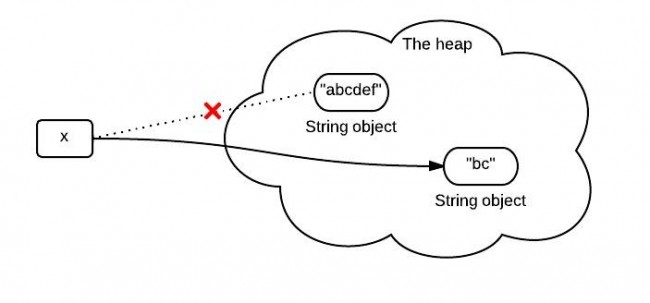
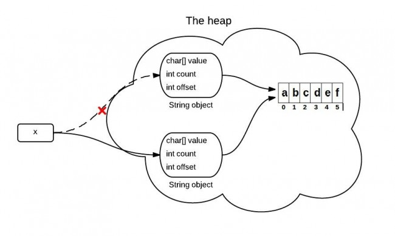
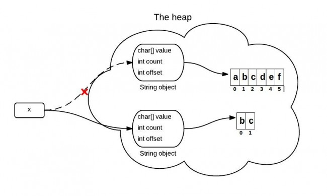
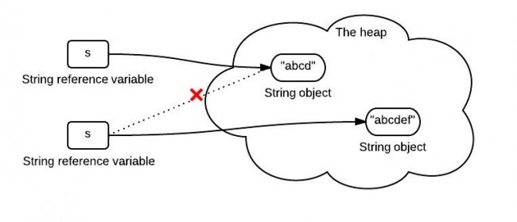
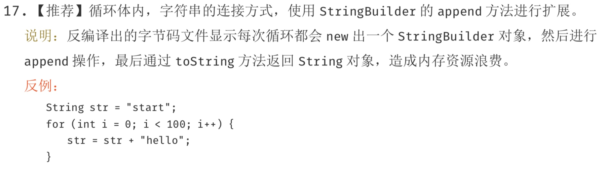

<!-- TOC -->

- [String](#string)
  - [字符串的比较](#字符串的比较)
  - [`substring()`](#substring)
    - [`substring()`方法的作用](#substring方法的作用)
    - [`JDK 6`中的`substring()`](#jdk-6中的substring)
    - [`JDK 6`中的`substring`导致的问题](#jdk-6中的substring导致的问题)
    - [`JDK 7`中的`substring`](#jdk-7中的substring)
    - [`replaceFirst`、`replaceAll`与`replace`的区别](#replacefirstreplaceall与replace的区别)
    - [`String`对`+`的重载](#string对的重载)
  - [字符串拼接](#字符串拼接)
    - [字符串不变性与字符串拼接](#字符串不变性与字符串拼接)
      - [使用`+`拼接字符串](#使用拼接字符串)
    - [字符串拼接的总结](#字符串拼接的总结)
  - [`String.valueOf`和`Integer.toString`的区别](#stringvalueof和integertostring的区别)
  - [`switch`对`String`的支持](#switch对string的支持)
    - [`switch`对`int`的支持](#switch对int的支持)
    - [`switch`对`char`的支持](#switch对char的支持)
    - [`switch`对字符串支持的实现](#switch对字符串支持的实现)
  - [字符串池](#字符串池)
    - [字符串常量池的位置](#字符串常量池的位置)
  - [`Class`常量池](#class常量池)
    - [`Class`文件](#class文件)
    - [`Class`常量池](#class常量池-1)
      - [字面量](#字面量)
      - [符号引用](#符号引用)
  - [运行时常量池](#运行时常量池)
  - [`intern`](#intern)
- [StringBuilder](#stringbuilder)

<!-- /TOC -->
# String
在Java中，`String`是一个引用类型，它本身也是一个`class`。但是，Java编译器对`String`有特殊处理，即可以直接用`"..."`来表示一个字符串：
```java
String s1 = "Hello!";
```
实际上字符串在`String`内部是通过一个`char[]`数组表示的，因此，按下面的写法也是可以的：
```java
String s2 = new String(new char[] {'H', 'e', 'l', 'l', 'o', '!'});
```
Java字符串的一个重要特点就是字符串不可变。这种不可变性是通过内部的`private final char[]`字段，以及没有任何修改`char[]`的方法实现的。
```java
public class Main {
    public static void main(String[] args) {
        String s = "Hello";
        System.out.println(s);
        s = s.toUpperCase();
        System.out.println(s);
    }
}
```

## 字符串的比较
当我们想要比较两个字符串是否相同时，要特别注意，我们实际上是想比较字符串的内容是否相同。必须使用`equals()`方法而不能用`==`。
我们看下面的例子：
```java
public class Main {
    public static void main(String[] args) {
        String s1 = "hello";
        String s2 = "hello";
        System.out.println(s1 == s2);
        System.out.println(s1.equals(s2));
    }
}
```
从表面上看，两个字符串用`==`和`equals()`比较都为`true`，但实际上那只是Java编译器在编译期，会自动把所有相同的字符串当作一个对象放入常量池，自然`s1`和`s2`的引用就是相同的。
上面的这段的代码可以这样解释:直接使用双引号声明出来的`String`对象会直接存储在常量池中,所以我们的`s1`指向常量池上的`"hello"`,我们使用`""`来创建字符串对象的时候,**先检查常量池上有没有这个字符串,如果有这个字符串,那么我们就直接引用,如果没有,那么我们就会创建它,然后再引用它。**所以说上面的这个例子中`s1`和`s2`的引用是相同的。但是如果我们向下面这样的话,他们就不会相等了。
```java
public static void main(String[] args) throws IOException {
    String s2 = new String("abc");
    String s1 = "abc";
    System.out.println(s1 == s2);
}
```
这是因为我们使用`new`创建的字符串不会放到常量池中,所以后面的`s2`引用与它不相同。

这里我们补充一个知识点:**对象变量并没有实际包含一个对象,它只是引用一个对象,在Java中,任何对象变量的值都是对存储在另一个地方的某个对象的引用,new操作符的返回值也是一个引用。**

所以，这种`==`比较返回`true`纯属巧合。换一种写法，`==`比较就会失败：
```java
public class Main {
    public static void main(String[] args) {
        String s1 = "hello";
        String s2 = "HELLO".toLowerCase();
        System.out.println(s1 == s2);
        System.out.println(s1.equals(s2));
    }
}
```
也就是说,**字符串操作不改变原字符串内容，而是返回新字符串；**
一旦一个`string`对象在内存(堆)中被创建出来，他就无法被修改。特别要注意的是，`String`类的所有方法都没有改变字符串本身的值，都是返回了一个新的对象。
如果你需要一个可修改的字符串，应该使用`StringBuffer` 或者 `StringBuilder`。否则会有大量时间浪费在垃圾回收上，因为每次试图修改都有新的`string`对象被创建出来。

结论：两个字符串比较，必须总是使用`equals()`方法。
要忽略大小写比较，使用`equalsIgnoreCase()`方法。
`String`类还提供了多种方法来搜索子串、提取子串。常用的方法有：
```java
// 是否包含子串:
"Hello".contains("ll"); // true
```
注意到`contains()`方法的参数是`CharSequence`而不是`String`，因为`CharSequence`是`String`的父类。
搜索子串的更多的例子：
```java
"Hello".indexOf("l"); // 2
"Hello".lastIndexOf("l"); // 3
"Hello".startsWith("He"); // true
"Hello".endsWith("lo"); // true
```
提取子串的例子：
```java
"Hello".substring(2); // "llo"
"Hello".substring(2, 4); "ll"
```
注意索引号是从`0`开始的。

## `substring()`

### `substring()`方法的作用
`substring(int beginIndex, int endIndex)`方法截取字符串并返回其`[beginIndex,endIndex-1]`范围内的内容。
因为x是不可变的，当使用x.substring(1,3)对x赋值的时候，它会指向一个全新的字符串：

这个图不是完全正确的表示堆中发生的事情。因为在jdk6 和 jdk7中调用substring时发生的事情并不一样.

### `JDK 6`中的`substring()`
`String`是通过字符数组实现的。在`jdk 6` 中，`String`类包含三个成员变量：`char value[]`， `int offset`，`int count`。他们分别用来存储真正的字符数组，数组的第一个位置索引以及字符串中包含的字符个数。
当调用`substring`方法的时候，会创建一个新的`string`对象，但是这个`string`的值仍然指向堆中的同一个字符数组。这两个对象中只有`count`和`offset` 的值是不同的。

源代码如下:
```java
//JDK 6
String(int offset, int count, char value[]) {
    this.value = value;
    this.offset = offset;
    this.count = count;
}

public String substring(int beginIndex, int endIndex) {
    //check boundary
    return  new String(offset + beginIndex, endIndex - beginIndex, value);
}
```

### `JDK 6`中的`substring`导致的问题
如果你有一个很长很长的字符串，但是当你使用`substring`进行切割的时候你只需要很短的一段。这可能导致性能问题，因为你需要的只是一小段字符序列，但是你却引用了整个字符串(因为这个非常长的字符数组一直在被引用，所以无法被回收，就可能导致内存泄露).在JDK 6中，一般用以下方式来解决该问题，原理其实就是生成一个新的字符串并引用他。
```java
x = x.substring(x, y) + ""
```
> 内存泄露：在计算机科学中，内存泄漏指由于疏忽或错误造成程序未能释放已经不再使用的内存。 内存泄漏并非指内存在物理上的消失，而是应用程序分配某段内存后，由于设计错误，导致在释放该段内存之前就失去了对该段内存的控制，从而造成了内存的浪费。

### `JDK 7`中的`substring`
上面提到的问题，在`jdk 7`中得到解决。在`jdk 7` 中，`substring`方法会在堆内存中创建一个新的数组。

`Java`源码中关于这部分的主要代码如下：
```java
//JDK 7
public String(char value[], int offset, int count) {
    //check boundary
    this.value = Arrays.copyOfRange(value, offset, offset + count);
}

public String substring(int beginIndex, int endIndex) {
    //check boundary
    int subLen = endIndex - beginIndex;
    return new String(value, beginIndex, subLen);
}
```
以上是`JDK 7`中的`subString`方法，其使用`new String`创建了一个新字符串，避免对老字符串的引用。从而解决了内存泄露问题。

### `replaceFirst`、`replaceAll`与`replace`的区别
`replace`、`replaceAll`和`replaceFirst`是`Java`中常用的替换字符的方法,它们的方法定义是：
`replace(CharSequence target, CharSequence replacement)`，用`replacement`替换所有的`target`，两个参数都是字符串。
`replaceAll(String regex, String replacement)`，用`replacement`替换所有的`regex`匹配项，`regex`很明显是个正则表达式，`replacement`是字符串。
`replaceFirst(String regex, String replacement)`，基本和`replaceAll`相同，区别是只替换第一个匹配项。
可以看到，其中`replaceAll`以及`replaceFirst`是和正则表达式有关的，而`replace`和正则表达式无关。
`replaceAll`和`replaceFirst`的区别主要是替换的内容不同，`replaceAll`是替换所有匹配的字符，而`replaceFirst()`仅替换第一次出现的字符

### `String`对`+`的重载
1. `String s = "a" + "b"`，编译器会进行常量折叠(因为两个都是编译期常量，编译期可知)，即变成 `String s = "ab"`
2. 对于能够进行优化的(`String s = "a" + 变量` 等)用 `StringBuilder` 的 `append()` 方法替代，最后调用 `toString()` 方法 (底层就是一个 `new String()`)
```java
@Override
public String toString() {
    // Create a copy, don't share the array
    return new String(value, 0, count);
}
```
## 字符串拼接

### 字符串不变性与字符串拼接
所有的所谓字符串拼接，都是重新生成了一个新的字符串。下面一段字符串拼接代码：
```java
String s = "abcd";
s = s.concat("ef");
```

`s`中保存的是一个重新创建出来的`String`对象的引用。
那么，在`Java`中，到底如何进行字符串拼接呢？字符串拼接有很多种方式，这里简单介绍几种比较常用的。

#### 使用`+`拼接字符串
在`Java`中，拼接字符串最简单的方式就是直接使用符号`+`来拼接。如：
```java
String wechat = "Hollis";
String introduce = "每日更新Java相关技术文章";
String hollis = wechat + "," + introduce;
```
这里要特别说明一点，有人把`Java`中使用`+`拼接字符串的功能理解为运算符重载。其实并不是，`Java`是不支持运算符重载的。这其实只是`Java`提供的一个语法糖。后面再详细介绍。
> 运算符重载：在计算机程序设计中，运算符重载（英语：operator overloading）是多态的一种。运算符重载，就是对已有的运算符重新进行定义，赋予其另一种功能，以适应不同的数据类型。

> 语法糖：语法糖（Syntactic sugar），也译为糖衣语法，是由英国计算机科学家彼得·兰丁发明的一个术语，指计算机语言中添加的某种语法，这种语法对语言的功能没有影响，但是更方便程序员使用。语法糖让程序更加简洁，有更高的可读性。

`concat`
除了使用`+`拼接字符串之外，还可以使用`String`类中的方法`concat`方法来拼接字符串。如：
```java
String wechat = "Hollis";
String introduce = "每日更新Java相关技术文章";
String hollis = wechat.concat(",").concat(introduce);
```
concat方法的源码:
```java
public String concat(String str) {
    int otherLen = str.length();
    if (otherLen == 0) {
        return this;
    }
    int len = value.length;
    char buf[] = Arrays.copyOf(value, len + otherLen);
    str.getChars(buf, len);
    return new String(buf, true);
}
```
这段代码首先创建了一个字符数组，长度是已有字符串和待拼接字符串的长度之和，再把两个字符串的值复制到新的字符数组中，并使用这个字符数组创建一个新的String对象并返回。通过源码我们也可以看到，经过`concat`方法，其实是`new`了一个新的`String`，这也就呼应到前面我们说的字符串的不变性问题上了。
`StringBuffer`
关于字符串，`Java`中除了定义了一个可以用来定义字符串常量的`String`类以外，还提供了可以用来定义字符串变量的`StringBuffer`类，它的对象是可以扩充和修改的。
使用`StringBuffer`可以方便的对字符串进行拼接。如：
```java
StringBuffer wechat = new StringBuffer("Hollis");
String introduce = "每日更新Java相关技术文章";
StringBuffer hollis = wechat.append(",").append(introduce);
```
`StringBuilder`
除了`StringBuffer`以外，还有一个类`StringBuilder`也可以使用，其用法和`StringBuffer`类似。如：
```java
StringBuilder wechat = new StringBuilder("Hollis");
String introduce = "每日更新Java相关技术文章";
StringBuilder hollis = wechat.append(",").append(introduce);
```
`StringUtils.join`
除了`JDK`中内置的字符串拼接方法，还可以使用一些开源类库中提供的字符串拼接方法名，如`apache.commons`中提供的`StringUtils`类，其中的`join`方法可以拼接字符串。
```java
String wechat = "Hollis";
String introduce = "每日更新Java相关技术文章";
System.out.println(StringUtils.join(wechat, ",", introduce));
```
这里简单说一下，`StringUtils`中提供的`join`方法，最主要的功能是：将数组或集合以某拼接符拼接到一起形成新的字符串，如：
```java
String []list  ={"Hollis","每日更新Java相关技术文章"};
String result= StringUtils.join(list,",");
System.out.println(result);
//结果：Hollis,每日更新Java相关技术文章
```
并且，`Java 8`中的`String`类中也提供了一个静态的`join`方法，用法和`StringUtils.join`类似。通过查看`StringUtils.join`的源代码，我们可以发现，其实他也是通过`StringBuilder`来实现的。
以上就是比较常用的五种在`Java`种拼接字符串的方式，那么到底哪种更好用呢？为什么阿里巴巴`Java`开发手册中不建议在循环体中使用+进行字符串拼接呢？

上面的代码其实是:
```java
String str = "start";
for(int i = 0; i < 100; i++)
    str = (new StringBuilder()).append(str).append("hello").toString();
```
每次都会`new`一个`StringBuilder`对象。
上面五种方法的比较:
从结果可以看出，用时从短到长的对比是：

`StringBuilder`<`StringBuffer`<`concat`<`+`<`StringUtils.join`

`StringBuffer`在`StringBuilder`的基础上，做了同步处理，所以在耗时上会相对多一些。

通过查看反编译以后的代码，我们可以发现，原来字符串常量在拼接过程中，是将`String`转成了`StringBuilder`后，使用其`append`方法进行处理的。
那么也就是说，`Java`中的`+`对字符串的拼接，其实现原理是使用`StringBuilder.append`。

### 字符串拼接的总结
本文介绍了什么是字符串拼接，虽然字符串是不可变的，但是还是可以通过新建字符串的方式来进行字符串的拼接。

常用的字符串拼接方式有五种，分别是使用`+`、使用`concat`、使用`StringBuilder`、使用`StringBuffer`以及使用`StringUtils.join`。

由于字符串拼接过程中会创建新的对象，所以如果要在一个循环体中进行字符串拼接，就要考虑内存问题和效率问题。

因此，经过对比，我们发现，直接使用`StringBuilder`的方式是效率最高的。因为`StringBuilder`天生就是设计来定义可变字符串和字符串的变化操作的。
但是，还要强调的是：
+ 如果不是在循环体中进行字符串拼接的话，直接使用`+`就好了。
+ 如果在并发场景中进行字符串拼接的话，要使用`StringBuffer`来代替`StringBuilder`。

## `String.valueOf`和`Integer.toString`的区别
我们有三种方式将一个`int`类型的变量变成一个`String`类型，那么他们有什么区别？
```java
1.int i = 5;
2.String i1 = "" + i;
3.String i2 = String.valueOf(i);
4.String i3 = Integer.toString(i);
```
第三行和第四行没有任何区别，因为`String.valueOf(i)`也是调用`Integer.toString(i)`来实现的。

第二行代码其实是`String i1 = (new StringBuilder()).append(i).toString();`，首先创建一个`StringBuilder`对象，然后再调用`append`方法，再调用`toString`方法。

## `switch`对`String`的支持
`Java 7`中，`switch`的参数可以是`String`类型了，这对我们来说是一个很方便的改进。到目前为止`switch`支持这样几种数据类型：`byte` `short` `int` `char` `String`(事实上，前面几种类型的包装类型也全都支持，还支持枚举类型)。

### `switch`对`int`的支持
```java
public class switchDemoInt {
    public static void main(String[] args) {
        int a = 5;
        switch (a) {
        case 1:
            System.out.println(1);
            break;
        case 5:
            System.out.println(5);
            break;
        default:
            break;
        }
    }
}
//output 5
```
反编译后的代码如下：
```java
public class switchDemoInt
{
    public switchDemoInt()
    {
    }
    public static void main(String args[])
    {
        int a = 5;
        switch(a)
        {
        case 1: // '\001'
            System.out.println(1);
            break;

        case 5: // '\005'
            System.out.println(5);
            break;
        }
    }
}
```
我们发现，反编译后的代码和之前的代码比较除了多了两行注释以外没有任何区别，那么我们就知道，**switch对int的判断是直接比较整数的值**。

### `switch`对`char`的支持
```java
public class switchDemoInt {
    public static void main(String[] args) {
        char a = 'b';
        switch (a) {
        case 'a':
            System.out.println('a');
            break;
        case 'b':
            System.out.println('b');
            break;
        default:
            break;
        }
    }
}
```
编译后的代码如下：
```java
public class switchDemoChar
{
    public switchDemoChar()
    {
    }
    public static void main(String args[])
    {
        char a = 'b';
        switch(a)
        {
        case 97: // 'a'
            System.out.println('a');
            break;
        case 98: // 'b'
            System.out.println('b');
            break;
        }
  }
}
```
通过以上的代码作比较我们发现：对`char`类型进行比较的时候，实际上比较的是`ascii`码，编译器会把`char`型变量转换成对应的`int`型变量.

### `switch`对字符串支持的实现
```java
public class switchDemoString {
    public static void main(String[] args) {
        String str = "world";
        switch (str) {
        case "hello":
            System.out.println("hello");
            break;
        case "world":
            System.out.println("world");
            break;
        default:
            break;
        }
    }
}
```
对代码进行反编译:
```java
public class switchDemoString
{
    public switchDemoString()
    {
    }
    public static void main(String args[])
    {
        String str = "world";
        String s;
        switch((s = str).hashCode())
        {
        default:
            break;
        case 99162322:
            if(s.equals("hello"))
                System.out.println("hello");
            break;
        case 113318802:
            if(s.equals("world"))
                System.out.println("world");
            break;
        }
    }
}
```
看到这个代码，你知道原来字符串的`switch`是通过`equals()`和`hashCode()`方法来实现的。**switch中只能使用整型**,比如`byte`,`short`，`char`(ascii码是整型)以及`int`。还好`hashCode()`方法返回的是`int`，而不是`long`。通过这个很容易记住`hashCode`返回的是`int`这个事实。仔细看下可以发现，进行`switch`的实际是哈希值，然后通过使用`equals`方法比较进行安全检查，这个检查是必要的，因为哈希可能会发生碰撞。
因此它的性能是不如使用枚举进行`switch`或者使用纯整数常量，但这也不是很差。因为`Java`编译器只增加了一个`equals`方法，如果你比较的是字符串字面量的话会非常快，比如`”abc” ==”abc”`。如果你把`hashCode()`方法的调用也考虑进来了，那么还会再多一次的调用开销，因为字符串一旦创建了，它就会把哈希值缓存起来。因此如果这个`switch`语句是用在一个循环里的，比如逐项处理某个值，或者游戏引擎循环地渲染屏幕，这里`hashCode()`方法的调用开销其实不会很大。
`switch`只支持一种数据类型，那就是整型，其他数据类型都是转换成整型之后再使用`switch`的。

## 字符串池
字符串大家一定都不陌生，他是我们非常常用的一个类。
String作为一个Java类，可以通过以下两种方式创建一个字符串：
```java
String str = "Hollis";

String str = new String("Hollis")；
```
而第一种是我们比较常用的做法，这种形式叫做"字面量"。
在JVM中，为了减少相同的字符串的重复创建，为了达到节省内存的目的。会单独开辟一块内存，用于保存字符串常量，这个内存区域被叫做字符串常量池。
当代码中出现双引号形式（字面量）创建字符串对象时，JVM 会先对这个字符串进行检查，如果字符串常量池中存在相同内容的字符串对象的引用，则将这个引用返回；否则，创建新的字符串对象，然后将这个引用放入字符串常量池，并返回该引用。
这种机制，就是字符串驻留或池化。

### 字符串常量池的位置
在`JDK 7`以前的版本中，字符串常量池是放在永久代中的。

因为按照计划，`JDK`会在后续的版本中通过元空间来代替永久代，所以首先在`JDK 7`中，将字符串常量池先从永久代中移出，暂时放到了堆内存中。

在`JDK 8`中，彻底移除了永久代，使用元空间替代了永久代.

## `Class`常量池
谈到常量池，在`Java`体系中，共用三种常量池。分别是**字符串常量池、Class常量池和运行时常量池**。

### `Class`文件
计算机只认识0和1，所以程序员写的代码都需要经过编译成0和1构成的二进制格式才能够让计算机运行。
我们在《深入分析`Java`的编译原理》中提到过，为了让`Java`语言具有良好的跨平台能力，`Java`独具匠心的提供了一种可以在所有平台上都能使用的一种中间代码——字节码（`ByteCode`）。

有了字节码，无论是哪种平台（如`Windows`、`Linux`等），只要安装了虚拟机，都可以直接运行字节码。

同样，有了字节码，也解除了`Java`虚拟机和`Java`语言之间的耦合。这话可能很多人不理解，`Java`虚拟机不就是运行`Java`语言的么？这种解耦指的是什么？

其实，目前`Java`虚拟机已经可以支持很多除`Java`语言以外的语言了，如`Groovy`、`JRuby`、`Jython`、`Scala`等。之所以可以支持，就是因为这些语言也可以被编译成字节码。而虚拟机并不关心字节码是有哪种语言编译而来的。

`Java`语言中负责编译出字节码的编译器是一个命令是`javac`。

> javac是收录于JDK中的Java语言编译器。该工具可以将后缀名为.java的源文件编译为后缀名为.class的可以运行于Java虚拟机的字节码。

### `Class`常量池
`Class`常量池可以理解为是`Class`文件中的资源仓库。 `Class`文件中除了包含类的版本、字段、方法、接口等描述信息外，还有一项信息就是常量池(constant pool table)，用于存放编译器生成的各种字面量(Literal)和符号引用(Symbolic References)。

由于不同的`Class`文件中包含的常量的个数是不固定的，所以在`Class`文件的常量池入口处会设置两个字节的常量池容量计数器，记录了常量池中常量的个数。


常量池中主要存放两大类常量：字面量（literal）和符号引用（symbolic references）。

#### 字面量
> 在计算机科学中，字面量（literal）是用于表达源代码中一个固定值的表示法（notation）。几乎所有计算机编程语言都具有对基本值的字面量表示，诸如：整数、浮点数以及字符串；而有很多也对布尔类型和字符类型的值也支持字面量表示；还有一些甚至对枚举类型的元素以及像数组、记录和对象等复合类型的值也支持字面量表示法。

以上是关于计算机科学中关于字面量的解释，并不是很容易理解。说简单点，字面量就是指由字母、数字等构成的字符串或者数值。

字面量只可以右值出现，所谓右值是指等号右边的值，如：int a=123这里的a为左值，123为右值.
```java
int a = 123;
String s = "hollis";
```

#### 符号引用
符号引用是编译原理中的概念，是相对于直接引用来说的。主要包括了以下三类常量： * 类和接口的全限定名 * 字段的名称和描述符 * 方法的名称和描述符

## 运行时常量池

## `intern`
在JVM中，为了减少相同的字符串的重复创建，为了达到节省内存的目的。会单独开辟一块内存，用于保存字符串常量，这个内存区域被叫做字符串常量池。

当代码中出现双引号形式（字面量）创建字符串对象时，JVM 会先对这个字符串进行检查，如果字符串常量池中存在相同内容的字符串对象的引用，则将这个引用返回；否则，创建新的字符串对象，然后将这个引用放入字符串常量池，并返回该引用。

除了以上方式之外，还有一种可以在运行期将字符串内容放置到字符串常量池的办法，那就是使用`intern`

`intern`的功能很简单：

在每次赋值的时候使用 `String` 的 `intern` 方法，如果常量池中有相同值，就会重复使用该对象，返回对象引用。
 

# StringBuilder
Java编译器对`String`做了特殊处理，使得我们可以直接用`+`拼接字符串。
考察下面的循环代码：
```java
String s = "";
for (int i = 0; i < 1000; i++) {
    s = s + "," + i;
}
```
虽然可以直接拼接字符串，但是，在循环中，每次循环都会创建新的字符串对象，然后扔掉旧的字符串。这样，绝大部分字符串都是临时对象，不但浪费内存，还会影响GC效率。上面的代码会转化成`s = (new StringBuilder()).append(s).append(",").append(i).toString();`运行,在某种程度上可以说是节约了内存,因为使用`StringBuilder`来创建字符串的话,不会每拼接一次就创建一个字符串,但即使是这样的话,每次循环都必须要创建`StringBuilder`,因此我们可以将上面的代码修改为:
```java
StringBuilder sb = new StringBuilder(1024);
for (int i = 0; i < 1000; i++) {
    sb.append(',');
    sb.append(i);
}
String s = sb.toString();
```
这样的话,只创建一个`StringBuilder`就可以解决了。

对比`StringBuilder`与`String`不相同的例子:
比如我们想要递归并且按层次打印一个目录下面的文件夹以及文件名,正如下面的这种形式:
```
Documents/
  word/
    1.docx
    2.docx
    work/
      abc.doc
  ppt/
  other/
```
比如我们打印当前目录下的文件以及文件夹名,使用`String`:
```java
public static void main(String[] args) throws IOException {
    File targetFolder=new File(".");
    String indentation="";
    listDir(targetFolder.getCanonicalFile(), indentation);//传入当前路径的规范路径和空字符串
}

static void listDir(File dir, String indentation) {
    System.out.println(indentation + dir.getAbsolutePath());
    if (dir.isDirectory()) {
        File[] files = dir.listFiles();
        for (File file : files) {
            listDir(file, indentation + "    ");
        }
    }
}
```
上面的打印结果没有问题.
使用`StringBuilder`的情况:
```java
public static void main(String[] args) throws IOException {
    File file = new File(".");
    listDir(file.getCanonicalFile(), new StringBuilder(""));
}

static void listDir(File dir, StringBuilder s) {
    if (dir.isDirectory()) {
        System.out.println(s + dir.getAbsoluteFile().toString());
        File[] files = dir.listFiles();
        for (File file : files) {
            listDir(file, s.append("    "));
        }
    } else {
        System.out.println(s + dir.getAbsoluteFile().toString());
    }
}
```
如果使用`StringBuilder`的情况,会出现这样的情况:
```
Documents/
  word/
    1.docx
        2.docx
            work/
                abc.doc
                    ppt/
                        other/
```
即现实下一个目录或者文件的时候,不论是不是下一级目录,都会缩进。
出现上面情况的原因:因为传进去的参数是`StringBuilder()`,并且之后我们传进去的参数都是`s.append("    ")`,也就是每次返回的是同一个对象,当我们对同级的文件进行处理的时候:
```java
for (File file : files) {
    listDir(file, s.append("    "));
}
```
每次执行一个循环,`s`就会增加一个空格,在一次执行循环的时候,必然会比之前多一个空格.事实上,如果两个同级的文件`A`和`B`,如果`A`下面有两个文件的话,那么每遍历一个文件都会给`s`添加一个空格,所以`B`前面应该比`A`多三个空格。
```
D:\learn\notebooks\JavaDemo\JavaBaseDemo\io-file\.idea\dictionaries
    D:\learn\notebooks\JavaDemo\JavaBaseDemo\io-file\.idea\dictionaries\21973.xml
        D:\learn\notebooks\JavaDemo\JavaBaseDemo\io-file\.idea\dictionaries\no
            D:\learn\notebooks\JavaDemo\JavaBaseDemo\io-file\.idea\misc.xml
```
上面的例子中`dictionaries`和`misc.xml`是同级目录。但是`String`不会出现这种情况,因为**字符串操作不改变原字符串内容，而是返回新字符串；**:
```java
for (File file : files) {
    listDir(file, s + "    ");
}
```
`s + "    "`会产生一个新对象传进去,而并不是`s`,并且`s`也没有发生改变,所以当执行下一个循环的时候,`s + "    "`和之前的`s + "    "`是一样的。
所以我们能够看见下面的结果:
```
D:\learn\notebooks\JavaDemo\JavaBaseDemo\io-file\.idea\dictionaries
    D:\learn\notebooks\JavaDemo\JavaBaseDemo\io-file\.idea\dictionaries\21973.xml
    D:\learn\notebooks\JavaDemo\JavaBaseDemo\io-file\.idea\dictionaries\no
D:\learn\notebooks\JavaDemo\JavaBaseDemo\io-file\.idea\misc.xml
```

和`String`类类似，`StringBuilder`类也封装了一个字符数组，定义如下：
```java
char[] value;
```
与`String`不同的是，它并不是`final`的，所以他是可以修改的。另外，与`String`不同，字符数组中不一定所有位置都已经被使用，它有一个实例变量，表示数组中已经使用的字符个数，定义如下：
```java
int count;
```
其`append`源码如下：
```java
public StringBuilder append(String str) {
    super.append(str);
    return this;
}
```
该类继承了`AbstractStringBuilder`类，看下其`append`方法：
```java
public AbstractStringBuilder append(String str) {
    if (str == null)
        return appendNull();
    int len = str.length();
    ensureCapacityInternal(count + len);
    str.getChars(0, len, value, count);
    count += len;
    return this;
}
```
`append`会直接拷贝字符到内部的字符数组中，如果字符数组长度不够，会进行扩展。
`StringBuffer`和`StringBuilder`类似，最大的区别就是`StringBuffer`是线程安全的，看一下`StringBuffer`的`append`方法。
```java
public synchronized StringBuffer append(String str) {
    toStringCache = null;
    super.append(str);
    return this;
}
```
该方法使用`synchronized`进行声明，说明是一个线程安全的方法。而`StringBuilder`则不是线程安全的。
