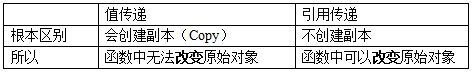
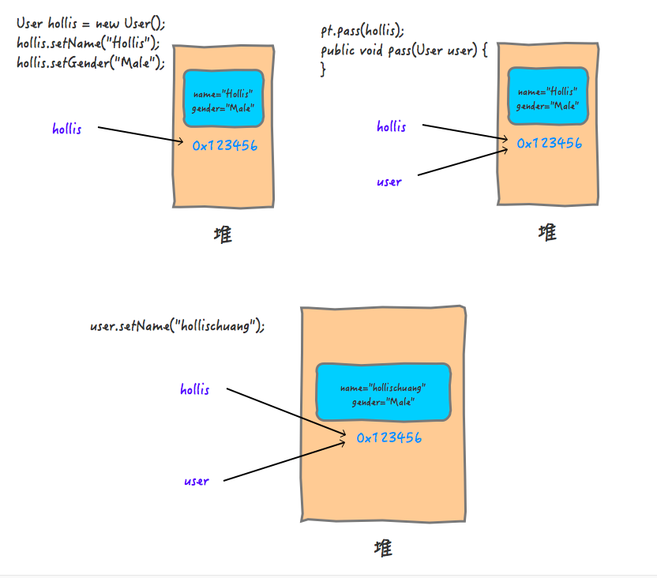
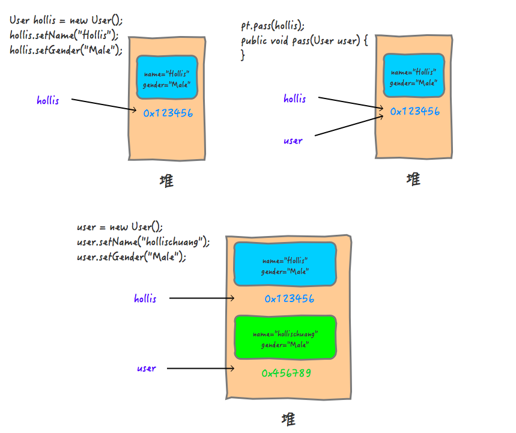

# 值传递

## 实参和形参
形式参数：是在定义函数名和函数体的时候使用的参数,目的是用来接收调用该函数时传入的参数。
实际参数：在调用有参函数时，主调函数和被调函数之间有数据传递关系。在主调函数中调用一个函数时，函数名后面括号中的参数称为“实际参数”。

实际参数是调用有参方法的时候真正传递的内容，而形式参数是用于接收实参内容的参数。

## 值传递和引用传递
值传递（pass by value）是指在调用函数时将实际参数复制一份传递到函数中，这样在函数中如果对参数进行修改，将不会影响到实际参数。
引用传递（pass by reference）是指在调用函数时将实际参数的地址直接传递到函数中，那么在函数中对参数所进行的修改，将影响到实际参数。

## `Java`中只有值传递

### 传参策略
+ 传值调用（值传递）
    + 在传值调用中，实际参数先被求值，然后其值通过复制，被传递给被调函数的形式参数。因为形式参数拿到的只是一个"局部拷贝"，所以如果在被调函数中改变了形式参数的值，并不会改变实际参数的值。
+ 传引用调用（引用传递）
    + 在传引用调用中，传递给函数的是它的实际参数的隐式引用而不是实参的拷贝。因为传递的是引用，所以，如果在被调函数中改变了形式参数的值，改变对于调用者来说是可见的。
+ 传共享对象调用（共享对象传递）
    + 传共享对象调用中，先获取到实际参数的地址，然后将其复制，并把该地址的拷贝传递给被调函数的形式参数。因为参数的地址都指向同一个对象，所以我们也称之为"传共享对象"，所以，如果在被调函数中改变了形式参数的值，调用者是可以看到这种变化的。

**因为传共享对象调用的过程和传值调用的过程是一样的，而且都有一步关键的操作，那就是"复制"，所以，通常我们认为传共享对象调用是传值调用的特例。**

传值调用是指在调用函数时将实际参数复制一份传递到函数中，传引用调用是指在调用函数时将实际参数的引用直接传递到函数中。

### `Java`的传值策略
Java中的基本数据类型是值传递的。
> Primitive arguments, such as an int or a double, are passed into methods by value. This means that any changes to the values of the parameters exist only within the scope of the method. When the method returns, the parameters are gone and any changes to them are lost.

> 原始参数通过值传递给方法。这意味着对参数值的任何更改都只存在于方法的范围内。当方法返回时，参数将消失，对它们的任何更改都将丢失。

### `Java`中的对象传递
> Reference data type parameters, such as objects, are also passed into methods by value. This means that when the method returns, the passed-in reference still references the same object as before. However, the values of the object’s fields can be changed in the method, if they have the proper access level.

> 引用数据类型参数(如对象)也按值传递给方法。这意味着，当方法返回时，传入的引用仍然引用与以前相同的对象。但是，如果对象字段具有适当的访问级别，则可以在方法中更改这些字段的值。

Java中使用的求值策略就是传共享对象调用，也就是说，Java会将对象的地址的拷贝传递给被调函数的形式参数。
下图展示了`Java`传递参数的过程:

**Java对象的传递，是通过复制的方式把引用关系传递了，如果我们没有改引用关系，而是找到引用的地址，把里面的内容改了，是会对调用方有影响的，因为大家指向的是同一个共享对象。**

**Java中的对象传递，如果是修改引用，是不会对原来的对象有任何影响的，但是如果直接修改共享对象的属性的值，是会对原来的对象有影响的。**

## 总结
值传递和引用传递最大的区别是传递的过程中有没有复制出一个副本来，如果是传递副本，那就是值传递，否则就是引用传递。
在Java中，其实是通过值传递实现的参数传递，只不过对于Java对象的传递，传递的内容是对象的引用。
**Java中的求值策略是共享对象传递，也可以说Java中只有值传递，只不过传递的内容是对象的引用，绝对不能认为Java中有引用传递。**