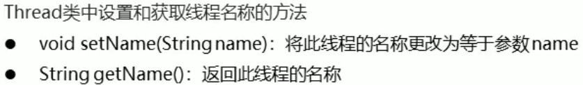
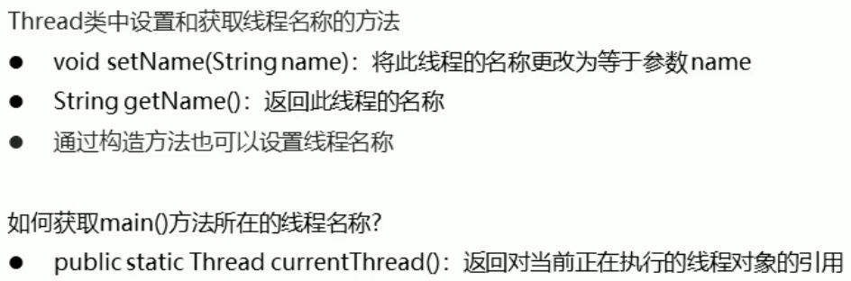
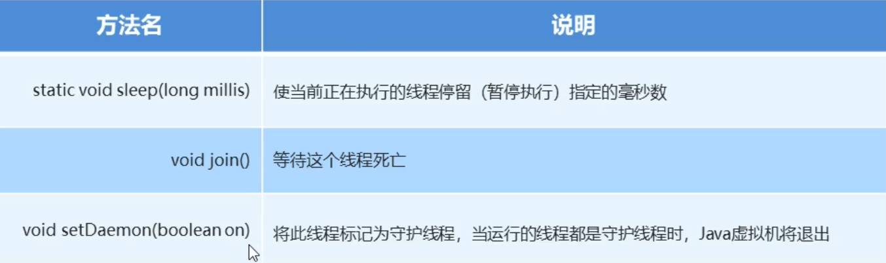
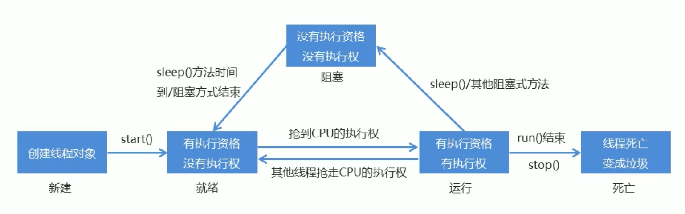
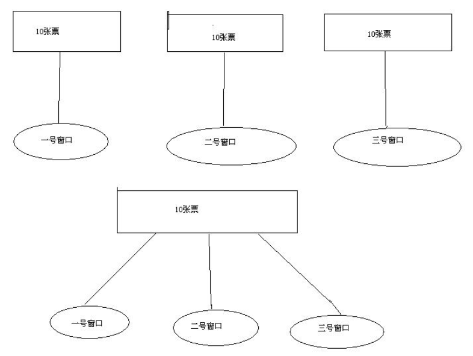

# 多线程

## 进程与线程


## 多线程执行方式


代码示例:
实现`Thread`的`MyThread`类,在`run`方法里面是封装的被线程执行的代码。
```java
public class MyThread extends Thread {
    @Override
    public void run() {
        for (int i = 0; i < 100; i++) {
            System.out.println(i);
        }
    }
}
```
```java
public static void main(String[] args) {
    MyThread my1 = new MyThread();
    MyThread my2 = new MyThread();

    my1.start();
    my2.start();
}
```
但是我们不能够直接使用`my1.run()`和`my2.run()`来使`run()`里面的代码一块执行,我们使用`start()`方法才会启动线程,来调用此线程的`run()`方法。

## 设置和获取线程名称



## 线程调度


## 线程控制

见下面的示例代码:
```java
public static void main(String[] args) {
    MyThread my1 = new MyThread("关羽");
    MyThread my2 = new MyThread("张飞");

    Thread.currentThread().setName("刘备");
    //设置为保护守护线程
    my1.setDaemon(true);
    my2.setDaemon(true);

    //开始执行线程
    my1.start();
    my2.start();

    for(int i = 0; i < 2; i++) {
        System.out.println(Thread.currentThread().getName() + ":" + i);
    }
}
```

## 线程生命周期


## 多线程的另一种实现方式


两种方式的比较
使用实现`Runnable`接口的方式
```java
public class MyThread implements Runnable {
    private int ticket = 10;

    @Override
    public void run() {
        for(int i = 0; i <500; i++) {
            if(this.ticket > 0)
                System.out.println(Thread.currentThread().getName() + "卖票---->" + (this.ticket--));
            }
    }
}
```
```java
    public static void main(String[] args) {
        MyThread my1 = new MyThread();
        Thread thread1 = new Thread(my1, "一号窗口");
        Thread thread2 = new Thread(my1, "二号窗口");
        Thread thread3 = new Thread(my1, "三号窗口");
        thread1.start();
        thread2.start();
        thread3.start();
    }
```
使用继承`Thread`类的方式:
```java
public class MyThread extends Thread {
    private int ticket = 10;

    public MyThread() {

    }

    public MyThread(String name) {
        super(name);
    }

    @Override
    public void run() {
        for(int i = 0; i <500; i++) {
            if(this.ticket > 0)
                System.out.println(Thread.currentThread().getName() + "卖票---->" + (this.ticket--));
        }
    }
}
```
同样运行上面的代码:
```java
public static void main(String[] args) {
    MyThread thread1 = new MyThread("一号窗口");
    MyThread thread2 = new MyThread("二号窗口");
    MyThread thread3 = new MyThread("三号窗口");

    thread1.start();
    thread2.start();
    thread3.start();
}
```
上面的结果并不一样
第一种方式的运行结果为:
```
三号窗口卖票---->8
二号窗口卖票---->9
一号窗口卖票---->10
二号窗口卖票---->6
三号窗口卖票---->7
二号窗口卖票---->4
一号窗口卖票---->5
二号窗口卖票---->2
三号窗口卖票---->3
一号窗口卖票---->1
```
第二种方式的运行结果为:
```
二号窗口卖票---->10
三号窗口卖票---->10
一号窗口卖票---->10
三号窗口卖票---->9
二号窗口卖票---->9
三号窗口卖票---->8
一号窗口卖票---->9
三号窗口卖票---->7
二号窗口卖票---->8
三号窗口卖票---->6
一号窗口卖票---->8
三号窗口卖票---->5
二号窗口卖票---->7
三号窗口卖票---->4
一号窗口卖票---->7
三号窗口卖票---->3
二号窗口卖票---->6
三号窗口卖票---->2
一号窗口卖票---->6
三号窗口卖票---->1
二号窗口卖票---->5
一号窗口卖票---->5
二号窗口卖票---->4
一号窗口卖票---->4
二号窗口卖票---->3
一号窗口卖票---->3
二号窗口卖票---->2
一号窗口卖票---->2
二号窗口卖票---->1
一号窗口卖票---->1
```
通过下面的图示能够看到它们的差别:

```java
第二种方式相当于对三个任务,对三个任务创建三个线程,去完成这个任务。
第一种方式相当于对一个任务,对一个任务创建三个线程,去完成这个任务。
```
相当于一个是多个线程分别完成自己的任务，一个是多个线程共同完成一个任务。
## 线程同步
运行下面的代码会产生问题:
```java
public class MyThread implements Runnable {
    private int ticket = 100;

    public MyThread() {

    }

    @Override
    public void run() {
        for(int i = 0; i <500; i++) {
            if(this.ticket > 0) {
                try {
                    Thread.sleep(100);
                } catch (InterruptedException e) {
                    e.printStackTrace();
                }
                System.out.println(Thread.currentThread().getName() + "卖票---->" + (this.ticket--));
            }
        }
    }
}
```
```java
    public static void main(String[] args) {
        MyThread my1 = new MyThread();

        Thread thread1 = new Thread(my1, "一号窗口");
        Thread thread2 = new Thread(my1, "二号窗口");
        Thread thread3 = new Thread(my1, "三号窗口");

        thread1.start();
        thread2.start();
        thread3.start();
    }
```
可能会产生下面的结果:
```
二号窗口卖票---->98
一号窗口卖票---->99
三号窗口卖票---->100
二号窗口卖票---->97
三号窗口卖票---->96
一号窗口卖票---->96
二号窗口卖票---->95
一号窗口卖票---->95
三号窗口卖票---->95
二号窗口卖票---->94
三号窗口卖票---->94
一号窗口卖票---->94
二号窗口卖票---->93
三号窗口卖票---->93
一号窗口卖票---->93
一号窗口卖票---->92
三号窗口卖票---->91
二号窗口卖票---->92
三号窗口卖票---->90
一号窗口卖票---->90
二号窗口卖票---->89
三号窗口卖票---->88
二号窗口卖票---->86
一号窗口卖票---->87
三号窗口卖票---->85
一号窗口卖票---->84
二号窗口卖票---->83
三号窗口卖票---->82
二号窗口卖票---->81
一号窗口卖票---->80
三号窗口卖票---->79
一号窗口卖票---->78
二号窗口卖票---->77
三号窗口卖票---->76
一号窗口卖票---->75
二号窗口卖票---->74
三号窗口卖票---->73
二号窗口卖票---->72
一号窗口卖票---->71
三号窗口卖票---->70
二号窗口卖票---->69
一号窗口卖票---->68
三号窗口卖票---->67
二号窗口卖票---->66
一号窗口卖票---->65
三号窗口卖票---->64
二号窗口卖票---->63
一号窗口卖票---->62
三号窗口卖票---->61
二号窗口卖票---->60
一号窗口卖票---->59
三号窗口卖票---->58
二号窗口卖票---->57
一号窗口卖票---->56
三号窗口卖票---->55
二号窗口卖票---->54
一号窗口卖票---->53
三号窗口卖票---->52
二号窗口卖票---->51
一号窗口卖票---->50
二号窗口卖票---->49
三号窗口卖票---->48
一号窗口卖票---->47
二号窗口卖票---->46
一号窗口卖票---->45
三号窗口卖票---->44
二号窗口卖票---->43
一号窗口卖票---->42
三号窗口卖票---->41
二号窗口卖票---->40
三号窗口卖票---->38
一号窗口卖票---->39
二号窗口卖票---->37
一号窗口卖票---->36
三号窗口卖票---->35
二号窗口卖票---->34
一号窗口卖票---->33
三号窗口卖票---->32
二号窗口卖票---->31
一号窗口卖票---->30
三号窗口卖票---->29
二号窗口卖票---->28
一号窗口卖票---->27
三号窗口卖票---->27
一号窗口卖票---->26
二号窗口卖票---->24
三号窗口卖票---->25
一号窗口卖票---->23
二号窗口卖票---->22
三号窗口卖票---->21
一号窗口卖票---->20
二号窗口卖票---->19
三号窗口卖票---->18
一号窗口卖票---->17
二号窗口卖票---->16
三号窗口卖票---->15
一号窗口卖票---->14
二号窗口卖票---->13
三号窗口卖票---->12
一号窗口卖票---->11
二号窗口卖票---->10
三号窗口卖票---->9
一号窗口卖票---->8
二号窗口卖票---->8
三号窗口卖票---->7
二号窗口卖票---->6
一号窗口卖票---->6
三号窗口卖票---->5
一号窗口卖票---->4
二号窗口卖票---->4
三号窗口卖票---->3
一号窗口卖票---->2
二号窗口卖票---->1
三号窗口卖票---->0
```
可以从上面看到出现了`一号窗口卖票---->8`和`二号窗口卖票---->8`出现了两个8,出现了错误。
出现的主要原因是因为**多个线程同时操作了共享数据**,也就是说造成这种问题的条件为:
1. 多线程环境
2. 有共享数据
3. 多个线程操作共享数据

其中上面的条件中前两条很难被破坏,所以说我们主要是为了避免第三条语句被破坏。我们的解决思路是:
```
把操作共享代码块的语句锁起来,让任意时刻只有一个线程执行。
```
对于Java来说,我们采用的是同步代码块的方式。 
### `synchronized`关键字


 

为了解决上面出现的情况,主要是为了实现,我们可以使用下面的示例代码:
```java
public class MyThread implements Runnable {
    private int ticket = 100;
    private Object obj = new Object();

    public MyThread() {

    }

    @Override
    public void run() {
        for(int i = 0; i <500; i++) {
            synchronized (obj) {
                if(this.ticket > 0) {
                    try {
                        Thread.sleep(100);
                    } catch (InterruptedException e) {
                        e.printStackTrace();
                    }
                    System.out.println(Thread.currentThread().getName() + "卖票---->" + (this.ticket--));
                }
            }
        }
    }
}
```
相当于对上面的代码加了锁,但是采用下面的代码是不可取的:
```java
synchronized (new Object()) {
    if(this.ticket > 0) {
        try {
            Thread.sleep(100);
        } catch (InterruptedException e) {
            e.printStackTrace();
        }
        System.out.println(Thread.currentThread().getName() + "卖票---->" + (this.ticket--));
    }
}
```
因为上面的代码是每一个线程运行的时候,都会生成一个锁对象,相当于每个线程对应一把锁,但实际上我们需要的是所有的线程公用一把锁。
事实上,我们还可以更进一步,就是将`synchronized`关键字放到方法声明中:
```java
public synchronized void method() {
    method body
}
```
尽管没有写出显式锁来,但其实显式锁是`this`。
相当于之前的:
```java
synchronized (this) {
    if(this.ticket > 0) {
        try {
            Thread.sleep(100);
        } catch (InterruptedException e) {
            e.printStackTrace();
        }
        System.out.println(Thread.currentThread().getName() + "卖票---->" + (this.ticket--));
    }
}
```
我们可以使用下面的代码来验证:
```java
public class MyThread implements Runnable {
    private int ticket = 100;
    private int x = 0;

    public MyThread() {

    }

    @Override
    public void run() {
        for(int i = 0; i <500; i++) {
            if(x % 2 == 0) {
                synchronized (this) {
                    if(this.ticket > 0) {
                        try {
                            Thread.sleep(100);
                        } catch (InterruptedException e) {
                            e.printStackTrace();
                        }
                        System.out.println(Thread.currentThread().getName() + "卖票---->" + (this.ticket--));
                    }
                }
            } else {

            }
        }
    }

    private synchronized void sellTicket() {
        if(this.ticket > 0) {
            try {
                Thread.sleep(100);
            } catch (InterruptedException e) {
                e.printStackTrace();
            }
            System.out.println(Thread.currentThread().getName() + "卖票---->" + (this.ticket--));
        }
    }
}
```
当把上面的`obj`替换成`this`的时候,会发现使用的还是同一把锁,完全没有问题。

### 锁对象
上面我们使用了`synchronized`关键字,但是我们现在是用另一种方式,一种显式锁,即`ReentrantLock`类。
基本结构如下所示:
```java
myLock.lock(); //a ReentrantLock object
try {
    critical section
} finally {
    myLock.unlock(); //确保锁一定会释放
}
```
我们可以对之前我们的卖票程序进行改写:
```java
public void run() {
    for(int i = 0; i <500; i++) {
        //锁上
        lock.lock();
        try {
            if(this.ticket > 0) {
                try {
                    Thread.sleep(100);
                } catch (InterruptedException e) {
                    e.printStackTrace();
                }
                System.out.println(Thread.currentThread().getName() + "卖票---->" + (this.ticket--));
            }
        } finally {
            //保证锁肯定能被释放
            lock.unlock();
        }
    }
}
```
也就是将之前的隐式锁换成了显式锁。
这里需要注意的是:这里的锁被称为重入锁,也就是线程可以反复获得已经拥有的锁。锁有一个持有计数(hold out)来跟踪对`lock`方法的嵌套调用。线程每一次调用`lock`之后都可以用`unlock`来释放锁,被一个锁保护的代码可以使用另一个使用相同锁的方法。

### 条件对象
但是我们可能会遇到一些问题,比如当线程进入临界区之后,发现必须要满足某个条件才能够执行,那么我们就需要条件对象来管理那些获得了一个锁却不能够做有用工作的进程。
比如下面的代码:
```java
if(bank.getBalance(from) >= amount)
    bank.transfer(from, to, amount);
```
其中`bank.transfer()`作为临界区,可能当前线程受到阻塞,不能够进入,但是,又有可能会发生下面的情况,该线程之前通过了判断条件`bank.getBalance(from) >= amount`进到了这里面,可能运行完了之后就不满足前面的条件了,所以说前面的代码我们也应该加上锁:
```java
lock.lock();
try {
    while(accounts[from] < amount) {
        //wait
    }
} finally {
    lock.unlock();
}
```
但是这样同样会有问题,因为加入我们进来之后发现我们不满足当前继续向下执行的条件,但是我们这个线程刚刚获得了锁,也就是需要别的线程来改变当前条件的机会没有了,那么我们需要引入**条件对象**。也就是在类里面添加:
```java
private Condition sufficientFunds;
```
当我们在执行前面代码的时候,发现条件不符合,我们可以使用`sufficientFunds.await()`暂停该线程,并放弃锁,但是这种自动阻塞和因为进不了临界区而被迫阻塞有着本质上的不同。
> 一旦一个线程调用了`await()`方法,就进入到了这个条件的等待集。当锁可用的时候,它仍然不会立刻运行,必须要等到另外一个线程调用`signalAll()`方法。也就是调用`sufficientFunds.signalAll()`方法。

> 只有当线程拥有一个条件的锁的时候,他才能够在这个条件上调用`await`、`signalAll`与`signal`方法。


PS:
1. `var`关键字只能用于方法中的局部变量,参数和字段的类型必须声明。