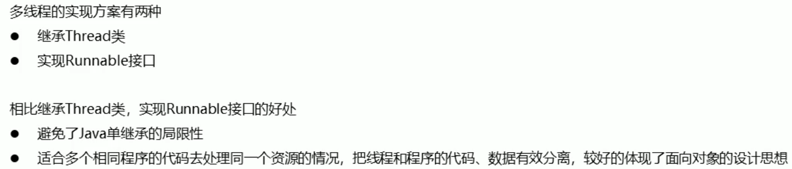

<!-- TOC -->

- [多线程](#多线程)
  - [进程与线程](#进程与线程)
  - [多线程执行方式](#多线程执行方式)
  - [设置和获取线程名称](#设置和获取线程名称)
  - [线程调度](#线程调度)
  - [线程控制](#线程控制)
  - [线程生命周期](#线程生命周期)
    - [线程方法](#线程方法)
    - [线程停止](#线程停止)
    - [线程休眠](#线程休眠)
    - [线程礼让](#线程礼让)
    - [线程强制执行](#线程强制执行)
    - [线程状态](#线程状态)
      - [`NEW`](#new)
      - [`RUNNABLE`中的`READY`](#runnable中的ready)
      - [`RUNNABLE`中的`RUNNING`](#runnable中的running)
      - [`BLOCKED`](#blocked)
      - [`WAITING`](#waiting)
      - [`TIMED_WAITING`](#timed_waiting)
      - [`TERMINATED`](#terminated)
  - [守护(daemon)线程](#守护daemon线程)
  - [多线程的另一种实现方式](#多线程的另一种实现方式)
  - [代理模式](#代理模式)
  - [线程同步](#线程同步)
    - [`synchronized`关键字](#synchronized关键字)
    - [死锁](#死锁)
    - [锁对象](#锁对象)
    - [条件对象](#条件对象)
    - [线程安全的类](#线程安全的类)
  - [线程之间的通信以及生产者和消费者问题](#线程之间的通信以及生产者和消费者问题)
    - [线程之间的通信](#线程之间的通信)
      - [`wait()`](#wait)
      - [`notify()`](#notify)
      - [`notifyAll()`](#notifyall)
    - [java中的`notify()`和`notifyAll()`有什么区别？](#java中的notify和notifyall有什么区别)
    - [生产者-消费者](#生产者-消费者)
      - [`wait()/notifyAll()`](#waitnotifyall)
      - [信号灯法](#信号灯法)
  - [线程池](#线程池)
    - [线程池原理](#线程池原理)
    - [关闭线程池](#关闭线程池)
  - [补充](#补充)

<!-- /TOC -->
# 多线程

## 进程与线程


## 多线程执行方式


代码示例:
实现`Thread`的`MyThread`类,在`run`方法里面是封装的被线程执行的代码。
```java
public class MyThread extends Thread {
    @Override
    public void run() {
        for (int i = 0; i < 100; i++) {
            System.out.println(i);
        }
    }
}
```
```java
public static void main(String[] args) {
    MyThread my1 = new MyThread();
    MyThread my2 = new MyThread();

    my1.start();
    my2.start();
}
```
但是我们不能够直接使用`my1.run()`和`my2.run()`来使`run()`里面的代码一块执行,我们使用`start()`方法才会启动线程,来调用此线程的`run()`方法。

另外一个代码示例:
```java
public class TestThread2 extends Thread {

    private String url;    // 网络图片地址
    private String name;    // 保存的文件名

    public TestThread2(String url, String name) {
        this.url = url;
        this.name = name;
    }

    @Override
    public void run() {
        WebDownloader webDownloader = new WebDownloader();
        webDownloader.downloader(url, name);
        System.out.println("下载了文件名为：" + name);
    }

    public static void main(String[] args) {
        TestThread2 t1 = new TestThread2("https://img.iplaysoft.com/wp-content/uploads/2019/free-images/free_stock_photo.jpg!0x0.webp", "1.jpg");
        TestThread2 t2 = new TestThread2("https://mat1.gtimg.com/rain/apub2019/af220d8420f8.spring.png", "2.jpg");
        TestThread2 t3 = new TestThread2("https://inews.gtimg.com/newsapp_ls/0/13162991419_640330/0", "3.jpg");

        t1.start();
        t2.start();
        t3.start();
    }
}

// 下载器
class WebDownloader {

    // 下载方法
    public void downloader(String url, String name) {
        try {
            FileUtils.copyURLToFile(new URL(url), new File(name));
        } catch (IOException e) {
            e.printStackTrace();
            System.out.println("IO异常，downloader方法出现问题");
        }
    }
}
```

## 设置和获取线程名称


## 线程调度


## 线程控制

见下面的示例代码:
```java
public static void main(String[] args) {
    MyThread my1 = new MyThread("关羽");
    MyThread my2 = new MyThread("张飞");

    Thread.currentThread().setName("刘备");
    //设置为保护守护线程
    my1.setDaemon(true);
    my2.setDaemon(true);

    //开始执行线程
    my1.start();
    my2.start();

    for(int i = 0; i < 2; i++) {
        System.out.println(Thread.currentThread().getName() + ":" + i);
    }
}
```

## 线程生命周期


### 线程方法
+ `setPriority(int newPriority)`: 设置线程的优先级
+ `static void sleep(long millis)`：在指定的毫秒数内让正在执行的线程休眠
+ `void join()`：等待该线程终止
+ `static void yield()`：暂停当前正在执行的线程对象，并执行其它线程
+ `void interrupt()`：中断线程，不要使用
+ `boolean isAlive()`：测试线程是否处于活动状态

### 线程停止
1. `JDK`中提供的`stop`等停止线程的方法不建议使用
2. 尽量等待线程自动停止
3. 通过设置标志位，自己定义修改标志位的方法来停止线程

### 线程休眠
+ `sleep`方法可以指定当前线程阻塞的毫秒数
+ `sleep`存在异常`InterruptedException`
+ `sleep`时间达到后进入到就绪状态
+ `sleep`可以模拟网络延时，倒计时等
+ 每一个对象都有一个锁，`sleep`不会释放锁

`Thread.sleep()`被用来暂停当前线程的执行,会通知线程调度器把当前线程在指定的时间周期内置为`wait`状态。当`wait`时间结束，线程状态重新变为`Runnable`并等待`CPU`的再次调度执行。所以线程`sleep`的实际时间取决于线程调度器，而这是由操作系统来完成的。

### 线程礼让
使用`yield()`方法，可以让当前正在执行的线程暂停，但是并不阻塞，可以将线程从运行状态转为就绪状态，之后**让CPU重新调度，礼让不一定成功，取决于CPU。**

### 线程强制执行
`join()`方法可以强制执行线程，当该线程执行完毕之后，再执行其它线程，其它线程阻塞。可以想象成插队。

### 线程状态


#### `NEW`
实现`Runnable`接口和继承`Thread`可以得到一个线程类，`new`一个实例出来，线程就进入了初始状态。

#### `RUNNABLE`中的`READY`
+ 调用线程的`start()`方法，此线程进入就绪状态，但是如果没有得到`CPU`的时间片，就不能运行，即进入不到`RUNNABLE`中的`RUNNING`。
+ 当前线程`sleep()`方法结束之后，其他线程`join()`结束，等待用户完毕，也会进入到`READY`。
+ 调用当前线程的yield()方法，当前线程进入`READY`。
+ 锁池里的线程拿到对象锁后，进入就绪状态。

#### `RUNNABLE`中的`RUNNING`
线程调度程序从可运行池中选择一个线程作为当前线程时线程所处的状态。这也是线程进入运行状态的唯一的一种方式。

#### `BLOCKED`
阻塞状态是线程阻塞在进入`synchronized`关键字修饰的方法或代码块(获取锁)时的状态。

#### `WAITING`
处于这种状态的线程不会被分配CPU执行时间，它们要等待被显式地唤醒，否则会处于无限期等待的状态。

#### `TIMED_WAITING`
处于这种状态的线程不会被分配CPU执行时间，不过**无须无限期等待被其他线程显示地唤醒**，在达到一定时间后它们会自动唤醒。

#### `TERMINATED`
+ 当线程的`run()`方法完成时，或者主线程的`main()`方法完成时，我们就认为它终止了。这个线程对象也许是活的，但是它已经不是一个单独执行的线程。线程一旦终止了，就不能复生。

+ 在一个终止的线程上调用`start()`方法，会抛出`java.lang.IllegalThreadStateException`异常。

## 守护(daemon)线程
+ 线程分为**用户线程**和**守护线程**
+ 虚拟机必须确保用户线程执行完毕
+ 虚拟机不需要等待守护线程执行完毕，当运行的线程全为守护线程时，虚拟机就会停止。像垃圾回收线程就是守护线程。
+ 当线程刚创建出来，默认为用户线程，可以通过`setDaemon(boolean on)`来设置


## 多线程的另一种实现方式


两种方式的比较
使用实现`Runnable`接口的方式
```java
public class MyThread implements Runnable {
    private int ticket = 10;

    @Override
    public void run() {
        for(int i = 0; i <500; i++) {
            if(this.ticket > 0)
                System.out.println(Thread.currentThread().getName() + "卖票---->" + (this.ticket--));
            }
    }
}
```
```java
    public static void main(String[] args) {
        MyThread my1 = new MyThread();
        Thread thread1 = new Thread(my1, "一号窗口");
        Thread thread2 = new Thread(my1, "二号窗口");
        Thread thread3 = new Thread(my1, "三号窗口");
        thread1.start();
        thread2.start();
        thread3.start();
    }
```
使用继承`Thread`类的方式:
```java
public class MyThread extends Thread {
    private int ticket = 10;

    public MyThread() {

    }

    public MyThread(String name) {
        super(name);
    }

    @Override
    public void run() {
        for(int i = 0; i <500; i++) {
            if(this.ticket > 0)
                System.out.println(Thread.currentThread().getName() + "卖票---->" + (this.ticket--));
        }
    }
}
```
同样运行上面的代码:
```java
public static void main(String[] args) {
    MyThread thread1 = new MyThread("一号窗口");
    MyThread thread2 = new MyThread("二号窗口");
    MyThread thread3 = new MyThread("三号窗口");

    thread1.start();
    thread2.start();
    thread3.start();
}
```
上面的结果并不一样
第一种方式的运行结果为:
```
三号窗口卖票---->8
二号窗口卖票---->9
一号窗口卖票---->10
二号窗口卖票---->6
三号窗口卖票---->7
二号窗口卖票---->4
一号窗口卖票---->5
二号窗口卖票---->2
三号窗口卖票---->3
一号窗口卖票---->1
```
第二种方式的运行结果为:
```
二号窗口卖票---->10
三号窗口卖票---->10
一号窗口卖票---->10
三号窗口卖票---->9
二号窗口卖票---->9
三号窗口卖票---->8
一号窗口卖票---->9
三号窗口卖票---->7
二号窗口卖票---->8
三号窗口卖票---->6
一号窗口卖票---->8
三号窗口卖票---->5
二号窗口卖票---->7
三号窗口卖票---->4
一号窗口卖票---->7
三号窗口卖票---->3
二号窗口卖票---->6
三号窗口卖票---->2
一号窗口卖票---->6
三号窗口卖票---->1
二号窗口卖票---->5
一号窗口卖票---->5
二号窗口卖票---->4
一号窗口卖票---->4
二号窗口卖票---->3
一号窗口卖票---->3
二号窗口卖票---->2
一号窗口卖票---->2
二号窗口卖票---->1
一号窗口卖票---->1
```
通过下面的图示能够看到它们的差别:

```java
第二种方式相当于对三个任务,对三个任务创建三个线程,去完成这个任务。
第一种方式相当于对一个任务,对一个任务创建三个线程,去完成这个任务。
```
相当于一个是多个线程分别完成自己的任务，一个是多个线程共同完成一个任务。

## 代理模式
1. 代理角色
2. 真实角色(目标角色)
3. 代理角色和真实角色都要实现同一接口
4. 代理角色持有真实角色的引用

优点:
    代理对象可以拥有真实对象所不具备的功能。
    真实对象可以专注自己的功能。

代码示例:
```java
public class StaticProxy {

    public static void main(String[] args) {
        WeddingCompany weddingCompany = new WeddingCompany(new You());
        weddingCompany.marry();
    }
}

interface Marry {
    void marry();
}

class You implements Marry{
    @Override
    public void marry() {
        System.out.println("我要结婚了");
    }
}

class WeddingCompany implements Marry {

    private Marry target;

    public WeddingCompany(Marry target) {
        this.target = target;
    }

    @Override
    public void marry() {
        before();
        this.target.marry();
        after();
    }

    private void after() {
        System.out.println("结婚之后，收尾款");
    }

    private void before() {
        System.out.println("结婚之前，布置现场");
    }
}
```
我们之前使用实现`Runnable`接口的创建多线程的方式就是代理模式。
```java
new Thread(new Runnable() {
    @Override
    public void run() {
        System.out.println("I love you");
    }
}).start();
```
首先，`Thread`类实现了`Runnable`接口，我们的匿名内部类同样也实现了`Runnable`接口。并且重写了里面的`run`方法。


## 线程同步
同一个对象被多个线程同时操作。由于同一进程的多个线程共享同一块存储空间，为了保证访问数据的安全性，在访问时加入锁机制`synchronized`，当一个线程获取了对象的排它锁，独占资源，其他资源必须等待，使用后，释放锁即可。使用锁会出现下面的问题:
+ 一个线程持有锁会导致其它所有需要此锁的线程挂起。
+ 在多线程的竞争下，加锁，释放锁会导致比较多的上下文切换和调度延迟，引起性能问题。
+ 如果一个优先级高的线程等待一个优先级低的线程释放锁，会导致优先级倒置，引起性能问题。

下面是一些线程不安全的例子：
运行下面的代码会产生问题:
```java
public class MyThread implements Runnable {
    private int ticket = 100;

    public MyThread() {

    }

    @Override
    public void run() {
        for(int i = 0; i <500; i++) {
            if(this.ticket > 0) {
                try {
                    Thread.sleep(100);
                } catch (InterruptedException e) {
                    e.printStackTrace();
                }
                System.out.println(Thread.currentThread().getName() + "卖票---->" + (this.ticket--));
            }
        }
    }
}
```
```java
    public static void main(String[] args) {
        MyThread my1 = new MyThread();

        Thread thread1 = new Thread(my1, "一号窗口");
        Thread thread2 = new Thread(my1, "二号窗口");
        Thread thread3 = new Thread(my1, "三号窗口");

        thread1.start();
        thread2.start();
        thread3.start();
    }
```
可能会产生下面的结果:
```
二号窗口卖票---->98
一号窗口卖票---->99
三号窗口卖票---->100
二号窗口卖票---->97
三号窗口卖票---->96
一号窗口卖票---->96
二号窗口卖票---->95
一号窗口卖票---->95
三号窗口卖票---->95
二号窗口卖票---->94
三号窗口卖票---->94
一号窗口卖票---->94
二号窗口卖票---->93
三号窗口卖票---->93
一号窗口卖票---->93
一号窗口卖票---->92
三号窗口卖票---->91
二号窗口卖票---->92
三号窗口卖票---->90
一号窗口卖票---->90
二号窗口卖票---->89
三号窗口卖票---->88
二号窗口卖票---->86
一号窗口卖票---->87
三号窗口卖票---->85
一号窗口卖票---->84
二号窗口卖票---->83
三号窗口卖票---->82
二号窗口卖票---->81
一号窗口卖票---->80
三号窗口卖票---->79
一号窗口卖票---->78
二号窗口卖票---->77
三号窗口卖票---->76
一号窗口卖票---->75
二号窗口卖票---->74
三号窗口卖票---->73
二号窗口卖票---->72
一号窗口卖票---->71
三号窗口卖票---->70
二号窗口卖票---->69
一号窗口卖票---->68
三号窗口卖票---->67
二号窗口卖票---->66
一号窗口卖票---->65
三号窗口卖票---->64
二号窗口卖票---->63
一号窗口卖票---->62
三号窗口卖票---->61
二号窗口卖票---->60
一号窗口卖票---->59
三号窗口卖票---->58
二号窗口卖票---->57
一号窗口卖票---->56
三号窗口卖票---->55
二号窗口卖票---->54
一号窗口卖票---->53
三号窗口卖票---->52
二号窗口卖票---->51
一号窗口卖票---->50
二号窗口卖票---->49
三号窗口卖票---->48
一号窗口卖票---->47
二号窗口卖票---->46
一号窗口卖票---->45
三号窗口卖票---->44
二号窗口卖票---->43
一号窗口卖票---->42
三号窗口卖票---->41
二号窗口卖票---->40
三号窗口卖票---->38
一号窗口卖票---->39
二号窗口卖票---->37
一号窗口卖票---->36
三号窗口卖票---->35
二号窗口卖票---->34
一号窗口卖票---->33
三号窗口卖票---->32
二号窗口卖票---->31
一号窗口卖票---->30
三号窗口卖票---->29
二号窗口卖票---->28
一号窗口卖票---->27
三号窗口卖票---->27
一号窗口卖票---->26
二号窗口卖票---->24
三号窗口卖票---->25
一号窗口卖票---->23
二号窗口卖票---->22
三号窗口卖票---->21
一号窗口卖票---->20
二号窗口卖票---->19
三号窗口卖票---->18
一号窗口卖票---->17
二号窗口卖票---->16
三号窗口卖票---->15
一号窗口卖票---->14
二号窗口卖票---->13
三号窗口卖票---->12
一号窗口卖票---->11
二号窗口卖票---->10
三号窗口卖票---->9
一号窗口卖票---->8
二号窗口卖票---->8
三号窗口卖票---->7
二号窗口卖票---->6
一号窗口卖票---->6
三号窗口卖票---->5
一号窗口卖票---->4
二号窗口卖票---->4
三号窗口卖票---->3
一号窗口卖票---->2
二号窗口卖票---->1
三号窗口卖票---->0
```
可以从上面看到出现了`一号窗口卖票---->8`和`二号窗口卖票---->8`出现了两个8,出现了错误。
出现的主要原因是因为**多个线程同时操作了共享数据**,也就是说造成这种问题的条件为:
1. 多线程环境
2. 有共享数据
3. 多个线程操作共享数据

其中上面的条件中前两条很难被破坏,所以说我们主要是为了避免第三条语句被破坏。我们的解决思路是:
```
把操作共享代码块的语句锁起来,让任意时刻只有一个线程执行。
```
对于Java来说,我们采用的是同步代码块的方式。 

### `synchronized`关键字
对于`synchronized`关键字的使用，包括两种用法：

+ `synchronized`方法
+ `synchronized`块


 

为了解决上面出现的情况,主要是为了实现,我们可以使用下面的示例代码:
```java
public class MyThread implements Runnable {
    private int ticket = 100;
    private Object obj = new Object();

    public MyThread() {

    }

    @Override
    public void run() {
        for(int i = 0; i <500; i++) {
            synchronized (obj) {
                if(this.ticket > 0) {
                    try {
                        Thread.sleep(100);
                    } catch (InterruptedException e) {
                        e.printStackTrace();
                    }
                    System.out.println(Thread.currentThread().getName() + "卖票---->" + (this.ticket--));
                }
            }
        }
    }
}
```
相当于对上面的代码加了锁,但是采用下面的代码是不可取的:
```java
synchronized (new Object()) {
    if(this.ticket > 0) {
        try {
            Thread.sleep(100);
        } catch (InterruptedException e) {
            e.printStackTrace();
        }
        System.out.println(Thread.currentThread().getName() + "卖票---->" + (this.ticket--));
    }
}
```
因为上面的代码是每一个线程运行的时候,都会生成一个锁对象,相当于每个线程对应一把锁,但实际上我们需要的是所有的线程公用一把锁。
事实上,我们还可以更进一步,就是将`synchronized`关键字放到方法声明中:
```java
public synchronized void method() {
    method body
}
```
尽管没有写出显式锁来,但其实显式锁是`this`。
相当于之前的:
```java
synchronized (this) {
    if(this.ticket > 0) {
        try {
            Thread.sleep(100);
        } catch (InterruptedException e) {
            e.printStackTrace();
        }
        System.out.println(Thread.currentThread().getName() + "卖票---->" + (this.ticket--));
    }
}
```
我们可以使用下面的代码来验证:
```java
public class MyThread implements Runnable {
    private int ticket = 100;
    private int x = 0;

    public MyThread() {

    }

    @Override
    public void run() {
        for(int i = 0; i <500; i++) {
            if(x % 2 == 0) {
                synchronized (this) {
                    if(this.ticket > 0) {
                        try {
                            Thread.sleep(100);
                        } catch (InterruptedException e) {
                            e.printStackTrace();
                        }
                        System.out.println(Thread.currentThread().getName() + "卖票---->" + (this.ticket--));
                    }
                }
            } else {

            }
        }
    }

    private synchronized void sellTicket() {
        if(this.ticket > 0) {
            try {
                Thread.sleep(100);
            } catch (InterruptedException e) {
                e.printStackTrace();
            }
            System.out.println(Thread.currentThread().getName() + "卖票---->" + (this.ticket--));
        }
    }
}
```
当把上面的`obj`替换成`this`的时候,会发现使用的还是同一把锁,完全没有问题。
但是还是会出现相应的问题,就是如果我把下面的方法改成了静态方法怎么办？当我们修改成静态方法之后,会发现在方法体里面使用不了关键字`this`,也就是说不能够将`this`作为锁了。那么我们使用`类名.class`作为锁（涉及到反射的知识）。

### 死锁
发生的原因：
1. 互斥条件：一个资源每次只能被一个线程使用。
2. 请求与保持条件：一个进程因请求资源而阻塞时，对已获得的资源保持不放。
3. 不剥夺条件：进程以获得的资源，在未使用完之前，不能强行剥夺。
4. 循环等待条件：若干进程之间形成一种头尾相接的循环等待关系。

只要破坏上面的任何一个条件，就能避免死锁的发生。

### 锁对象
上面我们使用了`synchronized`关键字,但是我们现在是用另一种方式,一种显式锁,即`ReentrantLock`类。
基本结构如下所示:
```java
myLock.lock(); //a ReentrantLock object
try {
    critical section
} finally {
    myLock.unlock(); //确保锁一定会释放
}
```
我们可以对之前我们的卖票程序进行改写:
```java
public void run() {
    for(int i = 0; i <500; i++) {
        //锁上
        lock.lock();
        try {
            if(this.ticket > 0) {
                try {
                    Thread.sleep(100);
                } catch (InterruptedException e) {
                    e.printStackTrace();
                }
                System.out.println(Thread.currentThread().getName() + "卖票---->" + (this.ticket--));
            }
        } finally {
            //保证锁肯定能被释放
            lock.unlock();
        }
    }
}
```
也就是将之前的隐式锁换成了显式锁。
这里需要注意的是:这里的锁被称为重入锁,也就是线程可以反复获得已经拥有的锁。锁有一个持有计数(hold out)来跟踪对`lock`方法的嵌套调用。线程每一次调用`lock`之后都可以用`unlock`来释放锁,被一个锁保护的代码可以使用另一个使用相同锁的方法。

### 条件对象
但是我们可能会遇到一些问题,比如当线程进入临界区之后,发现必须要满足某个条件才能够执行,那么我们就需要条件对象来管理那些获得了一个锁却不能够做有用工作的进程。
比如下面的代码:
```java
if(bank.getBalance(from) >= amount)
    bank.transfer(from, to, amount);
```
其中`bank.transfer()`作为临界区,可能当前线程受到阻塞,不能够进入,但是,又有可能会发生下面的情况,该线程之前通过了判断条件`bank.getBalance(from) >= amount`进到了这里面,可能运行完了之后就不满足前面的条件了,所以说前面的代码我们也应该加上锁:
```java
lock.lock();
try {
    while(accounts[from] < amount) {
        //wait
    }
} finally {
    lock.unlock();
}
```
但是这样同样会有问题,因为加入我们进来之后发现我们不满足当前继续向下执行的条件,但是我们这个线程刚刚获得了锁,也就是需要别的线程来改变当前条件的机会没有了,那么我们需要引入**条件对象**。也就是在类里面添加:
```java
private Condition sufficientFunds;
```
当我们在执行前面代码的时候,发现条件不符合,我们可以使用`sufficientFunds.await()`暂停该线程,并放弃锁,但是这种自动阻塞和因为进不了临界区而被迫阻塞有着本质上的不同。
> 一旦一个线程调用了`await()`方法,就进入到了这个条件的等待集。当锁可用的时候,它仍然不会立刻运行,必须要等到另外一个线程调用`signalAll()`方法。也就是调用`sufficientFunds.signalAll()`方法。

> 只有当线程拥有一个条件的锁的时候,他才能够在这个条件上调用`await`、`signalAll`与`signal`方法。

### 线程安全的类

除了上面这种方式,还有另外一种方式:可以使用`Collections.synchronizedList()`方法将`ArrayList`转化为线程安全的,类似的还有`synchronizedMap()`与`synchronizedSet()`方法。

## 线程之间的通信以及生产者和消费者问题
>生产者和消费者问题是线程模型中的经典问题：生产者和消费者在同一时间段内共用同一个存储空间，如下图所示，生产者向空间里存放数据，而消费者取用数据，如果不加以协调可能会出现以下情况：
>存储空间已满，而生产者占用着它，消费者等着生产者让出空间从而去除产品，生产者等着消费者消费产品，从而向空间中添加产品。互相等待，从而发生死锁。


正如我们上面提到过的`await()`,`signal()`,`signalAll()`方法一样,消费者和生产者同样也会遇到这样的问题,当消费者从共享数据区域取数据的时候很可能发现没有数据可取,当生产者向共享数据区域添加数据的时候,发现很可能共享数据区域已经满了,那么出现这样的情况,就要使用下面的几个方法:

### 线程之间的通信


在`Java`中，可以通过配合调用`Object`对象的`wait()`方法和`notify()`方法或`notifyAll()`方法来实现线程间的通信。在线程中调用`wait()`方法，将阻塞等待其他线程的通知（其他线程调用`notify()`方法或`notifyAll()`方法），在线程中调用`notify()`方法或`notifyAll()`方法，将通知其他线程从`wait()`方法处返回。

`Object`是所有类的超类，它有5个方法组成了等待/通知机制的核心：`notify()`、`notifyAll()`、`wait()`、`wait(long)`和`wait(long，int)`。在`Java`中，所有的类都从`Object`继承而来，因此，所有的类都拥有这些共有方法可供使用。而且，由于他们都被声明为`final`，因此在子类中不能覆写任何一个方法。

#### `wait()`
```java
public final void wait() throws InterruptedException,IllegalMonitorStateException
```
该方法用来将当前线程置入休眠状态，直到接到通知或被中断为止。在调用`wait()`之前，**线程必须要获得该对象的对象级别锁，即只能在同步方法或同步块中调用 `wait()`方法**。进入`wait()`方法后，**当前线程释放锁**。在从`wait()`返回前，线程与其他线程竞争重新获得锁。如果调用`wait()`时，没有持有适当的锁，则抛出`IllegalMonitorStateException`，它是`RuntimeException`的一个子类，因此，不需要`try-catch`结构。

#### `notify()`
```java
public final native void notify() throws IllegalMonitorStateException
```
**该方法也要在同步方法或同步块中调用**，即在调用前，线程也必须要获得该对象的对象级别锁，如果调用`notify()`时没有持有适当的锁，也会抛出`IllegalMonitorStateException`。

**该方法用来通知那些可能等待该对象的对象锁的其他线程**。如果有多个线程等待，则线程规划器任意挑选出其中一个`wait()`状态的线程来发出通知，并使它等待获取该对象的对象锁（`notify()`后，当前线程不会马上释放该对象锁，`wait()`所在的线程并不能马上获取该对象锁，要等到程序退出`synchronized`代码块后，当前线程才会释放锁，`wait()`所在的线程也才可以获取该对象锁），但不惊动其他同样在等待被该对象`notify()`的线程们。当第一个获得了该对象锁的`wait()`线程运行完毕以后，它会释放掉该对象锁，此时如果该对象没有再次使用`notify()`语句，则即便该对象已经空闲，其他`wait()`状态等待的线程由于没有得到该对象的通知，会继续阻塞在`wait()`状态，直到这个对象发出一个`notify()`或`notifyAll()`。这里需要注意：它们等待的是被`notify()`或`notifyAll`，而不是锁。这与下面的`notifyAll()`方法执行后的情况不同。

#### `notifyAll()`
```java
public final native void notifyAll() throws IllegalMonitorStateException
```
该方法与`notify()`方法的工作方式相同，重要的一点差异是：
`notifyAll()`使所有原来在该对象上`wait()`的线程统统退出`wait()`的状态（即全部被唤醒，不再等待`notify()`或`notifyAll()`，但由于此时还没有获取到该对象锁，因此还不能继续往下执行），变成等待获取该对象上的锁，一旦该对象锁被释放（`notifyAll()` 线程退出调用了`notifyAll()`的`synchronized`代码块的时候），他们就会去竞争。如果其中一个线程获得了该对象锁，它就会继续往下执行，在它退出`synchronized`代码块，释放锁后，其他的已经被唤醒的线程将会继续竞争获取该锁，一直进行下去，直到所有被唤醒的线程都执行完毕。

如果线程调用了对象的`wait()`方法，那么线程便会处于该对象的等待池中，等待池中的线程不会去竞争该对象的锁。

当有线程调用了对象的`notifyAll()`方法（唤醒所有`wait`线程）或 `notify()`方法（只随机唤醒一个`wait`线程），被唤醒的的线程便会进入该对象的锁池中，锁池中的线程会去竞争该对象锁。

优先级高的线程竞争到对象锁的概率大，假若某线程没有竞争到该对象锁，它还会留在锁池中，唯有线程再次调用`wait()`方法，它才会重新回到等待池中。而竞争到对象锁的线程则继续往下执行，直到执行完了`synchronized`代码块，它会释放掉该对象锁，这时锁池中的线程会继续竞争该对象锁。

### java中的`notify()`和`notifyAll()`有什么区别？
首先应该明白锁池和等待池的概念：
+ 锁池:假设线程A已经拥有了某个对象(注意:不是类)的锁，而其它的线程想要调用这个对象的某个`synchronized`方法(或者`synchronized`块)，由于这些线程在进入对象的`synchronized`方法之前必须先获得该对象的锁的拥有权，但是该对象的锁目前正被线程A拥有，所以这些线程就进入了该对象的锁池中。我的理解是：当一个线程从`synchronized`方法和`synchronized`块执行完之后，就会释放锁，如果线程没有执行完的话，且还需要进入到这个对象的`synchronized`方法(或者`synchronized`块)，那么也会进入到该对象的锁池。
  
+ 等待池:假设一个线程A调用了某个对象的`wait()`方法，线程A就会释放该对象的锁后，进入到了该对象的**等待池**中。

+ 如果线程调用了对象的`wait()`方法，那么线程便会处于该对象的**等待池**中，**等待池中的线程不会去竞争该对象的锁。**
+ 当有线程调用了对象的`notifyAll()`方法（唤醒所有`wait()`线程）或`notify()`方法（只随机唤醒一个`wait()`线程），被唤醒的的线程便会进入该对象的**锁池**中，**锁池中的线程会去竞争该对象锁**。也就是说，调用了`notify()`后只有一个线程会由等待池进入锁池，而`notifyAll()`**会将该对象等待池内的所有线程移动到锁池中**，等待锁竞争优先级高的线程竞争到对象锁的概率大，假若某线程没有竞争到该对象锁，它还会留在锁池中，唯有线程再次调用`wait()`方法，它才会重新回到等待池中。而竞争到对象锁的线程则继续往下执行，直到执行完了`synchronized`代码块，它会释放掉该对象锁，这时锁池中的线程会继续竞争该对象锁。

综上，所谓唤醒线程，另一种解释可以说是将线程由等待池移动到锁池，`notifyAll()`调用后，会将全部线程由等待池移到锁池，然后参与锁的竞争，竞争成功则继续执行，如果不成功则留在锁池等待锁被释放后再次参与竞争。而`notify()`只会唤醒一个线程。

### 生产者-消费者
首先我们先给出生产者-消费者会出现死锁的原因,很显然如果生产者占用着公共存储空间,那么当存储空间满的时候,他依旧占用,但他不能够继续往下执行下去,那么因为消费者不能够占有公共存储空间,那么就会让存储空间处于满的状态,也就是两个线程都无法执行下去。

有很多办法都能够解决生产者-消费者问题，下面介绍两种：

#### `wait()/notifyAll()`
关于`wait()/notifyAll()`上面有介绍，这里就不再介绍了。
下面我找的代码示例是我认为比较好的:
```java
public class TestPC {
    public static void main(String[] args) {
        SynContainer container = new SynContainer();

        new Producer(container, "生产者").start();
        new Consumer(container, "消费者1").start();
        new Consumer(container, "消费者2").start();
    }
}

class Producer extends Thread {
    SynContainer container;
    String name;

    public Producer (SynContainer container, String name) {
        super(name);
        this.container = container;
    }

    // 生产

    @Override
    public void run() {
        for (int i = 0; i < 100; i++) {
            container.push(new Chicken(i));
        }
    }
}

class Consumer extends Thread {
    SynContainer container;
    String name;

    public Consumer(SynContainer container, String name) {
        super(name);
        this.container = container;
    }

    @Override
    public void run() {
        for (int i = 0; i < 50; i++) {
            container.pop();
        }
    }
}

class Chicken {
    int id;
    public Chicken(int id) {
        this.id = id;
    }
}

class SynContainer {

    Chicken[] chickens = new Chicken[10];
    int count = 0;

    public synchronized void push(Chicken chicken) {
        if (count == chickens.length) {
            // 通知消费者消费
            try {
                this.wait();
            } catch (InterruptedException e) {
                e.printStackTrace();
            }
        }
        chickens[count++] = chicken;
        System.out.println(Thread.currentThread().getName() + "生产了" + chicken.id + "只鸡");
        //通知消费者消费
        this.notifyAll();
    }

    public synchronized void pop() {
        while (count == 0) {
            // 等待生产者生产
            try {
                this.wait();
            } catch (InterruptedException e) {
                e.printStackTrace();
            }
        }
        count--;
        Chicken chicken = chickens[count];
        // 通知生产者生产
        this.notifyAll();
        System.out.println(Thread.currentThread().getName() + "消费了" + chicken.id + "只鸡");
    }
}
```

#### 信号灯法
关于信号量`Semaphore`的用法：
`Semaphore`可以很轻松完成信号量控制，`Semaphore`可以控制某个资源可被同时访问的个数，通过`acquire()`获取一个许可，如果没有就等待，而`release()`释放一个许可。
`Semaphore`有两个构造函数，参数为许可的个数`permits`和是否公平竞争`fair`。通过`acquire`方法能够获得的许可个数为`permits`，如果超过了这个个数，就需要等待。当一个线程`release`释放了一个许可后，`fair`决定了正在等待的线程该由谁获取许可，如果是公平竞争则等待时间最长的线程获取，如果是非公平竞争则随机选择一个线程获取许可。不传`fair`的构造函数默认采用非公开竞争。
```java
Semaphore(int permits)
Semaphore(int permits, boolean fair)
```
一个线程可以一次获取一个许可，也可以一次获取多个。
如果`Semaphore`的最大许可数为1的话，可以实现互斥锁的功能。
```java
public class TestSemaphore {
    public static void main(String[] args) {
        SynContainer container = new SynContainer();
        new Producer(container, "生产者").start();
        new Consumer(container, "消费者").start();
    }
}

class Producer extends Thread {
    SynContainer container;
    String name;

    public Producer(SynContainer container, String name) {
        super(name);
        this.container = container;
    }

    @Override
    public void run() {
        for (int i = 0; i < 100; i++) {
            try {
                container.push(new Chicken(i));
            } catch (InterruptedException e) {
                e.printStackTrace();
            }
        }
    }
}

class Consumer extends Thread {
    SynContainer container;
    String name;

    public Consumer(SynContainer container, String name) {
        super(name);
        this.container = container;
    }

    @Override
    public void run() {
        for (int i = 0; i < 100; i++) {
            try {
                container.pop();
            } catch (InterruptedException e) {
                e.printStackTrace();
            }
        }
    }
}

class SynContainer {
    // 数据缓存区
    Chicken[] chickens = new Chicken[10];
    // 当前缓存区数据的个数
    int count = 0;
    // 非满锁
    private final Semaphore notFull;
    // 非空锁
    private final Semaphore notEmpty;
    // 互斥锁
    private final Semaphore mutex;

    public SynContainer() {
        notFull = new Semaphore(10);
        notEmpty = new Semaphore(0);
        mutex = new Semaphore(1);
    }

    public void push(Chicken chicken) throws InterruptedException {
        // producer获取信号，notFull信号量减一
        notFull.acquire();
        // 当前进程获得信号，mutex信号量减1，其他线程被阻塞操作共享区块data
        mutex.acquire();
        chickens[count++] = chicken;
        System.out.println(Thread.currentThread().getName() + "生产了" + chicken.id + "只鸡");
        // mutex信号量+1, 其他线程可以继续信号操作共享区块data
        mutex.release();
        // 成功生产数据，notEmpty信号量加1
        notEmpty.release();
    }

    public void pop() throws InterruptedException {
        //notEmpty信号减一
        notEmpty.acquire();
        mutex.acquire();
        count--;
        Chicken chicken = chickens[count];
        System.out.println(Thread.currentThread().getName() + "消费了" + chicken.id + "只鸡");
        mutex.release();
        //成功消耗数据, notFull信号量加1
        notFull.release();
    }
}

class Chicken {
    int id;
    public Chicken(int id) {
        this.id = id;
    }
}
```

## 线程池
使用线程池的优点：
+ 线程是稀缺资源，频繁的创建和销毁会花费大量的时间和系统资源。
+ 将创建好的线程放在线程池中，可以实现线程复用。
+ 解耦作用：线程的创建与执行完全分开，方便维护。

代码示例：
```java
public class TestPool {
    public static void main(String[] args) {
        // 创建线程池
        ExecutorService executorService = Executors.newFixedThreadPool(10);

        executorService.execute(new MyThread());
        executorService.execute(new MyThread());
        executorService.execute(new MyThread());

        executorService.shutdown();
    }
}

class MyThread implements Runnable {

    @Override
    public void run() {
        System.out.println(Thread.currentThread().getName());
    }
}
```

### 线程池原理
线程池，即使用池化技术，其中最核心的思想就是把宝贵的资源放到一个池子中；每次使用都从里面获取，用完之后又放回池子供其他人使用。

在JDK 1.5之后推出了相关的api,常见的创建线程池方式有以下几种：
+ `Executors.newCachedThreadPool()`：无限线程池。
+ `Executors.newFixedThreadPool(nThreads)`：创建固定大小的线程池。
+ `Executors.newSingleThreadExecutor()`：创建单个线程的线程池。

其实查看源码之后，都是利用创建`ThreadPoolExecutor`类来实现的：
```java
public static ExecutorService newFixedThreadPool(int nThreads) {
    return new ThreadPoolExecutor(nThreads, nThreads,
                                    0L, TimeUnit.MILLISECONDS,
                                    new LinkedBlockingQueue<Runnable>());
}
```
`ThreadPoolExecutor`的构造函数为：
```java
ThreadPoolExecutor(int corePoolSize, int maximumPoolSize, long keepAliveTime, TimeUnit unit, BlockingQueue<Runnable> workQueue, RejectedExecutionHandler handler)
```
这几个参数的作用：
+ `corePoolSize` 为线程池的基本大小。
+ `maximumPoolSize` 为线程池最大线程大小。
+ `keepAliveTime` 和 `unit` 则是线程空闲后的存活时间。
+ `workQueue` 用于存放任务的阻塞队列。

  
    > The queue used for holding tasks and handing off to worker threads.
We do not require that workQueue.poll() returning null necessarily means that workQueue.isEmpty(), so rely solely on isEmpty to see if the queue is empty (which we must do for example when deciding whether to transition from SHUTDOWN to TIDYING).  This accommodates special-purpose queues such as DelayQueues for which poll() is allowed to return null even if it may later return non-null when delays expire.

    > 用于持有任务和交接给工人线程的队列。
我们并不要求workQueue.poll()返回null就一定意味着workQueue.isEmpty()，所以仅仅依靠isEmpty来查看队列是否为空（例如在决定是否从SHUTDOWN过渡到TIDYING时我们必须这样做）。 这就适应了特殊用途的队列，比如DelayQueue，允许poll()返回null，即使以后当延迟过期时它可能返回非空。

+ `handler` 当队列和最大线程池都满了之后的饱和策略。

我们一般都是使用`execute()`来提交一个任务到线程中去：
```java
threadPool.execute(new Job());
```
线程池也如同线程一样，也定义了状态：
```java
// Accept new tasks and process queued tasks
private static final int RUNNING    = -1 << COUNT_BITS;
// Don't accept new tasks, but process queued tasks
private static final int SHUTDOWN   =  0 << COUNT_BITS;
// Don't accept new tasks, don't process queued tasks,
// and interrupt in-progress tasks
private static final int STOP       =  1 << COUNT_BITS;
// All tasks have terminated, workerCount is zero,
// the thread transitioning to state TIDYING
// will run the terminated() hook method
private static final int TIDYING    =  2 << COUNT_BITS;
// terminated() has completed
private static final int TERMINATED =  3 << COUNT_BITS;
```
+ `RUNNING`自然是运行状态，指可以接受任务,执行队列里的任务
+ `SHUTDOWN`指调用了`shutdown()`方法，不再接受新任务了，但是队列里的任务得执行完毕
+ `STOP`指调用了`shutdownNow()`方法，不再接受新任务，同时抛弃队列里的所有任务并中断所有正在执行任务。
+ `TIDYING`所有任务都执行完毕，在调用`shutdown()/shutdownNow()`中都会尝试更新为这个状态。
+ `TERMINATED`终止状态，当执行`terminated()`后会更新为这个状态。


`execute()`的源码：
```java
public void execute(Runnable command) {
    if (command == null)
        throw new NullPointerException();
        /*
         * Proceed in 3 steps:
         *
         * 1. If fewer than corePoolSize threads are running, try to
         * start a new thread with the given command as its first
         * task.  The call to addWorker atomically checks runState and
         * workerCount, and so prevents false alarms that would add
         * threads when it shouldn't, by returning false.
         *
         * 2. If a task can be successfully queued, then we still need
         * to double-check whether we should have added a thread
         * (because existing ones died since last checking) or that
         * the pool shut down since entry into this method. So we
         * recheck state and if necessary roll back the enqueuing if
         * stopped, or start a new thread if there are none.
         *
         * 3. If we cannot queue task, then we try to add a new
         * thread.  If it fails, we know we are shut down or saturated
         * and so reject the task.
         */            
    int c = ctl.get();
    if (workerCountOf(c) < corePoolSize) {
        if (addWorker(command, true))
            return;
        c = ctl.get();
    }
    if (isRunning(c) && workQueue.offer(command)) {
        int recheck = ctl.get();
        if (! isRunning(recheck) && remove(command))
            reject(command);
        else if (workerCountOf(recheck) == 0)
            addWorker(null, false);
    }
    else if (!addWorker(command, false))
        reject(command);
}
```
`execute()`的执行顺序：
1. 获取线程池的状态。`int c = ctl.get();`
2. 当前线程数量小于`coreSize`时创建一个新的线程运行。同时刷新线程池的状态。
```java
if (workerCountOf(c) < corePoolSize) {
    if (addWorker(command, true))
        return;
    c = ctl.get();
}
```
对应了注释中的：
```
If fewer than corePoolSize threads are running, try to start a new thread 
with the given command as its first task. 

如果运行的线程少于corePoolSize，则尝试用给定的命令启动一个新的线程作为其第一个任务。
```
3. 如果当前线程处于运行状态，并且写入阻塞队列成功。
4. 双重检查，再次获取线程状态；如果线程状态变了（非运行状态）就需要从阻塞队列移除任务，并尝试判断线程是否全部执行完毕。同时执行拒绝策略。
5. 如果当前线程池为空就新创建一个线程并执行。
```java
if (isRunning(c) && workQueue.offer(command)) {
    int recheck = ctl.get();
    if (! isRunning(recheck) && remove(command))
        reject(command);
    else if (workerCountOf(recheck) == 0)
        addWorker(null, false);
}
```
对应注释中的:
```
If a task can be successfully queued, then we still need to double-check 
whether we should have added a thread (because existing ones died since 
last checking) or that the pool shut down since entry into this method. So 
we recheck state and if necessary roll back the enqueuing if stopped, or 
start a new thread if there are none.

如果一个任务可以成功排队，那么我们仍然需要仔细检查是否应该增加一个线程（因为现有
的线程自从上次检查后就死了），或者池子自从进入这个方法后就关闭了。所以我们重新检
查状态，如果停止了，必要时回滚enqueuing，如果没有，则启动新的线程。
```
6. 如果在第三步的判断为非运行状态，尝试新建线程，如果失败则执行拒绝策略。
```java
else if (!addWorker(command, false))
    reject(command);
```
对应注释中的:
```
If we cannot queue task, then we try to add a new thread.  
If it fails, we know we are shut down or saturated and so reject the task.

如果我们不能排队任务，那么我们就尝试添加一个新的
线程。 如果失败了，我们就知道自己停止或饱和了，所以拒绝任务。
```
可以借助下图来看这个流程:

### 关闭线程池
有运行任务自然也有关闭任务，从上文提到的 5 个状态就能看出如何来关闭线程池。

使用`shutdown()/shutdownNow()`方法

`shutdown()` 执行后停止接受新任务，会把队列的任务执行完毕。
`shutdownNow()` 也是停止接受新任务，但会中断所有的任务，将线程池状态变为`stop`。

可以按照下面的方式:
```java
long start = System.currentTimeMillis();
for (int i = 0; i <= 5; i++) {
    pool.execute(new Job());
}
pool.shutdown();
while (!pool.awaitTermination(1, TimeUnit.SECONDS)) {
    LOGGER.info("线程还在执行。。。");
}
long end = System.currentTimeMillis();
LOGGER.info("一共处理了【{}】", (end - start));
```
`pool.awaitTermination(1, TimeUnit.SECONDS)`会每隔一秒钟检查一次是否执行完毕（状态为`TERMINATED`），当从`while`循环退出时就表明线程池已经完全终止了。

## 补充
1. `var`关键字只能用于方法中的局部变量，也可以用于循环的索引。对于要作为参数和字段的变量来说，必须要显式声明类型。
```java
public void doSomething() {
    final var name = "Todd";   // name is inferred as a String!
}
```
```java
final List<String> names = new ArrayList<>();

public void doSomething() {
    for(var name: names) {
        System.out.println("Name: " + name);
    }
    for(var i = 0; i < names.size(); i++) {
        System.out.println("Name: " + names.get(i));
    }
}
```
