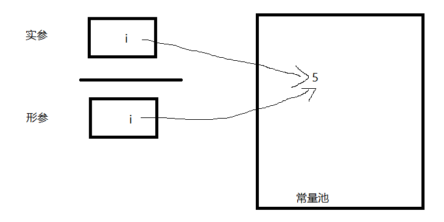
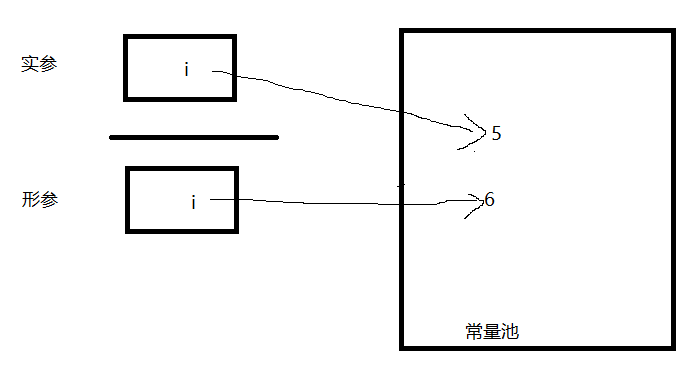

# 对象包装器与自动装箱

所有的基本类型都有其对应的对应类,我们叫做包装类:
```
int - Integer
long - Long
float - Float
double - Double
short - Short
byte - Byte
char - Character
boolean - Boolean
```
这里需要注意的是包装类是不可变的,这其实很难理解,比如下面的代码:
```java
Integer a=3;
a+=3;
System.out.println(a);
```
如果说`Integer`是不可变的话,那么为什么最后`a`会变成6。其实这里面涉及到装箱与开箱操作,上面的代码可以转化成下面:
```java
//原出处上面为int intA = a.getInt();但在《Core Java》上面拆箱是下面的语句,想表达的意思是我们在拆箱,领会精神。
int intA = a.intValue();//自动拆箱
intA++;
a = Integer.valueOf(intA);//自动装箱 this is a new reference也就是a已经不是之前的那个a,他是一个新Integer对象的引用
```
这么说来,自动装箱使得包装类的不可变好像是错误的一样,但实际上确实是不可变。
另外还有另外一个奇怪的是,`Integer i = new Integer(5)`与`Integer i = 5`这两个语句不一样,如果我们运行下面的语句:
```java
Integer a;
Integer b;
a = new Integer(5);
b = a;
if(b == a) {
    System.out.println("Strange");
}
a++;
if(b == a) {
    System.out.println("Stranger");
}
a--;
if(b == a) {
    System.out.println("Strangest");
}
```
如果执行上面的语句,会发现只会打印出`Strange`,但是我们将`a = new Integer(5)`改成`a = 5`或者`a = Integer.valueOf(5)`之后,会打印出`Strange`和`Strangest`。对此,我们有下面的解释:
当使用`a = new Integer()`时,我们会使用对象变量`a`指向堆中的`Integer`对象,但是当我们使用`a = Integer.valueOf(5)`和`a = 5`的时候,`it will use the integer cache for getting the instance`，会使用`integer cache`来获取实例,这样的话,当我们将a增加之后,又减小,使其与原来初始值相等,那么会和原来一样指向原来的对象。这样我们又引出了下面一个新的特性,自动装箱规范要求`boolean`,`byte`,`char <= 127`,介于`-128和127之间的short和int`被包装到固定的对象。也就是说满足上面条件的,比如上面的`a = 5`,`b = a`中的`a`和`b`指向的是相同的对象。
另外,还有其他的知识:
如果一个表达式中混合使用`Integer`和`Double`类型,`Integer`值就会拆箱,提升为double,再装箱为`Double`:
```java
Integer n = 1;
Double x = 2.0;
System.out.println(true ? n : x);
```
上面会打印出`1.0`。
还有就是我们之前讨论的改变数值参数的问题:
```java
    public static void main(String[] args) {
        int i = 5;
        System.out.println(i);
    }

    public static void add(int i) {
        i++;
    }

```
很容易理解上面的例子中变量`i`和`j`得不到交换。那么我们将上面的`int`改成`Integer`之后,其实也得不到交换。对此我们给出这样的解释:
下面的解释都是在`Integer`做出的:
当我们将实参传给形参之后,尽管此时形参和实参执行相同的对象,但是因为有自动装箱的存在,可以将上面的方法转化为:
```java
public static void add(Integer i) {
    int num = i.intValue();//拆箱
    num++;//自增运算
    i = Integer.valueOf(num);//装箱
}
```
也就是说此时的i已经指向一个新的对象了。
最初的状态为:

之后的状态为:

