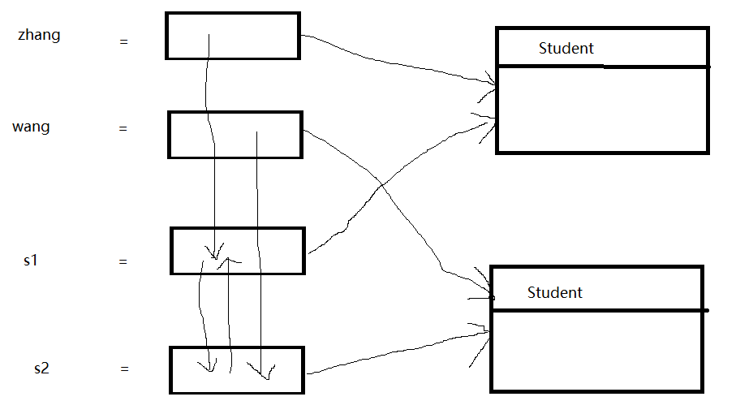

# 引用类型

## 参数问题
对于下面的代码:
```java
public static void main(String[] args) {
    int i = 5;
    int j = 6;
    swap(i, j);
    System.out.println(i + " " + j);
}

public static void swap(int i, int j) {
    int temp = i;
    i = j;
    j = temp;
}
```
上面的代码会发现根本交换不了变量`i`与变量`j`。原因很简单,是因为`Java`采用的是值传递的方法,但这还不是重点,重点是下面的部分:
一般来说在程序设计语言中存在**按值调用**与**按引用调用**,但事实上来说,`Java`只有按值调用。在某些情况下,可能会觉得`Java`向
能够实现**按引用调用**一样,但实际上不能,看下面的例子:
```java
public static void main(String[] args) {
    Student zhang = new Student();
    changeName(zhang);
    System.out.println(zhang.getName());
}

public static void changeName(Student s) {
    s.setName("howard");
}
```
会发现变量`s`的名字是`howard`,但其实对于并非采用的是按引用调用。用图示的方式来解释:

也就是说,首先我们应该明白的是**对象变量的值都是对存储在另一个地方的某个对象的引用**。所以我们采用**按值调用**的方式,将变量`zhang`赋值给了`s`之后,两个对象就指向同一个对象,是同一个对象的引用,所以通过对变量`s`对对象改造之后,`zhang`因为与`s`指向同一个对象,所以对象也会发生变化。

我们可以看下面的一个反例:
同样是交换的例子:
```java
public static void main(String[] args) {
    Student zhang = new Student("zhang", 15);
    Student wang = new Student("wang", 14);
    swapStudent(zhang, wang);
    System.out.println(zhang.getName() + " " + wang.getName());
}

public static void swapStudent(Student s1, Student s2) {
    Student temp = s1;
    s1 = s2;
    s2 = temp;
}
```
当我们执行完这个操作之后,我们会发现`zhang`和`wang`这两个变量并没有发生变化。因为我们可以从图例中看出来:

从上面的图可以看出来,`s1`和`zhang`指向同一个对象,`s2`和`wang`指向同一个对象,但是后来交换之后`s1`和`s2`指向的对象发生了交换,但是`zhang`和`wang`并没有发生变化。我们可以对比`C++`中的**按引用调用**:
```c++
```
```
总之,我们要牢记下面几点:
1. 方法不能够修改基本数据类型的参数(即数值型或布尔型)
2. 方法可以改变对象参数的状态
3. 方法不能够让一个对象参数引用另一个新对象
```
其中最为重要是第三点,不能够让一个对象参数引用另一个新对象,只能够改变里面的状态。
这里面其实还有一件事,比如下面的代码:
```java
    public static void main(String[] args) {
        int i = 5;
        add(i);
        System.out.println(i);
    }

    private static void add(int i) {
        i++;
    }
```
上面的变量`i`肯定不能够发生变化。但是我们把`int`换成`Integer`之后依旧不会发生变化。这是因为`Integer`对象是不可变的,包含在包装器中的内容不会发生变化。

## 往`List`添加元素
对于下面的代码:
```java
public static void main(String[] args) {
    Integer[] a = {1, 1, 1};
    List<Integer[]> list = new ArrayList<>();
    for (int i = 0; i < 1; i++) {
        list.add(a);
    }

    a[0] = 5;

    for (Integer[] integers : list) {
        for (int i = 0; i < 3; i++)
            System.out.println(integers[i]);
    }
}
```
如果运行上面的代码的话,你会发现列表中添加的是:`5, 1, 1`,这是因为往里面添加的是数组`a`的引用,当我们修改`a`里面的内容的时候,列表中也会发生相应的改变。

我们为了避免这种情况,我们可以向里面添加`a.clone`,关于这个方法:
```
 new操作符的本意是分配内存。程序执行到new操作符时，首先去看new操作符后面的类型，因为知
 道了类型，才能知道要分配多大的内存空间。分配完内存之后，再调用构造函数，填充对象的各个
 域，这一步叫做对象的初始化，构造方法返回后，一个对象创建完毕，可以把他的引用（地址）发
 布到外部，在外部就可以使用这个引用操纵这个对象。而clone在第一步是和new相似的，都是分配
 内存，调用clone方法时，分配的内存和源对象（即调用clone方法的对象）相同，然后再使用原对
 象中对应的各个域，填充新对象的域，填充完成之后，clone方法返回，一个新的相同的对象被创
 建，同样可以把这个新对象的引用发布到外部。
```
但其实对于`clone()`来说,这还涉及到**深拷贝**和**浅拷贝**,可以参考这篇写的很详细的博客:
https://blog.csdn.net/zhangjg_blog/article/details/18369201
下面有一个评论也很有意思:
```
博主你好！作为初学者正在研读你的博客，在网上看了其他人关于原型模式的文章，然后觉得你这
里好像有点不足，就是使用一般的clone()方法对对象中的String的克隆应该属于深克隆。原因在于
String的不可变，比如String str = "java";，除非你用反射，否则你无法改变“java”任何一个字
符。所以 ，当克隆的时候把原型对象中的String引用复制给新对象的引用时，虽然新对象和原型指
向相同的内容，但是原型不会影响到克隆对象的内容，从这一角度来说，对String应用的克隆属于
深度克隆。望指正。
```
