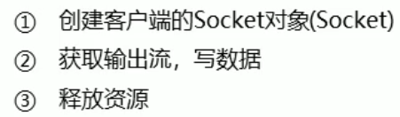

# 网络编程

## 网络编程概述


## 网络编程三要素


### IP地址


InetAddress的使用

```java
public static void main(String[] args) throws UnknownHostException {
    InetAddress address = InetAddress.getByName("LAPTOP-DF41VT87");
    String name = address.getHostName();
    String ip = address.getHostAddress();

    System.out.println(name + " " + ip);
}
```

### 端口


### 协议


## UDP通信程序

### UDP通信原理


### UDP发送数据的步骤


```java
DatagramSocket ds = new DatagramSocket();

byte[] bys = "hello UDP".getBytes();
int length = bys.length;
InetAddress address = InetAddress.getByName("172.26.77.45");
int port = 10086;
DatagramPacket dp = new DatagramPacket(bys, length, address, port);

ds.send(dp);

ds.close();
```

### UDP接受数据

```java
DatagramSocket ds = new DatagramSocket(10086);

byte[] bys = new byte[1024];
DatagramPacket dp = new DatagramPacket(bys, bys.length);

ds.receive(dp);

byte[] data = dp.getData();
String dataString = new String(data);
System.out.println(dataString);

ds.close();
```

## TCP通信程序

### TCP通信原理


### TCP发送数据


```java
Socket socket = new Socket("172.26.77.45", 10086);

OutputStream os = socket.getOutputStream();
os.write("hello TCP".getBytes());

socket.close();
```

### TCP接收数据

```java
ServerSocket ss = new ServerSocket(10086);

Socket s = ss.accept();

InputStream is = s.getInputStream();
byte[] bys = new byte[1024];
int len = is.read(bys);
String data = new String(bys, 0, len);
System.out.println("数据是: " + data);

s.close();
ss.close();
```


PS: IDEA可以同时运行两个程序,我们可以先运行UDP接受数据的程序,之后再运行UDP发送数据的程序。