# 集合

## 1.集合的体系结构

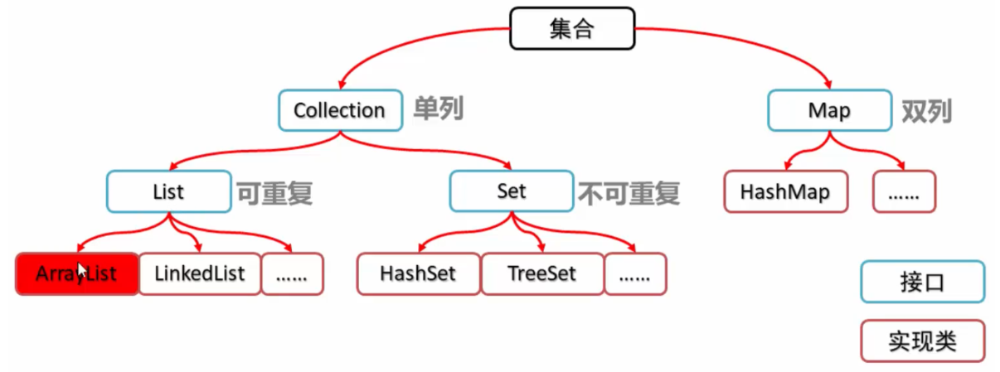

上面给出的这些全部都是接口。事实上，Java集合类库采用了接口与实现相分离的手段。

## 2.Collection接口

`Collection`中的常用方法：

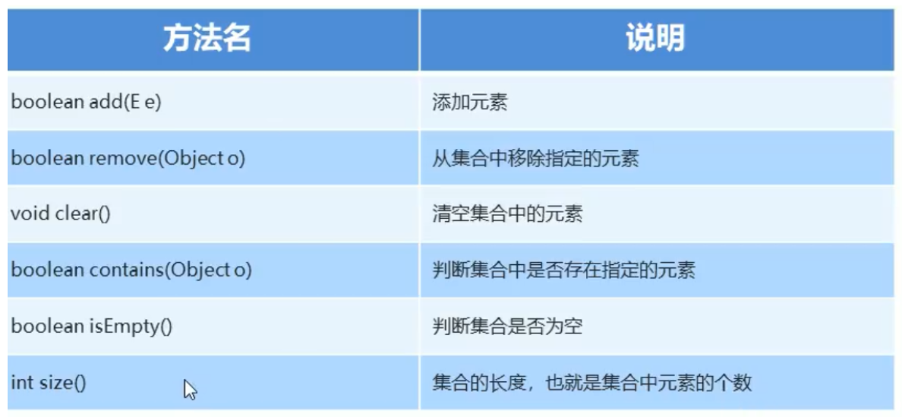

除了上面这些方法之外，`Collection`中还提供了一个非常重要的方法：`Iterator<E> Iterator()`。这个接口可以用于返回一个实现了`Iterator`接口的对象。

## 3.迭代器

```java
public interface Iterator<E> {
    E next();
    boolean hasNext();
    void remove();
    default void forEachRemaining(Consumer<? super E> action);
}
```

`next`方法：通过反复调用该方法，可以逐个访问集合中的每个元素，但是，如果到达了集合的末尾，将会抛出`NoSuchElementException`的异常，下面是`next`方法的定义：

> Returns the next element in the iteration.

`hasNext`方法：为了防止`next`方法抛出异常，在调用这个方法之前需要调用`hasNext`方法，如果迭代器对象还有可以访问的元素，那么这个方法就会返回`true`。所以说，我们可以通过下面的代码来遍历集合中所有的元素：

```java
Collection<String> c = ...;
Iterator<String> iter = c.iterator();
while(iter.hasNext()) {
    String element = iter.next();
    ...
}
```

> Java迭代器并不是这样处理的，查找操作与位置变更紧密耦合。查找一个元素的唯一方法是调用`next`，在执行查找操作的时候，迭代器的位置就会向前移动。

关于迭代器的示意图：

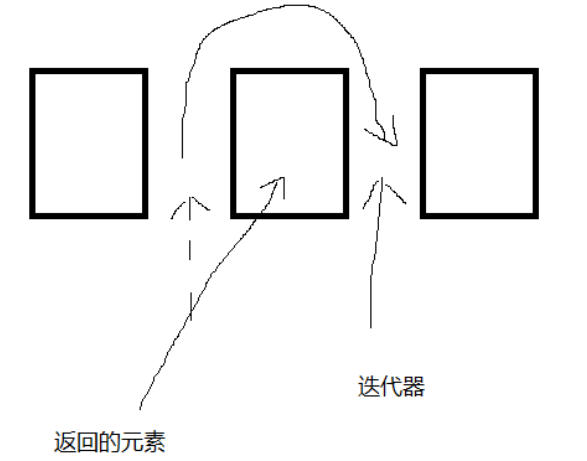

除了使用上面这种方法来遍历元素之外，我们可以采用for-each循环。

```java
for (String element : c) {
    ...
}
```

`for - each`循环可以处理任何实现了`Iterable`接口的对象，这个接口只包含一个抽象方法：

```java
public interface Iterable<E> {
    Iterator<E> iterator();
}
```

因为`Collection`接口扩展了`Iterable`接口，那么对于标准类库中的任何集合全部都能够使用`for - each`循环。

`remove`方法：该方法将会删除上次调用`next`方法时返回的元素，这两个方法之间具有依赖性，在调用`remove`之前必须要调用`next`方法，否则会抛出`IllegalStateException`异常。继承了`Iterator<E>`的`ListIterator<E>`也需要遵循这个准则。

## 4.List

关于`List`的定义：

> An ordered collection (also known as a sequence). The user of this interface has precise control over where in the list each element is inserted. The user can access elements by their integer index (position in the list), and search for elements in the list.
>
> Unlike sets, lists typically allow duplicate elements.

翻译成中文：

> 一个有序的集合（也称为序列）。该界面的用户可以精确控制每个元素在列表中的位置。用户可以通过元素的整数索引（在列表中的位置）访问元素，并在列表中搜索元素。
>
> 与sets不同，列表通常允许重复的元素。

### 1. `List`集合的特点：

1. 有序：如果存储的时候顺序是`hello`，`world`，`java`，那么第一个位置就是`hello`，第二个位置是`world`，第三个是`java`，即存储的顺序与输出的顺序一致。
2. 可重复：`List`中可以存储两个相同的元素。

### 2. `List`集合的特有方法：

跟之前的`collection`接口相比，`List`集合中通过索引`index`能够完成很多特有的方法：

```java
void add(int index, E element)	//在此集合的指定位置插入元素
E remove(int index)	//删除指定索引处的元素，返回被删除的元素
E set(int index, E element)	//修改指定索引处的元素，返回索引处的元素
E get(int index)	//返回指定索引处的元素
```

### 3. ListIterator

关于`ConcurrentModification`异常：如果有两个迭代器操作同一个集合的话，往往会出现很多错误，因为两个迭代器之间的信息不能够共通(比如第一个迭代器指向某个元素前面的位置，而另一个迭代器刚刚删除了这个元素，那么第一个迭代器就会进入到无效状态)，如果一个迭代器发现他的集合被另一个迭代器修改了，或者是被集合中的某个方法所修改，就会抛出`ConcurrentModification`异常。

当执行这段代码代码的时候，会产生异常`ConcurrentModification`：

```java
public static void main(String[] args)  {
    ArrayList<Integer> list = new ArrayList<Integer>();
    list.add(2);
    Iterator<Integer> iterator = list.iterator();
    while(iterator.hasNext()){
        Integer integer = iterator.next();
        if(integer == 2)
            list.remove(integer);
    }
}
```

下面的代码会避免这个问题：

```java
public static void main(String[] args)  {
    ArrayList<Integer> list = new ArrayList<Integer>();
    list.add(2);
    Iterator<Integer> iterator = list.iterator();
    while(iterator.hasNext()){
        Integer integer = iterator.next();
        if(integer == 2)
            iterator.remove();
    }
}
```

一个直观的理解是：上面通过`list`的`remove`方法来，不使用`iterator`的`remove`方法，当再次调用`iterator`的`next`方法的时候，`iterator`可以检测到上述的变化,所以会报错。但是如果使用了`iterator`的`remove`方法，则会知道，就不会出现这样的异常。

如何检测到并发修改？

> 有一个简单的方法，首先令集合能够跟踪更改操作(诸如添加或删除元素)，每个迭代器都会为它负责的更改的操作维护一个单独的更改操作次数，在每个迭代器方法开始处，都会检查它自己的更改操作数与集合的更改操作数是否相等，不相等，就会抛出一个Concurrent Modification异常。
>
> 需要 注意的是：链表只跟踪对列表的结构性修改，例如，添加或者删除链接，`set`方法不被视为结构性修改。

还有多个迭代器并发处理同一个集合的情况也可能会出现这样的异常。

```java
public static void main(String[] args)  {
    List<String> list = new ArrayList<String>();
    list.add("11");
    ListIterator<String> iter1 = list.listIterator();
    ListIterator<String> iter2 = list.listIterator();
    iter1.next();
    iter1.remove();
    iter2.next();//throws ConcurrentModificationException
}
```

因为`ListIterator`是`Iterator`的扩展，所以说有一些其余的方法。`ListIterator`类可以从前后两个方向遍历链表中的元素，除了`next`之外，还有`previous`方法。`previous`与`next`相反的方向移动，同样会返回其越过的元素。同样，也有相应的`hasPrevious`方法。

### 4.LinkedList

> LinkedList 是一个继承于AbstractSequentialList的双向链表。它也可以被当作堆栈、队列或双端队列进行操作。
> LinkedList 实现 List 接口，能对它进行队列操作。
> LinkedList 实现 Deque 接口，即能将LinkedList当作双端队列使用。
>
> 基于`LinkedList`的这些特点，我们可以简单地判断，需要频繁在开头、末尾、中间添加元素的时候，应当使用`LinkedList`。


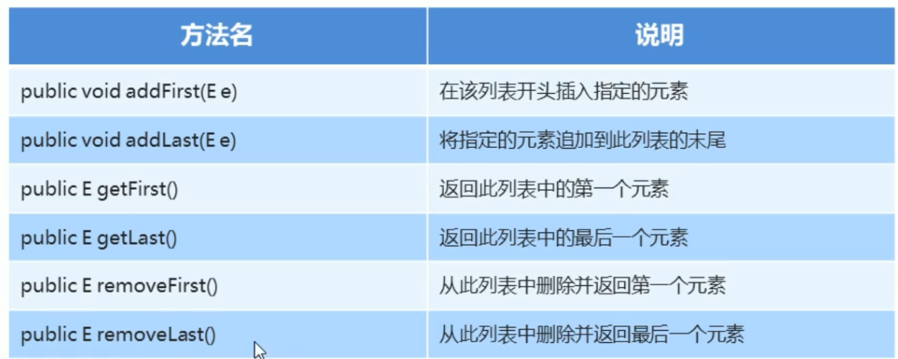
*LinkedList集合的特有功能*


关于`LinkedList`的详细文档：https://www.cnblogs.com/skywang12345/p/3308807.html

## 5.Set

`Set`不包括重复元素的集合，它的功能与`Collection`相同。

### 1.哈希值

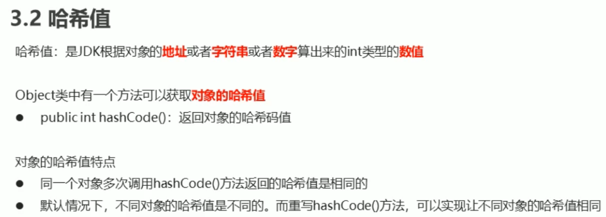

正如上面所提到的这样，可以通过地址，字符串或者数字来计算，对于`String`类来获取散列码的办法：

```java
int hash = 0;
for (int i = 0; i < length(); i++)
    hash = 31 * hash + charAt(i);
```

也就是我们在某一个类中可以通过重写`hashCode()`方法，在最初的`Object`类的`hashCode()`方法中，其值有对象的存储地址得出。

这里需要注意的是：`equals()`与`hashCode()`的定义必须相容，如果`x.equals(y)`返回`true`，那么`x.hashCode()`就必须与`y.hashCode()`返回相同的值。 

### 2.HashSet

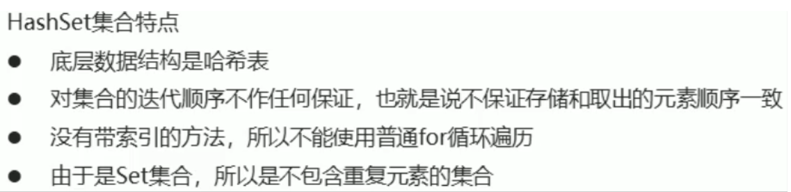

### 3.范例

```java
//Student类
public class Student {
    private int age;
    private String name;

    public Student() {

    }
    public Student(String name, int age) {
        this.name = name;
        this.age = age;
    }

    public int getAge() {
        return age;
    }

    public void setAge(int age) {
        this.age = age;
    }

    public String getName() {
        return name;
    }

    public void setName(String name) {
        this.name = name;
    }

    @Override
    public boolean equals(Object o) {
        if (this == o) return true;
        if (o == null || getClass() != o.getClass()) return false;

        Student student = (Student) o;

        if (age != student.age) return false;
        return name != null ? name.equals(student.name) : student.name == null;
    }

    @Override
    public int hashCode() {
        int result = age;
        result = 31 * result + (name != null ? name.hashCode() : 0);
        return result;
    }

    @Override
    public String toString() {
        return "Student{" +
                "age=" + age +
                ", name='" + name + '\'' +
                '}';
    }
}
```

我们使用`HashSet`来存储它们：

```java
public class Demo {
    public static void main(String[] args) {
        Set<Student> students = new HashSet<>();
        students.add(new Student("lin", 15));
        students.add(new Student("zha", 13));
        students.add(new Student("wang", 14));

        students.add(new Student("wang", 14));
        System.out.println(students);
    }
}
```

这里面比较关键的是这两个方法：`equals()`与`hashCode()`两个方法，上面我们也提到了这两个方法之间的关系。==如果`x.equals(y)`返回`true`，那么`x.hashCode()`就必须与`y.hashCode()`返回相同的值。我们大致看下我们用自动生成产生的这两个方法：

```java
@Override
public boolean equals(Object o) {
    if (this == o) return true;
    if (o == null || getClass() != o.getClass()) return false;

    Student student = (Student) o;

    if (age != student.age) return false;
    return name != null ? name.equals(student.name) : student.name == null;
}

@Override
public int hashCode() {
    int result = age;
    result = 31 * result + (name != null ? name.hashCode() : 0);
    return result;
}
```

因为这里需要注意的是：在为元素分配位置的时候，首先根据元素的哈希值找到元素应该放到哈希表中的那个桶，之后再看在这个桶里边是不是有别的元素，挨个比较，如果没有哈希值与之相同的，就将其放到这个桶里面，如果找到哈希值与之相同的，那么随后与之比较两个元素是否相等，最开始是使用的`hashCode()`方法，之后使用的是`equals()`方法。如果两个值不相等的话，就将其加入到桶里面，如果两个值相等的话，就不添加进去了，通过我们之前的讨论，我们可以得到以下的结论：

1. 哈希值相同，元素可以不相等，元素相等，哈希值一定相同。
2. 根据上面我们可以知道，元素只要相等，就一定会放到同一个桶内，这样的话我们就保证了`HashSet`里面不可能存储两个完全相同的元素。

### 4.哈希表

在上面我们我们提到了哈希表这种数据结构，现在我们简要来介绍这种结构：

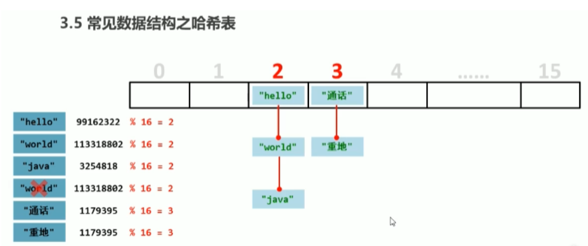

哈希表又叫散列表，在`Java`中用链表数组实现，每个列表被称为桶(bucket)，首先使用元素的哈希值与桶的总数取余，就可以得到保存这个元素的桶的索引。

### 5.LinkedHashSet

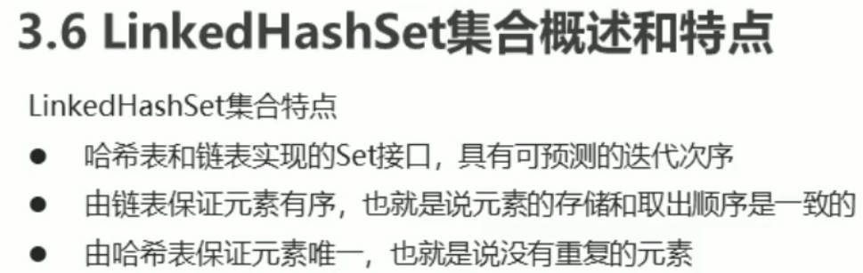

### 6.TreeSet

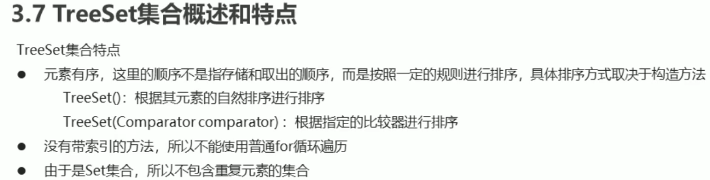

### 7.自然排序Comparable的使用

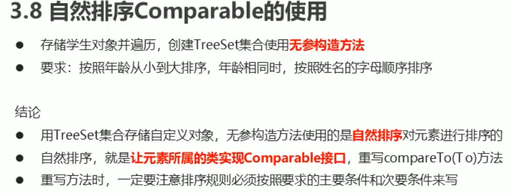

这里需要注意的是:==让元素所属的类实现`Comparable`接口，重写compareTo(T)方法==，我之前一直以为的是要让`TreeSet`直接或者间接地实现`Comparable`接口。

在源码中关于无参构造方法中有这么一段描述:
> Constructs a new, empty tree set, sorted according to the
  natural ordering of its elements.  All elements inserted into
  the set must implement the {@link Comparable} interface.

也就是必须保证插入到接口中的元素必须要满足`Comparable`接口。

如果一个类实现了`Comparable`接口,那么就必须要实现里面的`compareTo`方法。关于这个方法，需要注意的是:这个方法可任意返回一个整数，如果两个对象不想等的话，就应该返回一个正值或者返回一个负值，如果两个对象相等的话，就应该返回0。`Comparable`接口的文档建议`compareTo()`与`equals()`应该相兼容。
```java
public class Student {
    private int age;

    @Override
    public int compareTo(Student s) {
        return this.age - s.age;
    }
}
```
当希望排序顺序是正序的时候(按照年龄从小到大),如果按照逆序的话，应该将上面代码改为：`return s.age - this.age`。关于上面的函数`compareTo`,文档中给出了下面的解释:
> Compares this object with the specified object for order. Returns a negative integer, zero, or a positive integer as this object is less than, equal to, or greater than the specified object.

如果小于特定的对象(也就是传入的参数),那么就会返回一个负数，大于，则会返回一个正数，等于的话，就会返回一个0。
> 这里的话，仔细看会发现一件事情，对于代码
> ```java
>   @Override
>   public int compareTo(Student s) {
>       return this.age - s.age;
>   }
> ```
当我们使用上面的方法的时候，往往是通过对象调用的方式：`s1.compareTo(s)`,那么为什么对于传进来的参数对象也能够使用其私有变量.我之前在翁恺的课上看到过,但找不到当时的笔记了。

### 8.Comparator

除了之前我们使用实现`Comparable`接口的方式,我们还有另外一种方式来通过排序，从而确定集合元素在集合中的位置。
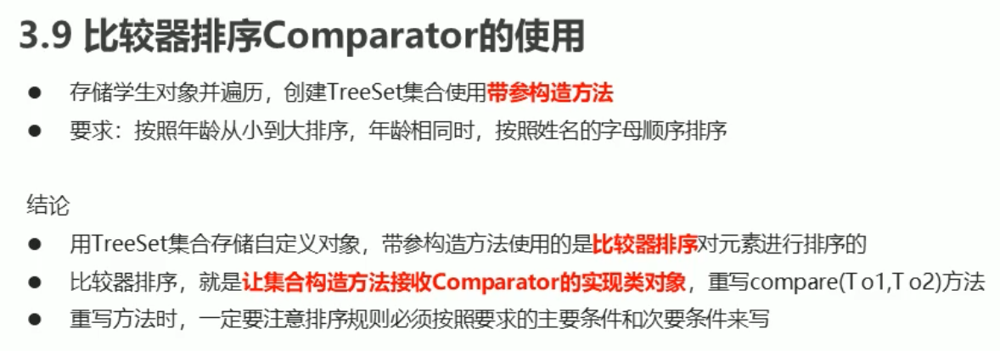
首先，我们之所以要提出`Comparator`接口，是因为有一些我们不能够修改的类，比如说`String`类，它里面也继承了`Comparable`接口，而里面实现的`compareTo`方法却是使用字典顺序来排序的，如果想要通过字符串的长度来比较，就需要采用`Comparator`。当构造`TreeSet`对象的时候，不使用无参构造函数，我们采用下面的构造函数:
```java
    public TreeSet(Comparator<? super E> comparator) {
        this(new TreeMap<>(comparator));
    }
```
举个例子:
```java
    Set<Student> students = new TreeSet<>(new Comparator<Student>() {
        @Override
        public int compare(Student s1, Student s2) {
            int num1 = s1.getAge() - s2.getAge();
            int num2 = num1 == 0 ? s1.getName().compareTo(s2.getName()) : num1;
            return num2;
        }
    });
```
与之前实现的`Comparable`接口的`compareTo()`方法基本上类似，我们可以在`Comparator`接口中的`compare()`方法中定义我们应该怎么排序。这里需要注意的是，我们之前是用要排序的元素实现`Comparable`接口。但是因为有的类型的元素，比如`String`，我们不能对其进行修改，我们可以采用另一种方式，即用于一个外部的类(实现了`Comparator`接口，这里可能有问题)，来将我们要比较的对象传进来进行比较。

之所以有上面两种方式,是因为比如有些类不是我们写的,或者是`Java`的API,我们很难甚至几乎不可能让他们实现`Comparable`接口,但我们可以使用`Comparator`来定义排序方式。

下面这段来自:https://zhuanlan.zhihu.com/p/54004622
如果侵权,请联系作者。
关于`compare()`方法,如果我们传进去的对象为(Object o1, Object o2):
```java
public int compare(Object o1, Object o2) {
    //升序
    return o1.a - o2.a;
    //降序
    return o2.a - o1.a;
}
```
首先o2是第二个元素，o1是第一个元素。无非就以下这些情况：
①： `o2.a > o1.a` : 那么此时返回正数，表示需要调整o1,o2的顺序，也就是需要把o2放到o1前面，这不就是降序了么。

②：`o2.a < o1.a` : 那么此时返回负数，表示不需要调整，也就是此时o1 比 o2大， 不还是降序么。
总结起来,就是一句话:**只要返回的是正数,就要调整顺序,只要返回的是负数,就不需要调整顺序。**

### 9.`contains()`方法
与上面的很多问题一样,使用`contains()`方法同样涉及到了`equals()`和`hashCode()`,可以参考这篇博客:https://blog.csdn.net/violet_echo_0908/article/details/50152915
和上面的比较排序一样,我们在判断集合中是否包含某个元素的时候,都会比较这两个元素相等与否,这就可能导致下面的问题:
```java
static class Position {
    //横坐标
    private int x;
    //纵坐标
    private int y;

    //构造函数
    public Position() {}
    public Position(int x, int y) {
        this.x = x;
        this.y = y;
    }
}

public static void main(String[] args) {
    Set<Position> set = new HashSet<>();
    Position p1 = new Position(0, 0);
    set.add(p1);
    Position p2 = new Position(0, 0);
    if (set.contains(p2)) {
        System.out.println("true");
    } else {
        System.out.println("false");
    }
}
```
对于上面的代码,会打印出`false`,尽管我们的本意是第二次添加的对象和第一个对象相同,所以应该打印出`true`,这是因为如果我们不重写`equals()`和`hashCode()`方法的话,默认两个对象返回不同的哈希值,所以我们重写一下方法,把他们定义相等即可。一般用IDEA自动生成这两个方法即可。

事实上,原则上要保证当`x.equals(y)`为`true`时,`x.hashCode()`必须等于`y.hashCode()`,但实际上,可以不满足,当然,不要这么做。

## List与Set的比较
　两个接口都是继承自Collection​，是常用来存放数据项的集合，主要区别如下:
① List和Set之间很重要的一个区别是是否允许重复元素的存在，在List中允许插入重复的元素，而在Set中不允许重复元素存在。
​② 与元素先后存放顺序有关，List是有序集合，会保留元素插入时的顺序，Set是无序集合。
​③ List可以通过下标来访问，而Set不能。

## 6.泛型

### 1.简介

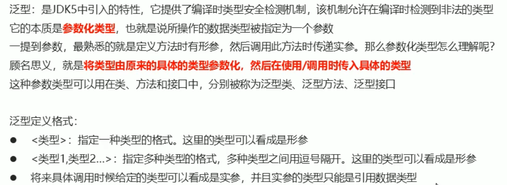
*泛型*

### 2.泛型类

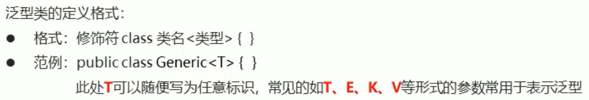
*泛型类*

例子:
```java
public class Generic<T> {
    private T t;

    public T getT() {
        return t;
    }
    public void setT(T t) {
        this.t = t;
    }
}

public class Demo {
    public static void main(String[] args) {
        Generic<String> g1 = new Generic<>();
        g1.setT("Tom");

        Generic<Integer> g1 = new Generic<>();
        g1.setT(10);
    }
}
``` 

### 3.泛型方法

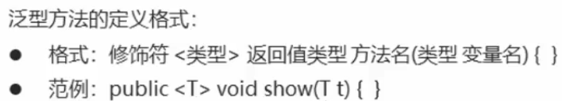
*泛型方法*
例子:
```java
public class Generic {
    public <T> void show(T t) {
        System.out.println(t);
    }
}

public class Demo {
    public static void main(String[] args) {
        Generic g = new Generic();
        g.show("Tom");
        g.show(20);
        g.show(true);
    }
}
``` 
当我们讲到这里的时候,就是针对上面的问题，就是**泛型方法**与**泛型类**中的`T`,为什么我们不使用`Object`来代替呢？针对上面的`Generic<T>`,我们可以有下面这个代码:
```java
public class Generic {
    private Object t;

    public Object getT() {
        return t;
    }
    public void setT(Object t) {
        this.t = t;
    }
}
```
事实上,最初的泛型程序设计就是这样,但是存在两个问题:
1. 当获取一个值,很可能要强制转化,因为存储的都是`Object`类型,必须转化成要使用的类型。比如:`String name = (String) g.getT();`。
2. 没有类型检查,比如存储进去一个`String`类型的值, 取出来强制转化为`Integer`类型就会出很大的问题:
   ```java
    public class Generic {
    private Object t;

    public Object getT() {
        return t;
    }

    public void setT(Object t) {
        this.t = t;
    }
   ```
   对于上面的类,我们运行下面程序时:
   ```java
    Generic g = new Generic();
    g.setT("li");
    Integer i = (Integer) g.getT();
   ```
   就会出现类型转化的错误。
   这是对于泛型类来说,为什么我们抛弃了上面关于`Object`的这种做法,那么对于泛型方法来说，我们为什么不这样呢？其实道理同样。

### 4.泛型接口


*泛型接口*


### 5.类型通配符

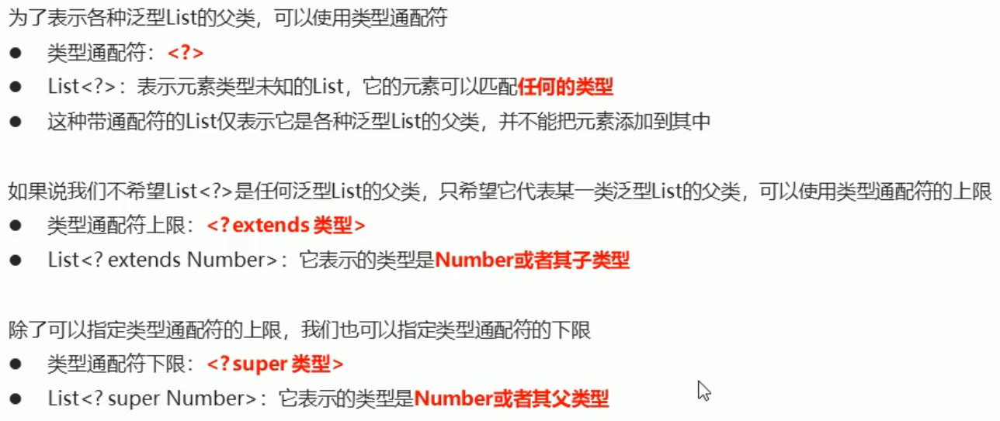
*类型通配符*
`<? extends 类型>`之所以是类型通配符上限,是因为`extends`后面的类型表示的是可以表示的所有类的父类,也就是能够表示的类型是该类型的子类以及其本身,所以叫做上限。
`<? super 类型>`之所以叫做类型通配符下限,是因为`super`后面的类型表示的是可以表示的所有类的子类,也就是能够表示的类型必须是该类型的父类以及其本身。

### 6.可变参数

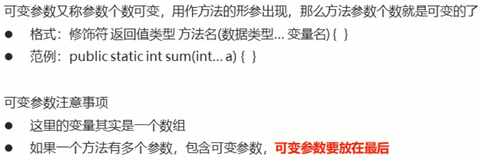
*可变参数*
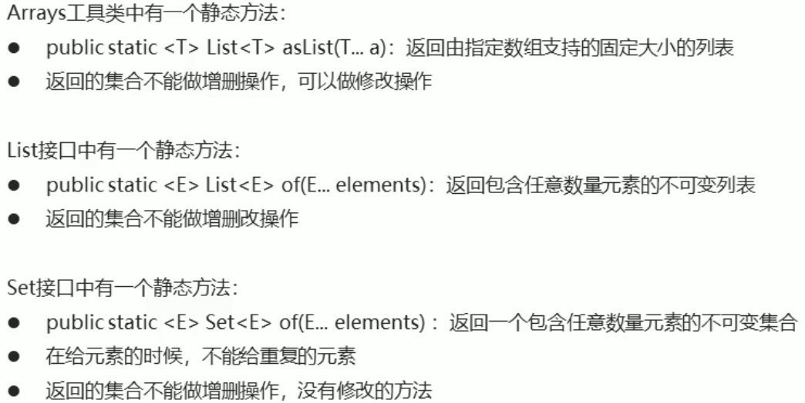

## 7.Map

如果想要查找一个元素,但是并没有要查找元素的准确副本的话,只需要知道一些信息,就可以找到与之相关的元素。`Map`映射就是这样的设计。

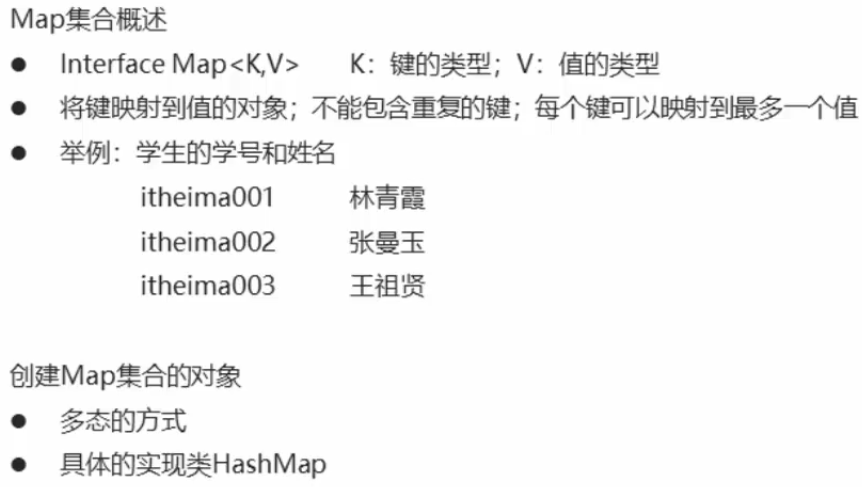
*Map集合*


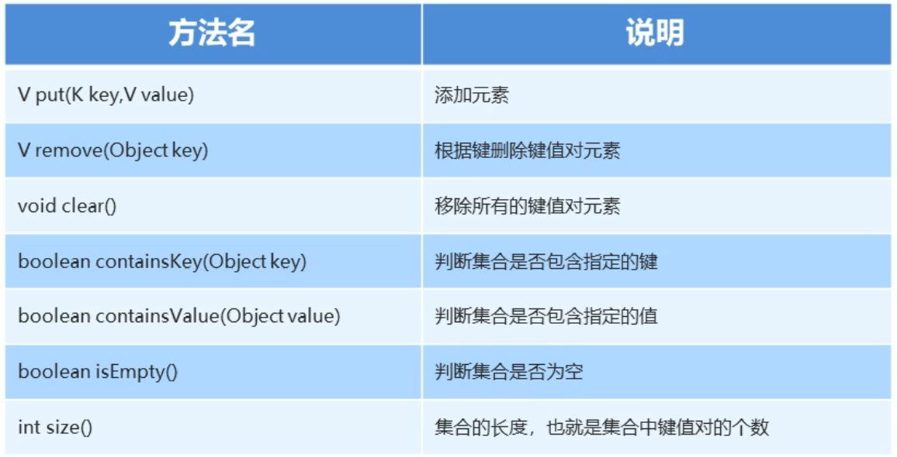
*Map集合的基本功能*


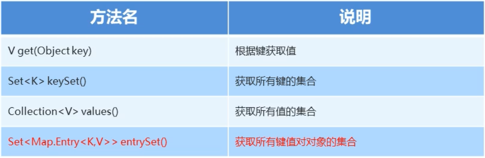
*Map集合的获取功能*


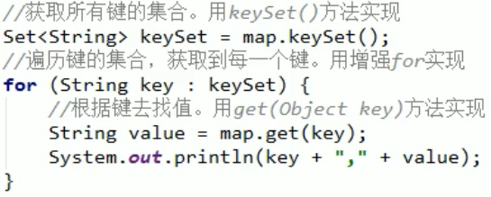
*Map的遍历方式1*


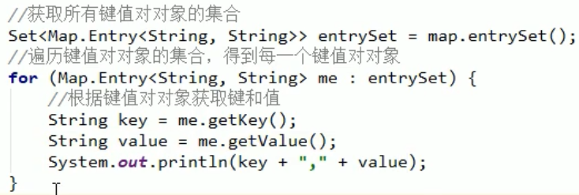
*Map的遍历方式2*


这里我们要补充一个概念:**类型变量的限定**
有的时候我们必须要对类型变量进行限定,比如下面的代码:
```java
    class ArrayAlg {
        public void <T> T min(T[] a) {
            if (a == null || a.length == 0) return null;
            T smallest = a[0];
            for (int i = 1; i < a.length; i++) {
                //compareTo方法: 将此对象与指定的对象进行顺序比较。返回负整数、零或正 //整数，因为这个对象小于、等于或大于指定的对象。
                if (smallest.compareTo(a[i]) > 0)) smallest = a[i];
            }
            return smallest;
        }
    }
```
但是这里需要知道的是: T所属的类必须要有一个`compareTo()`方法,也就是说T必须要实现接口`Comparable`的类。那么我们能将代码改成下面的形式:
```java
    //Comparable接口本身就是一个泛型类型,但是当前我们忽略。
    public static <T extends Comparable> T min(T[] a)...
```
但是,还有一个疑问就是:为什么这里使用的关键字是`extends`,而并不是`implements`。因为上面的`Comparable`是一个接口。记法如下所示:
```java
    <T extends BoundingType>
```
表示T应该是限定类型的子类型,T与限定类型既可以是类,也可以是接口,一个类型变量和通配符可以有多个限定:
```java
    T extends Comparable & Serializable
```
但是这里需要注意的是:
**可以有多个接口限定,但是最多有一个限定是类,如果有一个限定是类的话,就必须要放到限定列表的第一个限定。**

## Collections
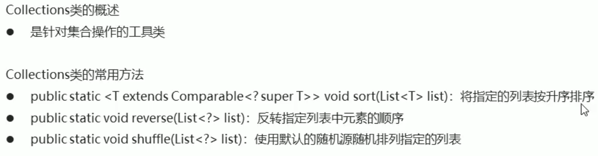
*Collections*


## 补充
1. java-doc文档中的方法：

   > 一、Static Methods、Instance Methods、Abstract Methods、Concrete Methods
   >
   > ——Static Methods：静态方法
   >
   > ——Instance Methods：实例方法（非静态方法）
   >
   > 
   >
   > ——Abstract Methods：抽象方法
   >
   > ——Concrete Methods：具体方法（非抽象方法）
   >
   > 
   >
   > ——Deprecated Methods：废弃方法
   >
   >  所有的Static Methods是Concrete Methods，但不是Instance Methods
   >
   > ==静态方法不能是抽象方法。==

2. 从Java 8之后，接口里面可以有方法体的方法，被叫做默认方法。

   ```java
   default boolean removeIf(Predicate<? super E> filter) {
       ...
   }
   ```

3. IDEA的使用:
   > 自动补全变量名称 : Ctrl + Alt + V
   >
   > 自动补全属性名称 : Ctrl + Alt + F
   >  
   > 整理代码 : Ctrl + Alt + L 

4. 有个小问题，从JDK文档应该是找不到**源码**的。
5. 有时间总结以下自己使用的vscode快捷键，这里发现一件事情，当使用`Ctrl + K Z`，进入到禅模式的时候，一定要切换成英文输入法。除了这个之外还需要注意的是，粘贴图片的快捷键是`Ctrl + Alt + V`。
6. 匿名内部类
    正如匿名的含义所示，指的就是没有名字的类，假设只要创建这个类的一个对象，就可以不用为这个类指定名字：
    比如这样:
    ```java
        Set<Student> students = new TreeSet<>(new Comparator<Student>() {
            @Override
            public int compare(Student s1, Student s2) {
                int num1 = s1.getAge() - s2.getAge();
                int num2 = num1 == 0 ? s1.getName().compareTo(s2.getName()) : num1;
                return num2;
        }
    ```
    上面的语法含义是:创建一个类对象，这个类实现了`Comparator`接口。需要的方法`compare`需要在{}中定义。
    一般地,语法如下:
    ```java
        new SuperType(construction parameters)
            {
                inner class methods and data
            }
    ```
    上面的`SuperType`可以是接口，这样的话，内部类就要实现这个接口，也可以是一个类，这样的话，内部类就必须扩展这个类。
    这里还需要注意的是:
    因为匿名类没有类名，但是构造器必须要与类名相同，所以匿名类没有构造器。因为构造参数要传递给超类，当匿名类实现一个接口，就不能有任何构造参数，但是仍然要提供小括号。如下：
    ```java
        new InterfaceType()
            {
                methods and data
            }
    ```
    匿名类没有构造器，但是可以提供一个对象初始化块:
    ```java
    var count = new Person("Stephen")
        {
            { initialization }
            ...
        }
    ```
    


   