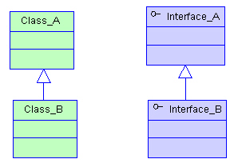
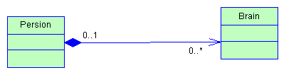

# 面向对象编程
这里主要讲解面向对象编程的三大特性:继承、多态、封装.总结的并不详细,只是记录了一些比较重要的知识点,很多琐碎内容没有记录。具体内容请参考:https://how2playlife.com/2019/09/01/1%E9%9D%A2%E5%90%91%E5%AF%B9%E8%B1%A1%E5%9F%BA%E7%A1%80/

## 三大基本特征
### 继承
继承概念的实现方式有二类：**实现继承与接口继承**。实现继承是指直接使用基类的属性和方法而无需额外编码的能力；接口继承是指仅使用属性和方法的名称、但是子类必须提供实现的能力；
#### 继承与实现
继承：如果多个类的某个部分的功能相同，那么可以抽象出一个类出来，把他们的相同部分都放到父类里，让他们都继承这个类。
实现：如果多个类处理的目标是一样的，但是处理的方法方式不同，那么就定义一个接口，也就是一个标准，让他们的实现这个接口，各自实现自己具体的处理方法来处理那个目标。
所以，继承的根本原因是因为要**复用**，而实现的根本原因是需要定义一个**标准**。
在Java中，继承使用extends关键字实现，而实现通过implements关键字。
Java中支持一个类同时实现多个接口，但是不支持同时继承多个类。
> 简单点说，就是同样是一台汽车，既可以是电动车，也可以是汽油车，也可以是油电混合的，只要实现不同的标准就行了，但是一台车只能属于一个品牌，一个厂商。
```java
class Car extends Benz implements GasolineCar, ElectroCar{

}
```
在接口中只能定义全局常量（static final）和无实现的方法（Java 8以及以后可以有default方法）；而在继承中可以定义属性方法,变量,常量等。
#### 继承与组合
Java是一个面向对象的语言。每一个学习过Java的人都知道，封装、继承、多态是面向对象的三个特征。每个人在刚刚学习继承的时候都会或多或少的有这样一个印象：继承可以帮助我实现类的复用。所以，很多开发人员在需要复用一些代码的时候会很自然的使用类的继承的方式，因为书上就是这么写的（老师就是这么教的）。但是，其实这样做是不对的。长期大量的使用继承会给代码带来很高的维护成本。
本文将介绍组合和继承的概念及区别，并从多方面分析在写代码时如何进行选择。
##### 面向对象的复用技术
前面提到复用，这里就简单介绍一下面向对象的复用技术。

复用性是面向对象技术带来的很棒的潜在好处之一。如果运用的好的话可以帮助我们节省很多开发时间，提升开发效率。但是，如果被滥用那么就可能产生很多难以维护的代码。

作为一门面向对象开发的语言，代码复用是Java引人注意的功能之一。Java代码的复用有继承，组合以及代理三种具体的表现形式。本文将重点介绍继承复用和组合复用。

##### 继承
继承（Inheritance）是一种联结类与类的层次模型。指的是一个类（称为子类、子接口）继承另外的一个类（称为父类、父接口）的功能，并可以增加它自己的新功能的能力，继承是类与类或者接口与接口之间最常见的关系；继承是一种**is-a**关系。（图片来自网络，侵删。）

示例:
```java

class Animal{  

    private void beat(){  
        System.out.println("心脏跳动...");  
    }  

    public void breath(){  
        beat();  
        System.out.println("呼吸中...");  
    }  

}  

class Bird extends Animal{  

    //创建子类独有的方法fly()  
    public void fly(){  
        System.out.println("我是鸟，我在天空中自由的飞翔...");  
    }  

}  
 
class Wolf extends Animal{  

    //创建子类独有的方法run()  
    public void run(){  
        System.out.println("我是狼，我在草原上快速奔跑...");  
    }  

}  

public class InheritTest{  

    public static void main(String[] args){  

        Bird b=new Bird();  
        b.breath();  
        b.fly();  

        Wolf w=new Wolf();  
        w.beat();  
        w.run();  
    }  
} 
```
运行结果:
```
呼吸中... 
我是鸟，我在天空中自由的飞翔... 

心脏跳动... 
我是狼，我在草原上快速奔跑... 
```

##### 组合
组合就是 A类的对象是B类的成员变量。相当于 A类对象是B类对象的一个变量，A类中的所有功能，B类都可以通过A类对象的调用来实现。
组合(Composition)体现的是整体与部分、拥有的关系，即**has-a**的关系。

示例:
```java

class 电池{

  public void 放电（）{
    System.out.println("输出电能");
  }

}

class 屏幕{
  
  public void 亮屏{
    System.out.println("显示内容");
  }

}

class CPU{

  public void 运算{
    System.out.println("浮点计算");
  }

}

class 手机{
  
  private 电池 dc;
  private 屏幕 pm;
  private CPU cpu;

  手机（电池  dc,屏幕 pm,CPU cpu）{
    this.dc = dc;
    this.pm = pm;
    this.cpu = cpu;
  }

  public 开机（）{

    dc.放电();
    cpu.运算();
    pm.亮屏();
    
    System.out.println("开机成功");
  }
  
   public static void main(String[] args) {
       
    电池 dc = new 电池();
    屏幕 pm = new 屏幕();
    CPU cpu = new CPU();
    
    手机  sj = new 手机(dc,pm,cpu);
    sj.开机();

   }
}
```

##### 组合与继承的区别和联系
+ 在继承结构中，父类的内部细节对于子类是可见的。所以我们通常也可以说通过继承的代码复用是一种白盒式代码复用。（如果基类的实现发生改变，那么派生类的实现也将随之改变。这样就导致了子类行为的不可预知性；）
+ 组合是通过对现有的对象进行拼装（组合）产生新的、更复杂的功能。因为在对象之间，各自的内部细节是不可见的，所以我们也说这种方式的代码复用是黑盒式代码复用。（因为组合中一般都定义一个类型，所以在编译期根本不知道具体会调用哪个实现类的方法）
+ 继承，在写代码的时候就要指名具体继承哪个类，所以，在编译期就确定了关系。（从基类继承来的实现是无法在运行期动态改变的，因此降低了应用的灵活性。）
+ 组合，在写代码的时候可以采用面向接口编程。所以，类的组合关系一般在运行期确定。

|组合关系|继承关系|
|----|----|
|优点：不破坏封装，整体类与局部类之间松耦合，彼此相对独立|缺点：破坏封装，子类与父类之间紧密耦合，子类依赖于父类的实现，子类缺乏独立性|
|优点：具有较好的可扩展性|缺点：支持扩展，但是往往以增加系统结构的复杂度为代价|
|优点：支持动态组合。在运行时，整体对象可以选择不同类型的局部对象|缺点：不支持动态继承。在运行时，子类无法选择不同的父类|
|优点：整体类可以对局部类进行包装，封装局部类的接口，提供新的接口|缺点：子类不能改变父类的接口|
|缺点：整体类不能自动获得和局部类同样的接口|优点：子类能自动继承父类的接口|
|缺点：创建整体类的对象时，需要创建所有局部类的对象|优点：创建子类的对象时，无须创建父类的对象|

相信很多人都知道面向对象中有一个比较重要的原则『多用组合、少用继承』或者说『组合优于继承』。从前面的介绍已经优缺点对比中也可以看出，组合确实比继承更加灵活，也更有助于代码维护。
**建议在同样可行的情况下，优先使用组合而不是继承。**
**因为组合更安全，更简单，更灵活，更高效。**
注意，并不是说继承就一点用都没有了，前面说的是【在同样可行的情况下】。有一些场景还是需要使用继承的，或者是更适合使用继承。
继承要慎用，其使用场合仅限于你确信使用该技术有效的情况。一个判断方法是，问一问自己是否需要从新类向基类进行向上转型(父类引用指向子类对象)。如果是必须的，则继承是必要的。反之则应该好好考虑是否需要继承。
只有当子类真正是超类的子类型时，才适合用继承。换句话说，对于两个类A和B，只有当两者之间确实存在is-a关系的时候，类B才应该继承类A。

#### 子类会不会继承父类的私有成员变量和方法？
官方文档的说法为:
> A subclass does not inherit the private members of its parent class. However, if the superclass has public or protected methods for accessing its private fields, these can also be used by the subclass.

> 子类不继承其父类的私有成员，但如果超类有用于访问其私有字段的公共或保护方法，这些方法也可以被子类使用。

但是官方文档中又有下面一段话:
> A subclass inherits all the members (fields, methods, and nested classes) from its superclass. Constructors are not members, so they are not inherited by subclasses, but the constructor of the superclass can be invoked from the subclass.

> 一个子类继承了它的超类的所有成员（字段、方法和内部类）。构造函数不是成员，所以不能被子类继承，但是超类的构造函数可以从子类中调用。

#### 权限限定符

也就是从`private` -> `public`,作用域会变得越来越大,但是在子类中只能够将权限限定符变大或者不变。

#### 方法的重写
子类可以修改继承下来的方法,这被叫做重写,但是要注意的是:**必须要保证方法名相等,返回值相等,参数类型与参数个数相等.**
重写和重载的比较:
重写:相对于继承而言,子类对从父类继承来的方法进行修改。
重载:在同一个类中,多个具有相同的方法名,但是他们的参数不相同(包括参数类型、参数个数、参数顺序)。但是不包括返回类型,也就是是说如果方法名,参数完全相同,但是返回类型不相同的话,不会被认为是重载,事实上,Java会认为这是完全相同的方法,所以会出现编译错误,只有方法名和参数被叫做签名,用来区分两个方法。

#### 继承的初始化顺序
这个在类的初始化中会有更加详细的论述,这里先简单地讨论一下:
1. 首先初始化父类,之后初始化子类。
2. 先初始化对象中的属性,再执行构造方法的初始化。

也就是说:
> 父类对象属性初始化—->父类对象构造方法—->子类对象属性初始化—>子类对象构造方法

#### final关键字
1. final 修饰类，则该类不允许被继承。
2. final 修饰方法，则该方法不允许被覆盖(重写)。
3. final 修饰成员变量，则该类的该属性不会进行隐式的初始化，所以 该final 属性的初始化属性必须有值，或在构造方法中赋值(但只能选其一，且必须选其一，因为没有默认值！)，且初始化之后就不能改了，只能赋值一次。
4. final 修饰局部变量，则该变量的值只能赋一次值，保证在使用之前被初始化赋值就OK。
关于`final`关键字的详细分析: https://www.cnblogs.com/dolphin0520/p/3736238.html

#### super关键字
在对象的内部使用,可以代表父类对象。
`super`关键字和`this`关键字很相似,但其实两者有差异,`this`代表调用该方法的对象的引用,可以将其赋值给其它的对象变量,但是`super`却不能这样,只是一个指示编译器调用超类方法的关键字。

### 封装
封装的相关内容见上面提到的博客。

### 多态
多态就是同一操作作用于不同的对象，可以有不同的解释，产生不同的执行结果。
如果按照这个概念来定义的话，那么多态应该是一种运行期的状态。

#### 多态的必要条件
为了实现运行期的多态，或者说是动态绑定，需要满足三个条件。
即有**类继承或者接口实现**、**子类要重写父类的方法**、**父类的引用指向子类的对象**。

#### 静态多态
另外，还有一种说法，包括维基百科也说明，多态还分为动态多态和静态多态。
上面提到的那种动态绑定认为是动态多态，因为只有在运行期才能知道真正调用的是哪个类的方法。
还有一种静态多态，一般认为Java中的函数重载是一种静态多态，因为他需要在编译期决定具体调用哪个方法.
关于这个动态静态的说法，我更偏向于重载和多态其实是无关的。
但是也要看情况，普通场合，我会认为只有方法的重写算是多态，毕竟这是我的观点。
但是如果在面试的时候，我“可能”会认为重载也算是多态，毕竟面试官也有他的观点。我会和面试官说：我认为，多态应该是一种运行期特性，Java中的重写是多态的体现。不过也有人提出重载是一种静态多态的想法，这个问题在StackOverflow等网站上有很多人讨论，但是并没有什么定论。我更加倾向于重载不是多态。

#### 引用多态
父类的引用可以指向本类的对象；
父类的引用可以指向子类的对象

#### 方法多态
根据上述创建的两个对象：本类对象和子类对象，同样都是父类的引用，当我们指向不同的对象时，它们调用的方法也是多态的。

创建本类对象时，调用的方法为本类方法；

创建子类对象时，调用的方法为子类重写的方法或者继承的方法；

使用多态的时候要注意：如果我们在子类中编写一个独有的方法（没有继承父类的方法），此时就不能通过父类的引用创建的子类对象来调用该方法！！！

注意： 继承是多态的基础。

#### 引用类型转化
```java
public class Animal {
    
}
```
```java
public class Dog extends Animal {

}
```
```java
public class Cat extends Animal {

}
```
```java
public static void main(String[] args) {
    //向上转型
    Animal a = new Dog();
    //向下转型
    Dog dog1 = (Dog) a;
    //能通过编译,但运行会出现问题
    //Dog dog2 = (Dog) new Animal();
    Cat cat = (Cat) a;
}
```
首先向上转型肯定完全没有问题,主要分析向下转型:
直接调用`Dog dog = new Animal()`肯定过不了编译,我们肯定应该用到强制转换,`Dog dog = (Dog) new Animal()`,这样的话,能够通过编译,但运行时肯定会出现错误,但是如果这样的话,肯定不会出现错误:`Animal a = new Dog(); Dog dog1 = (Dog) a;`,因为这里的这个对象变量`a`实际上指向一个`Dog`。
还有一种情况:父类的引用指向其他子类的对象，则不能通过强制转为该子类的对象。比如向下面这样:
```java
Animal a = new Dog();
Cat cat = (Cat) a;
```

## 五大基本原则
### 单一职责原则
其核心思想为：一个类，最好只做一件事，只有一个引起它的变化。单一职责原则可以看做是低耦合、高内聚在面向对象原则上的引申，将职责定义为引起变化的原因，以提高内聚性来减少引起变化的原因。职责过多，可能引起它变化的原因就越多，这将导致职责依赖，相互之间就产生影响，从而大大损伤其内聚性和耦合度。通常意义下的单一职责，就是指只有一种单一功能，不要为类实现过多的功能点，以保证实体只有一个引起它变化的原因。 专注，是一个人优良的品质；同样的，单一也是一个类的优良设计。交杂不清的职责将使得代码看起来特别别扭牵一发而动全身，有失美感和必然导致丑陋的系统错误风险。

### 开放封闭原则
其核心思想是：软件实体应该是可扩展的，而不可修改的。也就是，对扩展开放，对修改封闭的。开放封闭原则主要体现在两个方面1、对扩展开放，意味着有新的需求或变化时，可以对现有代码进行扩展，以适应新的情况。2、对修改封闭，意味着类一旦设计完成，就可以独立完成其工作，而不要对其进行任何尝试的修改。 实现开放封闭原则的核心思想就是对抽象编程，而不对具体编程，因为抽象相对稳定。让类依赖于固定的抽象，所以修改就是封闭的；而通过面向对象的继承和多态机制，又可以实现对抽象类的继承，通过覆写其方法来改变固有行为，实现新的拓展方法，所以就是开放的。 “需求总是变化”没有不变的软件，所以就需要用封闭开放原则来封闭变化满足需求，同时还能保持软件内部的封装体系稳定，不被需求的变化影响。

### `Liskov`替换原则
其核心思想是：子类必须能够替换其基类。这一思想体现为对继承机制的约束规范，只有子类能够替换基类时，才能保证系统在运行期内识别子类，这是保证继承复用的基础。在父类和子类的具体行为中，必须严格把握继承层次中的关系和特征，将基类替换为子类，程序的行为不会发生任何变化。同时，这一约束反过来则是不成立的，子类可以替换基类，但是基类不一定能替换子类。 Liskov替换原则，主要着眼于对抽象和多态建立在继承的基础上，因此只有遵循了Liskov替换原则，才能保证继承复用是可靠地。实现的方法是面向接口编程：将公共部分抽象为基类接口或抽象类，通过Extract Abstract Class，在子类中通过覆写父类的方法实现新的方式支持同样的职责。 Liskov替换原则是关于继承机制的设计原则，违反了Liskov替换原则就必然导致违反开放封闭原则。 Liskov替换原则能够保证系统具有良好的拓展性，同时实现基于多态的抽象机制，能够减少代码冗余，避免运行期的类型判别。

### 依赖倒置原则
其核心思想是：依赖于抽象。具体而言就是高层模块不依赖于底层模块，二者都共同依赖于抽象；抽象不依赖于具体，具体依赖于抽象。 我们知道，依赖一定会存在于类与类、模块与模块之间。当两个模块之间存在紧密的耦合关系时，最好的方法就是分离接口和实现：在依赖之间定义一个抽象的接口使得高层模块调用接口，而底层模块实现接口的定义，以此来有效控制耦合关系，达到依赖于抽象的设计目标。 抽象的稳定性决定了系统的稳定性，因为抽象是不变的，依赖于抽象是面向对象设计的精髓，也是依赖倒置原则的核心。 依赖于抽象是一个通用的原则，而某些时候依赖于细节则是在所难免的，必须权衡在抽象和具体之间的取舍，方法不是一成不变的。依赖于抽象，就是对接口编程，不要对实现编程。

### 接口隔离原则
其核心思想是：使用多个小的专门的接口，而不要使用一个大的总接口。 具体而言，接口隔离原则体现在：接口应该是内聚的，应该避免“胖”接口。一个类对另外一个类的依赖应该建立在最小的接口上，不要强迫依赖不用的方法，这是一种接口污染。 接口有效地将细节和抽象隔离，体现了对抽象编程的一切好处，接口隔离强调接口的单一性。而胖接口存在明显的弊端，会导致实现的类型必须完全实现接口的所有方法、属性等；而某些时候，实现类型并非需要所有的接口定义，在设计上这是“浪费”，而且在实施上这会带来潜在的问题，对胖接口的修改将导致一连串的客户端程序需要修改，有时候这是一种灾难。在这种情况下，将胖接口分解为多个特点的定制化方法，使得客户端仅仅依赖于它们的实际调用的方法，从而解除了客户端不会依赖于它们不用的方法。 分离的手段主要有以下两种：1、委托分离，通过增加一个新的类型来委托客户的请求，隔离客户和接口的直接依赖，但是会增加系统的开销。2、多重继承分离，通过接口多继承来实现客户的需求，这种方式是较好的。

以上就是5个基本的面向对象设计原则，它们就像面向对象程序设计中的金科玉律，遵守它们可以使我们的代码更加鲜活，易于复用，易于拓展，灵活优雅。不同的设计模式对应不同的需求，而设计原则则代表永恒的灵魂，需要在实践中时时刻刻地遵守。就如ARTHUR J.RIEL在那本《OOD启示录》中所说的：“你并不必严格遵守这些原则，违背它们也不会被处以宗教刑罚。但你应当把这些原则看做警铃，若违背了其中的一条，那么警铃就会响起。”

## 重写和重载 
重写是由于继承关系中的子类有一个和父类同名同参数的方法，会覆盖掉父类的方法。重载是因为一个同名方法可以传入多个参数组合。

这里需要注意的是,返回值不被认为是函数签名的一部分,也就是说返回值不能作为区分两个方法的标识.
所以在重写以及重载中,就会出现下面的情况:
重载:同名方法如果参数相同，即使返回值不同也是不能同时存在的，编译会出错。
重写:但是在子类中重写一个父类中的方法的时候，如果仅仅是返回值类型不相同或者访问修饰符的话，也不能够作为重写的方法。

### 重载与重写的区别
+ 重载是一个编译期概念、重写是一个运行期间概念。
+ 重载遵循所谓“编译期绑定”，即在编译时根据参数变量的类型判断应该调用哪个方法。
+ 重写遵循所谓“运行期绑定”，即在运行的时候，根据引用变量所指向的实际对象的类型来调用方法。
+ 因为在编译期已经确定调用哪个方法，所以重载并不是多态。而重写是多态。重载只是一种语言特性，是一种语法规则，与多态无关，与面向对象也无关。从jvm实现的角度来看，重写又叫运行时多态，编译时看不出子类调用的是哪个方法，但是运行时操作数栈会先根据子类的引用去子类的类信息中查找方法，找不到的话再到父类的类信息中查找方法。
而重载则是编译时多态，因为编译期就可以确定传入的参数组合，决定调用的具体方法是哪一个了。（注：严格来说，重载是编译时多态，即静态多态。但是，Java中提到的多态，在不特别说明的情况下都指动态多态）

### 示例
```java
class Dog{
    public void bark(){
        System.out.println("woof ");
    }
}
class Hound extends Dog{
    public void sniff(){
        System.out.println("sniff ");
    }

    public void bark(){
        System.out.println("bowl");
    }
}

public class OverridingTest{
    public static void main(String [] args){
        Dog dog = new Hound();
        dog.bark();
    }
}

```
输出结果:
```
bowl
```
上面的例子中，`dog`对象被定义为`Dog`类型。在编译期，编译器会检查`Dog`类中是否有可访问的`bark()`方法，只要其中包含`bark（）`方法，那么就可以编译通过。在**运行期**，`Hound`对象被`new`出来，并赋值给`dog`变量，这时，`JVM`是明确的知道`dog`变量指向的其实是`Hound`对象的引用。所以，当`dog`调用`bark()`方法的时候，就会调用`Hound`类中定义的`bark（）`方法。这就是所谓的动态多态性。

### 重写的条件
+ 参数列表必须完全与被重写方法的相同。
+ 返回类型必须完全与被重写方法的返回类型相同，严格来说，返回值类型也必须要兼容，可以与父类的返回值类型保持相同，也可以是它的子类或者实现类。
+ 访问级别的限制性一定不能比被重写方法的强；可以放松限制。
+ 重写方法一定不能抛出新的检查异常或比被重写的方法声明的检查异常更广泛的检查异常
+ 重写的方法能够抛出更少或更有限的异常（也就是说，被重写的方法声明了异常，但重写的方法可以什么也不声明）
+ 不能重写被标示为final的方法；
+ 如果不能继承一个方法，则不能重写这个方法。

### 重载的例子
```java
class Dog{
    public void bark(){
        System.out.println("woof ");
    }

    //overloading method
    public void bark(int num){
        for(int i=0; i<num; i++)
            System.out.println("woof ");
    }
}
```
上面的代码中，定义了两个bark方法，一个是没有参数的bark方法，另外一个是包含一个int类型参数的bark方法。在编译期，编译期可以根据方法签名（方法名和参数情况）情况确定哪个方法被调用。
这里需要注意的是：即使是参数的顺序不相同，也被会视为重载。

### 重载的条件
+ 被重载的方法必须改变参数列表；
+ 被重载的方法可以改变返回类型；
+ 被重载的方法可以改变访问修饰符；
+ 被重载的方法可以声明新的或更广的检查异常；
+ 方法能够在同一个类中或者在一个子类中被重载。

## 补充内容:
### 向上转型、向下转型与重写
> Father f1 = new Son(); // 这就叫 upcasting (向上转型)
// 现在f1引用指向一个Son对象
Son s1 = (Son)f1; // 这就叫 downcasting (向下转型)

我们现在将上面两部分内容综合起来,在向上转型、向下转型中讨论方法的重写问题。首先我们要明白,转型指的是左侧引用的改变,如果一个父类引用指向一个子类实例,就是向上转型。见我们下面的例子:
```java
public class Animal {
    public void eat() {
        System.out.println("eat");
    }
}
```
```java
public class Bird extends Animal {
    public void fly() {
        System.out.println("fly");
    }
    @Override
    public void eat() {
        System.out.println("eat bug");
    }
}
```
```java
//向上转型
Animal a = new Bird();
//不能调用子类的特有方法
a.fly();
//能调用子类父类共有的方法,如果子类重写,那么会调用子类中的方法,正如我们前面提到的那样,重写又叫做运行时多态,所以在运行时会根据引用去相应的类信息中找到相应的方法。
//这里的eat会调用子类Bird中的方法,因为引用a指向Bird类的对象。
a.eat();
Animal b = new Animal();
//这里的eat会调用父类Animal中的方法,因为引用b指向Animal类的对象。
b.eat();
//向下转型
Bird b2 = (Bird) a;
//能够正常调用继承下来的和独有的方法
b2.eat();
b2.fly();
```
向下转型分为两种情况:
1. 如果父类引用指向的是子类对象:那么这样的转型是安全的,编译和运行都不会出现错误
2. 如果父类引用指向的是父类对象:这样的转型不安全,尽管能通过编译,但是运行会出错

关于向上转型与向下转型的应用:
其实可以用于方法参数中的类型聚合，然后具体操作再进行分解。
```java
public static void add(List list) {
    //比如add方法用List引用类型作为参数传入，传入具体类时经历了向上转型
    System.out.println(list);
    //在操作具体集合时又经历了向下转型
    ArrayList arr = (ArrayList) list;
    LinkedList link = (LinkedList) list;
}
```
**向上转型和向下转型都是针对引用的转型，是编译期进行的转型，根据引用类型来判断使用哪个方法。并且在传入方法时会自动进行转型（有需要的话）。运行期将引用指向实例，如果是不安全的转型则会报错，若安全则继续执行方法。**

### 编译期的静态分派和静态分派
静态分派:
根据变量的「静态类型(外观类型)」(引用类型)匹配调用方法的过程称为静态分派。发生的场景为方法重载。
```java
public class StaticDispatch {

    static abstract class Human { }
    static class Man extends Human { }
    static class Woman extends Human { }
    static class Child extends Human { }

    public void say(Human human) {
        System.out.println("human");
    }

    public void say(Man man) {
        System.out.println("man");
    }

    public void say(Woman woman) {
        System.out.println("woman");
    }

    public void say(Child child) {
        System.out.println("child");
    }
}
```
```java
public static void main(String[] args) {
    Human man = new Man();
    Human woman = new Woman();
    Human child = new Child();

    StaticDispatch dispatch = new StaticDispatch();
    dispatch.say(man);
    dispatch.say(woman);
    dispatch.say(child);
}
```
运行结果为:
```
human
human
human
```
我个人认为下面这种情况也应该被归为静态分派的范畴:
```java
Father father = new Son();
//play()是Son中的特有方法
father.play();
```
上面的问题会在编译期报错,因为编译期会将`father`认为是父类对象变量,但实际上它指向子类对象。
动态分派:
根据变量的「实际类型」匹配调用方法的过程称为动态分派。发生的场景为方法重写。当调用一个可能被子类重写或继承的方法时，就会触发动态分派。
```java
public class DynamicDispatch {

    static class Human {
        public void say() {
            System.out.println("human");
        }
    }

    static class Man extends Human {
        @Override
        public void say() {
            System.out.println("man");
        }
    }

    static class Woman extends Human {
        @Override
        public void say() {
            System.out.println("woman");
        }
    }
}
```
```java
public static void main(String[] args) {
    Human human = new Human();
    Human man = new Man();
    Human woman = new Woman();
    human.say();
    man.say();
    woman.say();
}
```
运行结果为:
```
human
man
woman
```
### 方法重载匹配优先级
```java
public class Demo {
    public static void main(String[] args) {
        Demo a = new Demo();
        //方法重载优先级匹配 a = new 方法重载优先级匹配();
        //普通的重载一般就是同名方法不同参数。
        //这里我们来讨论当同名方法只有一个参数时的情况。
        //此时会调用char参数的方法。
        //当没有char参数的方法。会调用int类型的方法，如果没有int就调用long
        //即存在一个调用顺序char -> int -> long ->double -> ..。
        //当没有基本类型对应的方法时，先自动装箱，调用包装类方法。
        //如果没有包装类方法，则调用包装类实现的接口的方法。
        //最后再调用持有多个参数的char...方法。
        a.eat('a');
        a.eat('a','c','b');
    }
    public void eat(short i) {
        System.out.println("short");
    }
    public void eat(int i) {
        System.out.println("int");
    }
    public void eat(double i) {
        System.out.println("double");
    }
    public void eat(long i) {
        System.out.println("long");
    }
    public void eat(Character c) {
        System.out.println("Character");
    }
    public void eat(Comparable c) {
        System.out.println("Comparable");
    }
    public void eat(char ... c) {
        System.out.println(Arrays.toString(c));
        System.out.println("...");
    }

//    public void eat(char i) {
//        System.out.println("char");
//    }
}
```

### `instanceof`运算符
`instanceof`是Java的一个二元操作符，和==，>，<是同一类东东。由于它是由字母组成的，所以也是Java的保留关键字。它的作用是测试它左边的对象是否是它右边的类的实例，返回`boolean`类型的数据。
```java
public static void main(String[] args) {
    //向上转型
    Animal a = new Dog();
    //向下转型
    Dog dog1 = (Dog) a;
    //能通过编译,但运行会出现问题
    //Dog dog2 = (Dog) new Animal();
    if (a instanceof Cat) {
        Cat cat = (Cat) a;
        System.out.println("cat");
    }
    if (a instanceof Dog) {
        Dog dog = (Dog) a;
        System.out.println("dog");
    }
}
```
在比较一个对象是否和另一个对象属于同一个类实例的时候，我们通常可以采用instanceof和getClass两种方法通过两者是否相等来判断，但是两者在判断上面是有差别的。instanceof进行类型检查规则是:你属于该类吗？或者你属于该类的父类吗？而通过getClass获得类型信息采用==来进行检查是否相等的操作是严格的判断,不会存在继承方面的考虑。比如下面的例子,使用`getClass()`的话,判断起来很严格,他就认为对象变量`a`是Dog类对象的引用,但是对于`instanceof`来说,他会认为不仅仅是`Dog`类对象的引用,还可能是`Animal`对象的引用。
`instance`的检查范围很宽泛,即使是实现类与接口,也会返回`true`。
```java
public static void main(String[] args) {
    //向上转型
    Animal a = new Dog();
    //向下转型
    Dog dog1 = (Dog) a;
    //能通过编译,但运行会出现问题
    //Dog dog2 = (Dog) new Animal();
    if (a.getClass().getName() == "com.demo4.Cat") {
        Cat cat = (Cat) a;
        System.out.println("cat");
    }
    if (a.getClass().getName() == "com.demo4.Dog") {
        Dog dog = (Dog) a;
        System.out.println("dog");
    }
    if (a.getClass().getName() == "com.demo4.Animal") {
        Dog dog = (Dog) a;
        System.out.println("animal");
    }
    if (a instanceof Animal) {
        System.out.println("instance");
    }
}
```
**在写程序的时候，如果要进行类型转换，我们最好使用instanceof运算符来判断它左边的对象是否是它右边的类的实例，再进行强制转换。**
但实际上并没有我们想象中那么简单,因为毕竟是为了保证类型转化不会出现异常,所以我们看下面的例子:
```java
int a = 10;
```
```java
Animal animal = new Dog();
System.out.println(animal instanceof Dog);
System.out.println(animal instanceof Animal); 
System.out.println(animal.getClass().getName() == "com.demo4.Animal");
System.out.println(animal.getClass().getName() == "com.demo4.Dog");
```
上面的`Animal`引用实际上指向的是`Dog`类型的变量,所以`System.out.println(animal instanceof Dog);`会输出`true`,但是如果指向`Dog`类型变量,就会返回`false`,也就是只有对兼容的对象来说,才会返回`true`,会根据实际指向的对象来判断。也就是说如果左边的对象能够成为右边类的引用,那么就会返回`true`.

### 构造函数与默认构造函数
构造函数，是一种特殊的方法。 主要用来在创建对象时初始化对象， 即为对象成员变量赋初始值，总与new运算符一起使用在创建对象的语句中。 特别的一个类可以有多个构造函数，可根据其参数个数的不同或参数类型的不同来区分它们即构造函数的重载。

构造函数跟一般的实例方法十分相似；但是与其它方法不同，构造器没有返回类型，不会被继承，且可以有范围修饰符。构造器的函数名称必须和它所属的类的名称相同。 它承担着初始化对象数据成员的任务。

如果在编写一个可实例化的类时没有专门编写构造函数，多数编程语言会自动生成缺省构造器（默认构造函数）。默认构造函数一般会把成员变量的值初始化为默认值，如`int -> 0`，`Integer -> null`。如果有显式声明了构造函数的话，那么可以将默认构造函数覆盖掉，所以我们一般都会把默认构造函数写出来。

### 类变量、成员变量和局部变量
Java中共有三种变量，分别是类变量、成员变量和局部变量。他们分别存放在JVM的方法区、堆内存和栈内存中。
```java
/**
    * @author Hollis
    */
public class Variables {

    /**
        * 类变量
        */
    private static int a;

    /**
        * 成员变量
        */
    private int b;

    /**
        * 局部变量
        * @param c
        */
    public void test(int c){
        int d;
    }
}
```

### 平台无关性
平台无关性就是一种语言在计算机上的运行不受平台的约束，一次编译，到处执行（Write Once ,Run Anywhere）。
也就是说，用Java创建的可执行二进制程序，能够不加改变的运行于多个平台。

优点：